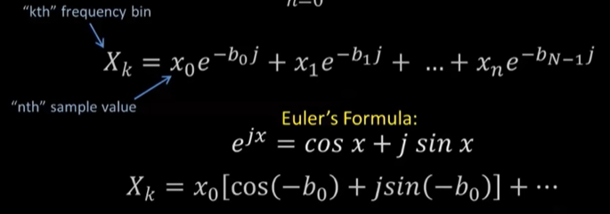

```
---
title: machine learning
description: 
categories: scientists
---定时器 你真的会使用吗？
```


# Math

## Condition number 

[Matrix Condition Number and Matrix Norms - Well conditioned or Ill conditioned (Numerical Methods), https://www.youtube.com/watch?v=GDYmWtWWtNQ]

We do matrix multiplications: AB = C. When a small change in A causes a big (small) change in C, we call the multiplication ill-conditioned (well conditioned). 


The following is an example of ill conditioned MM.


We can use **condition number** of A, defined as $|A|_{\infin}|A^{-1}|_{\infin}$, to more quantitively describe the illness of a A. 


## 傅里叶变换

[Discrete Fourier Transform - Simple Step by Step，https://www.youtube.com/watch?v=mkGsMWi_j4Q]


每个函数可以表示为傅里叶序列，即一系列不同频率的sin，cos函数的和。


k表示频率，$a_k$和$b_k$表示系数。

我们用傅里叶变换求$a_k$和$b_k$。Ft频率的系数可以如下计算$X(F)$。$X(F)$是一个复数，其实轴和虚轴分别对应$a_k$和$b_k$。


现实世界，我们经常是采样一些离散的$x(t)$，希望还原系数。如下，可以分别计算出第k个频率的$X_k$，再转换为$a_k$和$b_k$。N是采样数。


可以使用欧拉公式，把e项转换为正余弦函数，方便计算。




比如假设我们对一个正弦函数获得8个采样点。


那么，$X_2$这样算。


最后，我们算出所有$X_k$。

把$X_k$转换为$a_k$和$b_k$。


## 快速傅里叶变换

[Matrix Interpretation of the FFT Algorithm，https://www.youtube.com/watch?v=A6eBcTHlEL4]


DFT可以写成矩阵形式


直接算WX的开销是$N^2$。我们可以把W分解为logN简单的矩阵，每个矩阵是稀疏的，只要求O(N)的计算量。这样，可以把开销降为$NlogN$。

比如，对于四个采样点$x[i]$，$W$可以分解为$P$，$B_1$，$B_2$，从而$X=B_2B_1Px$。


$P$，$B_1$，$B_2$的形式如下


一般的


## Kronecker product

[浅谈张量分解（二）：张量分解的数学基础，https://zhuanlan.zhihu.com/p/24824550]


## Einstein summation

好像只是一套更简洁的计算表示方法。[Einstein Summation Convention: an Introduction, https://www.youtube.com/watch?v=CLrTj7D2fLM]


## Tensor contraction

[tensor contraction是什么?和内积有关系吗？ - 论智的回答 - 知乎 https://www.zhihu.com/question/286175595/answer/507916866]

两个tensor运算时，如果二者有些维度的size相同，在结果中有可能把这些维度只表示一次。即原来维度是m和n，结果维度小于m+n。


# ML

## 偏微分方程 


### [采用人工神经网络求解偏微分方程初探 | 杨超, https://www.bilibili.com/video/av59518217/]

用NN解PDE当前的问题

* 对解的光滑性要求高
* 边界条件难以处理 
* 训练速度低，收敛慢
* 精度不满意


早期的思想，效果不好


降低对光滑性要求


但是把边界条件写成正则项破坏了变分的性质，使得难以求解。


解决边界条件的一个思想


加速训练。最后一层重要，先把最后一层的参数估计出来。


并行加速

把要求解的区域分块，分别用不同的NN求解。


同时大幅度提高了精度和速度。


动态调节误差函数，根据误差调整网格大小或阶数，调整的幅度也通过NN学习。效果很好。


### Data Driven Discovery of Dynamical Systems and PDEs, https://www.youtube.com/watch?v=Oifg9avnsH4

用一组基函数，基于训练数据做回归 + 稀疏化正则项，就可以求解一些基本的PDE方程。能抵御较强的噪声。

不要直接基于观测数据训练。先对数据降维。

使用线性模型 y = Ax。有一些好处，比如基于现成的矩阵分析技术处理数据。


## 优化器

[从 SGD 到 Adam —— 深度学习优化算法概览(一), https://zhuanlan.zhihu.com/p/32626442]

### 1阶

#### SGD


#### 动量

如果连续的朝着一个方向走，增加这个方向的步长。在梯度变化小的方向加速。


#### AdaGrad

计算梯度


对每个不同的参数调整不同的学习率。频繁变化的参数以更小的步长进行更新，而稀疏的参数以更大的步长进行更新。


缺点：主要缺陷来自分母项的对梯度平方不断累积，随之时间步地增加，分母项越来越大，最终导致学习率收缩到太小无法进行有效更新。


作者：Emerson_G
链接：https://www.jianshu.com/p/aebcaf8af76e
来源：简书
著作权归作者所有。商业转载请联系作者获得授权，非商业转载请注明出处。

#### RMSProp

结合梯度平方的指数移动平均数来调节学习率的变化。


计算梯度平方的加权平均。只看最近一段时间g的变化，而不是迄今为止所有的g，避免Ada里v无限增大的问题：


克服了AdaGrad梯度急剧减小的问题。


#### Adam

动量和RMSProp的结合。

动量


RMSProp


一点矫正


更新


#### LARS

[paper_note.md]

逐层调整学习率。


#### LAMB

[paper_note.md]

对梯度做归一化。


### 2阶

[https://zhuanlan.zhihu.com/p/37524275]

#### 牛顿法


二阶不光看当前的梯度，还看梯度的变化率。当前速度快但是未来成长性不好的话也不是好选择。


#### 拟牛顿法

迭代的算出一个矩阵近似海森矩阵。


###  Derivative-Free Optimization

#### 动机

非凸地形。地形不可微。

* 不能获得解析函数的问题。钱老师的分型实验结果
* 小规模问题


[Global and derivative-free optimization, Lectures 1-2, Coralia Cartis, University of Oxford INFOMM CDT: Contemporary Numerical Techniques]


[AA222 - Introduction to Multidisciplinary Design Optimization]


#### 时间发展顺序


[Derivative-free optimization: A review of algorithms and comparison of software implementations]


##### direct search methods

只使用评估值，不近似梯度。


###### Nelder-Mead simplex  (1965)

https://codesachin.wordpress.com/2016/01/16/nelder-mead-optimization/

1. 对解排序，计算中心点，

   

2. 根据现有解的值，基于三种变换生成新解。

   **Reflection**


​		**expansion**


​	**Contraction**


​	**Shrink contraction**


3. 回到1，直到找到符合质量的解或达到预定迭代次数


###### Directional direct-search method

每一步，生成一组接。每个解是从一组方向里选一个，走一步而生成。评估部分或全部新解。选一个更好的解作为当前解。如果没有更好的解，降低步长。


####### pattern search （1961）

交替的以两种方式搜索。在每个坐标轴方向搜索。模式搜索，沿着前一个解和当前解的连线方向搜索。每一迭代，如果能找到更好的解则加大步长，否则减小步长。


[https://blog.csdn.net/uestcmarvin/article/details/78731417]


####### Simulated annealing (1983)

每个迭代生成一个新解，基于当前解的质量，新解的质量，温度决定是否接受新解。


####### Mesh Adaptive Direct Search (MADS)， (2006) 

初始化一个mesh，即一个搜索空间。

每个迭代尝试search和poll两种搜索方式。search是在mesh中一些固定的点搜索。poll是搜索一些新生成的点。每个点通过在一些方向上移动一个不长生成。如果search和poll没有找到更好的解，减小步长，否则增加步长。


[The mesh adaptive direct search algorithm for granular and discrete variables, S´ebastien Le Digabel, The Optimization Days 2018, 2018–05–08, https://www.gerad.ca/Sebastien.Le.Digabel/talks/2018_JOPT_25mins.pdf]


###### 基因算法（genetic algorithms）(1992)

三原则：

1. 优胜劣汰
2. 复制
3. 变异


###### 粒子群算法 (2003)

[AA222 - Introduction to Multidisciplinary Design Optimization]

1. 初始化一堆借解评估每个解。

2. 根据每个解自己的质量和其他解的质量更新这个解。

算一个更新方向

更新：

2. 回到1，直到找到符合质量的解或达到预定迭代次数


评估：


与基因算法区别：

* 没有交叉，没有染色体


###### CMA-ES  (2006)

##### model-based methods

[MTH8418, Derivative-Free Optimization (DFO), https://www.gerad.ca/Sebastien.Le.Digabel/MTH8418/]


使用surrogate function （cost model）近似梯度。可以使用各种模型。

每一步，找一个足够好的方向。在此方向上尝试找一个足够好的解——移动某个步长后，函数值下降足够多。如果找不到，步长减半。重复。


参数


###### 有限差分法

基于差分近似梯度。


###### line search (1984)

估计一个方向，走一步，调整方向，重复以上过程。


###### trust region methods (1982)

[[原创]信赖域(Trust Region)算法是怎么一回事，https://www.codelast.com/原创信赖域trust-region算法是怎么一回事/]

估计一个可以使目标函数下降的范围，在范围内取一个点，根据解的质量调整范围，重复以上过程。

如何调整范围？有一个surrogate model。cost model估计走一步后解的改进量为v0，实际改进量是v1。以减小v0与v1的差距为目标调整cost model，进而调整范围。


###### Cross-Entropy Method (1997)

- Rubinstein, R.Y. (1997). Optimization of Computer simulation Models with Rare Events, *European Journal of Operational Research*, **99**, 89–112.


用高斯函数作为surrogate model。


#### 主要的研究学者

[Simon Du](https://arxiv.org/search/stat?searchtype=author&query=Du%2C+S)

Michael I. Jordan

#### 落地场景

NAS，automl

[Google Vizier: A Service for Black-Box Optimization](https://research.google.com/pubs/archive/46180.pdf)

强化学习，演化算法


[https://planspace.org/20170830-berkeley_deep_rl_bootcamp/]


对抗攻击


#### 对硬件加速的价值

##### 并行度高

##### 扩展性低


就是zero order optimization，black-box optimization [ZOOpt: Toolbox for Derivative-Free Optimization]

#### 软件

> Some open-source packages of derivative-free optimization approaches have been available, including individual algorithms such as CMA-ES2 (Hansen et al., 2003), SMAC3 (Hutter et al., 2011), IMGPO4 (Kawaguchi et al., 2015), and RACOS5 (Yu et al., 2016); packages of a kind of algorithms such as DEAP6 (Fortin et al., 2012), BayesOpt7 (Martinez-Cantin, 2014), and Spearmint8 (Snoek et al., 2011); and those particularly designed for hyper-parameter optimization with machine learning frameworks, such as Scikit-Optimize9 and Hyperopt10 (Bergstra et al., 2011). These packages either provide general-purpose tools, or tools for a specific task (i.e., hyper-parameter tuning) in learning. The design of the ZOOpt aims at building a ready-to-use tool for solving more generic optimization problems in machine learning, which require high efficiency, scaling-up, noise-handling, etc.

facebook nevergrad

南大zoopt


## 注意力机制

基本思想

目标：对序列数据编码

以前用RNN编码，不能处理很长的序列。

LSTM部分成都解决了问题，但还是不行。

注意力机制：计算序列元素之间的相关性，根据相关性确定序列中各个元素的权重。


比如，一个编码解码器，需要对输入编码，生成输出。


先对没对输入和输出元素编码


计算元素对间的相关性，即注意力


基于注意力对整个输入字符串编码


解码


### 自注意力机制

[深度学习中的注意力机制, https://zhuanlan.zhihu.com/p/53036028]

不是算输入和输出元素之间的注意力，而是算输入元素之间的注意力，对输入元素序列编码。


### soft/hard attention

soft attention，就是基本attention，可以直接求梯度。

hard attention，从输出中采样一部分算attention。需要基于MCMC采样估计梯度。


## L0, l1, l2, 关系

https://zhuanlan.zhihu.com/p/25707761

 

他们都是可以防止过拟合，降低模型复杂度

 

L1是在loss function后面加上 模型参数的1范数（也就是|xi|）

 

L2是在loss function后面加上 模型参数的2范数（也就是sigma(xi^2)），注意L2范数的定义是sqrt(sigma(xi^2))，在正则项上没有添加sqrt根号是为了更加容易优化

 

L1 会产生稀疏的特征

L2 会产生更多地特征但是都会接近于0

L1会趋向于产生少量的特征，而其他的特征都是0，而L2会选择更多的特征，这些特征都会接近于0。L1在特征选择时候非常有用，而L2就只是一种规则化而已。

 

 

## LR正则化

## 高斯判别分析（GDA）

## 统计基础

### 最大似然估计 (MLE) 

http://www.zhihu.com/question/20447622

mle假设抽样与真实值间的误差符合高斯分布。通过构造一个高斯分布，使得在抽样点误差值的联合分布概率最大，可以求得高斯分布参数。

 

http://blog.sina.cn/dpool/blog/s/blog_78fd98af0100xk7k.html

 

### 梯度下降or拟牛顿法

牛顿法，使用二阶导数为零，计算汉森矩阵。汉森矩阵不好计算。

### Mini-batch Gradient Descent

我们都知道 GD（Gradient Descent） 的本质就是希望逐步逼近最优，其迭代公式为


我们最常用的 GD，是使用所有的训练样本来求梯度，即


利用所有的训练样本来求梯度，好处是梯度下降的方向会稳定地朝着极值方向并收敛，不容易受噪声影响；但是问题也比较明显，一个是考虑了所有的数据所有收敛慢，同时容易陷入局部最优。随着数据量的增大，更大的问题就是每更新一次参数，计算量太大；同时，由于考虑了所有数据，收敛就慢。

因此 SGD（Stochastic Gradient Descent） 就应运而生：每次 Iteration 计算梯度并更新参数时只考虑一个样本，对每一个样本执行完这个过程称为一次 Epoch。即


SGD 的好处就是加快了收敛的速度。问题就是由于根据一个样本求的梯度，方向并不一定指向极值方向；甚至可能出现每一次 Iteration 求出的梯度方向差异巨大，最终无法收敛。

因此 Mini-batch GD（Stochastic Gradient Descent） 又应运而生：每次 Iteration 计算梯度并更新参数时考虑 Batch_Size 个样本（称为一个 Batch），对所有样本执行完这个过程称为一次 Epoch。其公式如下，表示本次选择的 Batch，表示 Batch_Size


## 隐马尔科夫模型

 

## 生成模型与辨别模型

假如你的任务是识别一个语音属于哪种语言。例如对面一个人走过来，和你说了一句话，你需要识别出她说的到底是汉语、英语还是法语等。那么你可以有两种方法达到这个目的：

 

1、学习每一种语言，你花了大量精力把汉语、英语和法语等都学会了，我指的学会是你知道什么样的语音对应什么样的语言。然后再有人过来对你哄，你就可以知道他说的是什么语音，你就可以骂他是“米国人还是小日本了”。（呵呵，切勿将政治掺杂在技术里面）

 

2、不去学习每一种语言，你只学习这些语言模型之间的差别，然后再分类。意思是指我学会了汉语和英语等语言的发音是有差别的，我学会这种差别就好了。

   那么第一种方法就是生成方法，第二种方法是判别方法。

​    生成算法尝试去找到底这个数据是怎么生成的（产生的），然后再对一个信号进行分类。基于你的生成假设，那么那个类别最有可能产生这个信号，这个信号就属于那个类别。判别模型不关心数据是怎么生成的，它只关心信号之间的差别，然后用差别来简单对给定的一个信号进行分类。

 

## 越小的参数说明模型越简单

 

过拟合的，拟合会经过曲面的每个点，也就是说在较小的区间里面可能会有较大的曲率，这里的导数就是很大，线性模型里面的权值就是导数，所以越小的参数说明模型越简单。

 

## Svm

### 折页损失函数

 


### svm与lr异同

\* SVM的处理方法是只考虑support vectors,也就是和分类最相关的少数点,去学习分类器.而逻辑回归通过非线性映射,大大减小了离分类平面较远的点的权重,相对提升了与分类最相关的数据点的权重.两者的根本目的都是一样的.此外,根据需要,两个方法都可以增加不同的正则化项,如l1,l2等等.所以在很多实验中,两种算法的结果是很接近的.

但是逻辑回归相对来说模型更简单,好理解,实现起来,特别是大规模线性分类时比较方便.而SVM的理解和优化相对来说复杂一些.但是SVM的理论基础更加牢固,有一套结构化风险最小化的理论基础,虽然一般使用的人不太会去关注.还有很重要的一点,SVM转化为对偶问题后,分类只需要计算与少数几个支持向量的距离,这个在进行复杂核函数计算时优势很明显,能够大大简化模型和计算

 

### 核函数

## K近邻查询

就是给定查询点及正整数K，从数据集中找到距离查询点最近的K个数据

同样，针对特征点匹配也有两种方法：

·     最容易的办法就是线性扫描，也就是我们常说的穷举搜索，依次计算样本集E中每个样本到输入实例点的距离，然后抽取出计算出来的最小距离的点即为最近邻点。此种办法简单直白，但当样本集或训练集很大时，它的缺点就立马暴露出来了，举个例子，在物体识别的问题中，可能有数千个甚至数万个SIFT特征点，而去一一计算这成千上万的特征点与输入实例点的距离，明显是不足取的。

·     另外一种，就是构建数据索引，因为实际数据一般都会呈现簇状的聚类形态，因此我们想到建立数据索引，然后再进行快速匹配。索引树是一种树结构索引方法，其基本思想是对搜索空间进行层次划分。根据划分的空间是否有混叠可以分为Clipping和Overlapping两种。前者划分空间没有重叠，其代表就是k-d树；后者划分空间相互有交叠，其代表为R树。

 

 

## Q2. Is rotation necessary in PCA? If yes, Why? What will happen if you don’t rotate the components?

白化是一种重要的预处理过程，其目的就是降低输入数据的冗余性，使得经过白化处理的输入数据具有如下性质：(i)特征之间相关性较低；(ii)所有特征具有相同的方差。

 

\1. PCA白化

 根据白化的两个要求，我们首先是降低特征之间的相关性。在PCA中，我们选取前K大的特征值的特征向量作为投影方向，如果K的大小为数据的维度n，把这K个特征向量组成选择矩阵U（每一列为一个特征向量），为旋转后的数据。如果K<n，就是PCA降维，如果K=n，则降低特征间相关性降低。

 

## 变分自编码器

变分贝叶斯推断(Variational Bayes Inference)简介, blog.csdn.net/aws3217150

 

## GAN (生成式对抗网络)

 

## 判别模型与生成模型

### 区别

#### 解释1

回归模型是判别模型，也就是根据特征值来求结果的概率。形式化表示为[![clip_image002[8\]](file:///C:/Users/xling/AppData/Local/Temp/msohtmlclip1/01/clip_image016.gif)](http://images.cnblogs.com/cnblogs_com/jerrylead/201103/201103052258352389.png)，在参数[![clip_image004[8\]](file:///C:/Users/xling/AppData/Local/Temp/msohtmlclip1/01/clip_image018.gif)](http://images.cnblogs.com/cnblogs_com/jerrylead/201103/201103052258364831.png)确定的情况下，求解条件概率[![clip_image006[8\]](file:///C:/Users/xling/AppData/Local/Temp/msohtmlclip1/01/clip_image020.gif)](http://images.cnblogs.com/cnblogs_com/jerrylead/201103/201103052258361733.png)。通俗的解释为在给定特征后预测结果出现的概率。比如说要确定一只羊是山羊还是绵羊，用判别模型的方法是先从历史数据中学习到模型，然后通过提取这只羊的特征来预测出这只羊是山羊的概率，是绵羊的概率。

 

换一种思路，我们可以根据山羊的特征首先学习出一个山羊模型，然后根据绵羊的特征学习出一个绵羊模型。然后从这只羊中提取特征，放到山羊模型中看概率是多少，再放到绵羊模型中看概率是多少，哪个大就是哪个。形式化表示为求[![clip_image008[12\]](file:///C:/Users/xling/AppData/Local/Temp/msohtmlclip1/01/clip_image022.gif)](http://images.cnblogs.com/cnblogs_com/jerrylead/201103/201103052258372223.png)（也包括[![clip_image010[8\]](file:///C:/Users/xling/AppData/Local/Temp/msohtmlclip1/01/clip_image024.gif)](http://images.cnblogs.com/cnblogs_com/jerrylead/201103/201103052258372714.png)，y是模型结果，x是特征。

 

#### 解释2

##### 生成方法

**定义**

由数据学习联合概率分布P(X,Y), 然后由P(Y|X)=[](http://images.cnitblog.com/blog/408927/201310/20163233-81e4d6d415084e7ea32d81a3843fa77e.gif)求出概率分布P(Y|X)。该方法表示了给定输入X产生输出Y的生成关系。

**典型模型**

朴素贝叶斯方法、隐马尔可夫模型

**特点**

生成方法可以还原出联合概率分P(X,Y),而判别方法不能；生成方法的学习收敛速度更快，当样本容量增加的时候，学到的模型可以更快的收敛于真实模型；当存在隐变量时，仍可以利用生成方法学习，此时判别方法不能用。

**注释**

当我们找不到引起某一现象的原因的时候，我们就把这个在起作用，但是，无法确定的因素，叫“隐变量”

##### 判别方法

 **定义**

由数据直接学习决策函数Y=f(X)或条件概率分布P(Y|X)作为预测模型，即判别模型。判别方法关心的是对于给定的输入X，应该预测什么样的输出Y。

**典型模型**

k近邻法、感知机、决策树、逻辑斯谛回归模型、最大熵模型、支持向量机、提升方法、条件随机场

**特点**

判别方法直接学习的是决策函数Y=f(X)或条件概率分布P(Y|X)，直接面对预测，往往学习准确率更高；由于直接学习P(Y|X)或f(X)，可以对数据进行各种程度上的抽象、定义特征并使用特征，因此可以简化学习问题。

 

#### 解释3

##### 【摘要】

 

  \- 生成模型：无穷样本==》概率密度模型 = 产生模型==》预测

  \- 判别模型：有限样本==》判别函数 = 预测模型==》预测

 

【简介】

 

简单的说，假设o是观察值，q是模型。

如果对P(o|q)建模，就是Generative模型。其基本思想是首先建立样本的概率密度模型，再利用模型进行推理预测。要求已知样本无穷或尽可能的大限制。

这种方法一般建立在统计力学和bayes理论的基础之上。

如果对条件概率(后验概率) P(q|o)建模，就是Discrminative模型。基本思想是有限样本条件下建立判别函数，不考虑样本的产生模型，直接研究预测模型。代表性理论为统计学习理论。

这两种方法目前交叉较多。

 

##### 【判别模型Discriminative Model】——inter-class probabilistic description

 

又可以称为条件模型，或条件概率模型。估计的是条件概率分布(conditional distribution)， p(class|context)。

利用正负例和分类标签，focus在判别模型的边缘分布。目标函数直接对应于分类准确率。

 

\- 主要特点：

   寻找不同类别之间的最优分类面，反映的是异类数据之间的差异。

\- 优点:

   分类边界更灵活，比使用纯概率方法或生产模型得到的更高级。

   能清晰的分辨出多类或某一类与其他类之间的差异特征

   在聚类、viewpoint changes, partial occlusion and scale variations中的效果较好

   适用于较多类别的识别

   判别模型的性能比生成模型要简单，比较容易学习

\- 缺点：

   不能反映训练数据本身的特性。能力有限，可以告诉你的是1还是2，但没有办法把整个场景描述出来。

   Lack elegance of generative: Priors, 结构, 不确定性

   Alternative notions of penalty functions, regularization, 核函数

   黑盒操作: 变量间的关系不清楚，不可视

   

\- 常见的主要有：

   logistic regression

   SVMs

   traditional neural networks

   Nearest neighbor

   Conditional random fields(CRF): 目前最新提出的热门模型，从NLP领域产生的，正在向ASR和CV上发展。

 

\- 主要应用：

   Image and document classification

   Biosequence analysis

   Time series prediction

 

##### 【生成模型Generative Model】——intra-class probabilistic description

 

又叫产生式模型。估计的是联合概率分布（joint probability distribution），p(class, context)=p(class|context)*p(context)。

 

用于随机生成的观察值建模，特别是在给定某些隐藏参数情况下。在机器学习中，或用于直接对数据建模（用概率密度函数对观察到的draw建模），或作为生成条件概率密度函数的中间步骤。通过使用贝叶斯rule可以从生成模型中得到条件分布。

 

如果观察到的数据是完全由生成模型所生成的，那么就可以fitting生成模型的参数，从而仅可能的增加数据相似度。但数据很少能由生成模型完全得到，所以比较准确的方式是直接对条件密度函数建模，即使用分类或回归分析。

 

与描述模型的不同是，描述模型中所有变量都是直接测量得到。

 

\- 主要特点：

   一般主要是对后验概率建模，从统计的角度表示数据的分布情况，能够反映同类数据本身的相似度。

   只关注自己的inclass本身（即点左下角区域内的概率），不关心到底 decision boundary在哪。

\- 优点:

   实际上带的信息要比判别模型丰富，

   研究单类问题比判别模型灵活性强

   模型可以通过增量学习得到

   能用于数据不完整（missing data）情况

   modular construction of composed solutions to complex problems

   prior knowledge can be easily taken into account

   robust to partial occlusion and viewpoint changes

   can tolerate significant intra-class variation of object appearance

\- 缺点：

   tend to produce a significant number of false positives. This is particularly true for object classes which share a high visual similarity such as horses and cows

   学习和计算过程比较复杂

   

\- 常见的主要有：

   Gaussians, Naive Bayes, Mixtures of multinomials

   Mixtures of Gaussians, Mixtures of experts, HMMs

   Sigmoidal belief networks, Bayesian networks

   Markov random fields

 

   所列举的Generative model也可以用disriminative方法来训练，比如GMM或HMM，训练的方法有EBW(Extended Baum Welch),或最近Fei Sha提出的Large      Margin方法。

 

\- 主要应用：

   NLP:

   Traditional rule-based or Boolean logic systems (Dialog and Lexis-Nexis) are giving way to statistical approaches (Markov models and stochastic context grammars)

   Medical Diagnosis:

​     QMR knowledge base, initially a heuristic expert systems for reasoning about diseases and symptoms been augmented with decision theoretic formulation Genomics and Bioinformatics

   Sequences represented as generative HMMs

 

##### 【两者之间的关系】

由生成模型可以得到判别模型，但由判别模型得不到生成模型。

Can performance of SVMs be combined elegantly with flexible Bayesian statistics?

Maximum Entropy Discrimination marries both methods: Solve over a distribution of parameters (a distribution over solutions)

### 判别模型

 

#### **回****归**

##### 线性回归（Linear Regression）

​      首先要明白什么是回归。回归的目的是通过几个已知数据来预测另一个数值型数据的目标值。假设特征和结果满足线性关系，即满足一个计算公式h(x)，这个公式的自变量就是已知的数据x，函数值h(x)就是要预测的目标值。这一计算公式称为回归方程，得到这个方程的过程就称为回归。

​      线性回归就是假设这个方式是一个线性方程，即假设这个方程是一个多元一次方程。以咱们上面提到的例子为例：假设房子的房屋面积和卧室数量为自变量x，用x1表示房屋面积，x2表示卧室数量；房屋的交易价格为因变量y，我们用h(x)来表示y。假设房屋面积、卧室数量与房屋的交易价格是线性关系。他们满足公式

  

​      上述公式中的θ为参数，也称为权重，可以理解为x1和x2对h(x)的影响度。对这个公式稍作变化就是

  

​      公式中θ和x是向量，n是样本数。

​      假如我们依据这个公式来预测h(x)，公式中的x是我们已知的，然而θ的取值却不知道，只要我们把θ的取值求解出来，我们就可以依据这个公式来做预测了。

​      那么如何依据训练数据求解θ的最优取值呢？这就牵扯到另外一个概念：**损失函数（****Loss Function****）。**

 

###### 损失函数（Loss Function）

​      我们要做的是依据我们的训练集，选取最优的θ，在我们的训练集中让h(x)尽可能接近真实的值。h(x)和真实的值之间的差距，我们定义了一个函数来描述这个差距，这个函数称为损失函数，表达式如下：


​      这里的这个损失函数就是著名的**最小二乘****损失函数**，这里还涉及一个概念叫**最小二乘法**，这里不再展开了。

​      我们要选择最优的θ，使得h(x)最近进真实值。这个问题就转化为求解最优的θ，使损失函数J(θ)取最小值。那么如何解决这个转化后的问题呢？这又牵扯到一个概念：**梯度下降（****Radient Descent****）**

###### 最小均方算法（Least mean square，LMS算法）

（对的朋友，你没有看错，不是梯度下降，是LMS算法。耐心点，梯度下降一会儿就出来了）

我们先来看当训练样本只有一个的时候的情况，然后再将训练样本扩大到多个的情况。训练样本只有一个的情况，我们借鉴LMS算法的思想。扩大到多个我们稍后说。

​      我们要求解使得J(θ)最小的θ值，LMS算法大概的思路是：我们首先随便给θ一个初始化的值，然后改变θ值让J(θ)的取值变小，不断重复改变θ使J(θ)变小的过程直至J(θ)约等于最小值。

​      首先我们给θ一个初试值，然后向着让J(θ)变化最大的方向更新θ的取值，如此迭代。公式如下：

  

​      公式中α称为步长（learning rate），它控制θ每次向J(θ)变小的方向迭代时的变化幅度。J(θ)对θ的偏导表示J(θ)变化最大的方向。由于求的是极小值，因此梯度方向是偏导数的反方向。求解一下这个偏导，过程如下：

  

​      那么θ的迭代公式就变为：

  

​      这是当训练集只有一个样本时的数学表达。我们又**两种方式**将只有一个样本的数学表达转化为样本为多个的情况：**梯度下降（****gradient descent****）**和**正****则方程（****The normal equations****）**。这里我们重点讲梯度下降。

 

###### 梯度下降

批梯度下降（batch gradient descent）

​      如下公式是处理一个样本的表达式：

  

​      转化为处理多个样本就是如下表达：

  

​      这种新的表达式每一步都是计算的全部训练集的数据，所以称之为**批梯度下降（****batch gradient descent****）**。

  注意，梯度下降可能得到局部最优，但在优化问题里我们已经证明线性回归只有一个最优点，因为损失函数J(θ)是一个二次的凸函数，不会产生局部最优的情况。（假设学习步长α不是特别大）

​      批梯度下降的算法执行过程如下图：

  

 

​      大家仔细看批梯度下降的数学表达式，每次迭代的时候都要对所有数据集样本计算求和，计算量就会很大，尤其是训练数据集特别大的情况。那有没有计算量较小，而且效果也不错的方法呢？有！这就是：**随机梯度下降（****Stochastic Gradient Descent, SGD****）**

 

随机梯度下降（Stochastic Gradient Descent, SGD）

  随机梯度下降在计算下降最快的方向时时随机选一个数据进行计算，而不是扫描全部训练数据集，这样就加快了迭代速度。随机梯度下降并不是沿着J(θ)下降最快的方向收敛，而是震荡的方式趋向极小点。[余凯](http://baike.baidu.com/link?url=kTMitvYd1YRLTiN-LgsNk6_xe4lcRGt3TLNJ9XbxGjA1NHTsMriX1WN6aZ8lfliB4ZXpKSjNC4HB72BeG35Umv_lnz3uaw2m1BqYGxIpPpS)教授在龙星计划课程中用“曲线救国”来比喻随机梯度下降。

​      随机梯度下降表达式如下：

  

​      执行过程如下图：

  

​      批梯度下降和随机梯度下降在三维图上对比如下：

  

 

 

##### 指数分布族（The Exponential Family）

 如果一个分布可以用如下公式表达，那么这个分布就属于指数分布族：

 

  公式中y是随机变量；h(x)称为基础度量值（base measure）；

  η称为分布的自然参数（natural parameter），也称为标准参数（canonical parameter）；

  T(y)称为充分统计量，通常T(y)=y；

  a(η)称为对数分割函数（log partition function）；

  本质上是一个归一化常数，确保概率和为1。

  当T(y)被固定时，a(η)、b(y)就定义了一个以η为参数的一个指数分布。我们变化η就得到这个分布的不同分布。

 

  伯努利分布属于指数分布族。伯努利分布均值为φ，写为Bernoulli(φ)，是一个二值分布，y ∈ {0, 1}。所以p(y = 1; φ) = φ; p(y = 0; φ) = 1 − φ。当我们变化φ就得到了不同均值的伯努利分布。伯努利分布表达式转化为指数分布族表达式过程如下：

  

  其中，


 

###### 构建广义线性模型（Constructing GLMs）

   在分类和回归问题中，我们通过构建一个关于x的模型来预测y。这种问题可以利用**广****义线性模型（****Generalized linear models****，****GMLs****）**来解决。构建广义线性模型我们基于三个假设，也可以理解为我们基于三个设计决策，这三个决策帮助我们构建广义线性模型：

\1.  ,假设满足一个以为参数的指数分布。例如，给定了输入x和参数θ，那么可以构建y关于η的表达式。

\2.  给定x，我们的目标是要确定T(y)，即。大多数情况下T(y)=y，那么我们实际上要确定的是。即给定x，假设我们的目标函数是。（在逻辑回归中期望值是，因此目标函数h是φ；在线性回归中期望值是μ，而高斯分布中，因此线性回归中目标函数）。

\3.  假设自然参数η和x是线性相关，即假设：

 

   假设有一个预测问题：基于特征商店促销活动、最近的广告、天气、星期几等特征x，来预测商店在任一小时内的顾客数目y。

   根据概率知识可知，x、y符合泊松分布。泊松分布属于指数分布族，我们可以利用上面的3个假设，构建一个广义线性模型来进行构建预测模型。

 

###### GLMs构建最小二乘模型

   线性回归中的优化目标y（损失函数）是由最小二乘法得到的，可以使用广义线性模型构建最小二乘模型。三个假设：

\1.  最小二乘法得到的目标变量y是一个连续值，我们假设给定x下y的分布符合高斯分布。假设1中的ExponentialFamily(η)就是高斯分布。

\2.  在高斯分布中，目标函数

\3.  假设：

   推导过程如下：


   第一步变换根据假设2：

   第二步变换根据y|x; θ ∼ N(μ, σ2)，高斯分布的期望值是μ

   第三步根据假设1：高斯分布中

   第四步根据假设3：

 

   现在已经使用广义线性模型构建出了最小二乘模型，接下来的工作就是利用梯度下降、牛顿方法来求解θ。[梯度下降](http://www.cnblogs.com/BYRans/p/4700202.html)、[牛顿方法](http://www.cnblogs.com/BYRans/p/4720436.html)的内容请参考之前的讲义。

 

 

###### GLMs构建逻辑回归

   逻辑回归可以用于解决二分类问题，而分类问题目标函数y是二值的离散值，。根据统计知识，二分类问题可以选择伯努利分布来构建模型。

   在伯努利分布的指数分布族表达式中我们已知：，从而得到。

   构建广义线性模型的三个假设：

\1.  假设符合伯努利分布，

\2.  ，伯努利分布中

\3.  

 

推导过程如下：

  

   同最小二乘模型一样，接下来的工作就由梯度下降或牛顿方法来完成。

 

   注意一下上面的推到结果，回忆一下，在[逻辑回归](http://www.cnblogs.com/BYRans/p/4713624.html)中，我们选用Sigmoid函数。

   之所以在逻辑回归中选用这个g(z)作为Sigmoid函数是由一套理论作支持的，这个理论便是广义线性模型。

##### **逻辑回归**

逻辑回归就是一种减小预测范围，将预测值限定为[0,1]间的一种回归模型，其回归方程与回归曲线如图2所示。逻辑曲线在z=0时，十分敏感，在z>>0或z<<0处，都不敏感，将预测值限定为(0,1)。

###### **l1****，****l2****正****则**

逻辑回归常用的正则化有两种l1l1正则和l2l2正则。

 

 l1l1正则: φ(w)=∥w∥1=∑|w|φ(w)=∥w∥1=∑|w|

 l2l2正则: φ(w)=∥w∥2=∑w2=WTWφ(w)=∥w∥2=∑w2=WTW

同时最优化问题变为了

​    w=argminw[l(w,z)+λφ(W)])w=arg⁡minw[l(w,z)+λφ(W)])

l1l1正则和l2l2正则的作用都是为了防止W产生一些绝对值很大的值，避免过拟合。但是l1l1正则和l2l2正则存在一些区别：

l1l1正则在批量梯度下降的时候，能够产生稀疏解，就是W有很多维度的值为0，这些为0的维度通常都是相关度不高的维度，这样在计算高维度的向量时能够起到特征选择的作用。

稀疏解是在进行逻辑回归计算的时候一个很重要的目标，在广告CTR预估的时候，每个样本的维度都特别高，稀疏解可以大大节省计算时间。

但是前面说过批量梯度下降的计算时间很长，而随机梯度下降即使使用了l1l1正则，仍然很难得到一个稀疏解。

有一种解决办法，就是当W中某个维度的值低于一定阈值的时候，直接将这个维度的值设置为0。这种方式叫做截断法，但是这种方法太简单暴力，容易将一些实际中需要的维度干掉。那么有没有一种办法能够温柔一点呢，那就是截断梯度法[1]。

##### **Softmax**

Logistic回归只能进行二分类，因为它的随机变量的取值只能是0或者1。

Softmax 处理多分类问题。

[http://ufldl.stanford.edu/wiki/index.php/Softmax%E5%9B%9E%E5%BD%92](http://ufldl.stanford.edu/wiki/index.php/Softmax回归)

 

回想一下在 logistic 回归中，我们的训练集由  个已标记的样本构成： ，其中输入特征。（我们对符号的约定如下：特征向量  的维度为 ，其中  对应截距项 。） 由于 logistic 回归是针对二分类问题的，因此类标记 。假设函数(hypothesis function) 如下：


 

我们将训练模型参数 ，使其能够最小化代价函数 ：

![ \begin{align} J(clip_image084.gif) = -\frac{1}{m} \left[ \sum_{i=1}^m y^{(i)} \log h_\theta(x^{(i)}) + (1-y^{(i)}) \log (1-h_\theta(x^{(i)})) \right] \end{align} ](file:///C:/Users/xling/AppData/Local/Temp/msohtmlclip1/01/clip_image084.gif)

 

在 softmax回归中，我们解决的是多分类问题（相对于 logistic 回归解决的二分类问题），类标  可以取  个不同的值（而不是 2 个）。因此，对于训练集 ，我们有 。（注意此处的类别下标从 1 开始，而不是 0）。例如，在 MNIST 数字识别任务中，我们有  个不同的类别。

 

对于给定的测试输入 ，我们想用假设函数针对每一个类别j估算出概率值 。也就是说，我们想估计  的每一种分类结果出现的概率。因此，我们的假设函数将要输出一个  维的向量（向量元素的和为1）来表示这  个估计的概率值。 具体地说，我们的假设函数  形式如下：


 

其中  是模型的参数。请注意 这一项对概率分布进行归一化，使得所有概率之和为 1 。

 

为了方便起见，我们同样使用符号  来表示全部的模型参数。在实现Softmax回归时，将  用一个  的矩阵来表示会很方便，该矩阵是将  按行罗列起来得到的，如下所示：


 

###### 代价函数

现在我们来介绍 softmax 回归算法的代价函数。在下面的公式中， 是示性函数，其取值规则为：

 值为真的表达式 

 

，  值为假的表达式 。举例来说，表达式  的值为1 ，的值为 0。我们的代价函数为：

![ \begin{align} J(clip_image103.gif) = - \frac{1}{m} \left[ \sum_{i=1}^{m} \sum_{j=1}^{k}  1\left\{y^{(i)} = j\right\} \log \frac{e^{\theta_j^T x^{(i)}}}{\sum_{l=1}^k e^{ \theta_l^T x^{(i)} }}\right] \end{align} ](file:///C:/Users/xling/AppData/Local/Temp/msohtmlclip1/01/clip_image103.gif)

 

值得注意的是，上述公式是logistic回归代价函数的推广。logistic回归代价函数可以改为：

![ \begin{align} J(clip_image104.gif) &= -\frac{1}{m} \left[ \sum_{i=1}^m   (1-y^{(i)}) \log (1-h_\theta(x^{(i)})) + y^{(i)} \log h_\theta(x^{(i)}) \right] \\ &= - \frac{1}{m} \left[ \sum_{i=1}^{m} \sum_{j=0}^{1} 1\left\{y^{(i)} = j\right\} \log p(y^{(i)} = j | x^{(i)} ; \theta) \right] \end{align} ](file:///C:/Users/xling/AppData/Local/Temp/msohtmlclip1/01/clip_image104.gif)

 

可以看到，Softmax代价函数与logistic 代价函数在形式上非常类似，只是在Softmax损失函数中对类标记的  个可能值进行了累加。注意在Softmax回归中将  分类为类别  的概率为：

.

 

对于  的最小化问题，目前还没有闭式解法。因此，我们使用迭代的优化算法（例如梯度下降法，或 L-BFGS）。经过求导，我们得到梯度公式如下：

![ \begin{align} \nabla_{\theta_j} J(clip_image108.gif) = - \frac{1}{m} \sum_{i=1}^{m}{ \left[ x^{(i)} \left( 1\{ y^{(i)} = j\}  - p(y^{(i)} = j | x^{(i)}; \theta) \right) \right]  } \end{align} ](file:///C:/Users/xling/AppData/Local/Temp/msohtmlclip1/01/clip_image108.gif)

 

让我们来回顾一下符号 "" 的含义。 本身是一个向量，它的第  个元素  是 对 的第  个分量的偏导数。

 

有了上面的偏导数公式以后，我们就可以将它代入到梯度下降法等算法中，来最小化 。 例如，在梯度下降法的标准实现中，每一次迭代需要进行如下更新: (）。

当实现 softmax 回归算法时， 我们通常会使用上述代价函数的一个改进版本。具体来说，就是和权重衰减(weight decay)一起使用。我们接下来介绍使用它的动机和细节。

###### Softmax回归与Logistic 回归的关系

当类别数  时，softmax 回归退化为 logistic 回归。这表明 softmax 回归是 logistic 回归的一般形式。具体地说，当  时，softmax 回归的假设函数为：


 

利用softmax回归参数冗余的特点，我们令 ，并且从两个参数向量中都减去向量 ，得到:

![ \begin{align} h(clip_image120.gif) &=  \frac{1}{ e^{\vec{0}^Tx}  + e^{ (\theta_2-\theta_1)^T x^{(i)} } } \begin{bmatrix} e^{ \vec{0}^T x } \\ e^{ (\theta_2-\theta_1)^T x } \end{bmatrix} \\   &= \begin{bmatrix} \frac{1}{ 1 + e^{ (\theta_2-\theta_1)^T x^{(i)} } } \\ \frac{e^{ (\theta_2-\theta_1)^T x }}{ 1 + e^{ (\theta_2-\theta_1)^T x^{(i)} } } \end{bmatrix} \\  &= \begin{bmatrix} \frac{1}{ 1  + e^{ (\theta_2-\theta_1)^T x^{(i)} } } \\ 1 - \frac{1}{ 1  + e^{ (\theta_2-\theta_1)^T x^{(i)} } } \\ \end{bmatrix} \end{align} ](file:///C:/Users/xling/AppData/Local/Temp/msohtmlclip1/01/clip_image120.gif)

 

因此，用 来表示，我们就会发现 softmax 回归器预测其中一个类别的概率为 ，另一个类别概率的为 ，这与 logistic回归是一致的。

 


#### 线性判别分析

#### 支持向量机

#### Boosting

#### 条件随机场

#### 神经网络

 

### 生成模型

 

#### 隐马尔科夫模型

#### 朴素贝叶斯模型

朴素贝叶斯分类是一种十分简单的分类算法，叫它朴素贝叶斯分类是因为这种方法的思想真的很朴素，朴素贝叶斯的思想基础是这样的：对于给出的待分类项，求解在此项出现的条件下各个类别出现的概率，哪个最大，就认为此待分类项属于哪个类别。通俗来说，就好比这么个道理，你在街上看到一个黑人，我问你你猜这哥们哪里来的，你十有八九猜非洲。为什么呢？因为黑人中非洲人的比率最高，当然人家也可能是美洲人或亚洲人，但在没有其它可用信息下，我们会选择条件概率最大的类别，这就是朴素贝叶斯的思想基础。

   朴素贝叶斯分类的正式定义如下：

   1、设为一个待分类项，而每个a为x的一个特征属性。

   2、有类别集合。

   3、计算。

   4、如果，则。

   那么现在的关键就是如何计算第3步中的各个条件概率。我们可以这么做：

   1、找到一个已知分类的待分类项集合，这个集合叫做训练样本集。

   2、统计得到在各类别下各个特征属性的条件概率估计。即。

   3、如果各个特征属性是条件独立的，则根据贝叶斯定理有如下推导：

   

   因为分母对于所有类别为常数，因为我们只要将分子最大化皆可。又因为各特征属性是条件独立的，所以有：

   

   根据上述分析，朴素贝叶斯分类的流程可以由下图表示（暂时不考虑验证）：

[](http://images.cnblogs.com/cnblogs_com/leoo2sk/WindowsLiveWriter/4f6168bb064a_9C14/1_2.png)

   可以看到，整个朴素贝叶斯分类分为三个阶段：

   第一阶段——准备工作阶段，这个阶段的任务是为朴素贝叶斯分类做必要的准备，主要工作是根据具体情况确定特征属性，并对每个特征属性进行适当划分，然后由人工对一部分待分类项进行分类，形成训练样本集合。这一阶段的输入是所有待分类数据，输出是特征属性和训练样本。这一阶段是整个朴素贝叶斯分类中唯一需要人工完成的阶段，其质量对整个过程将有重要影响，分类器的质量很大程度上由特征属性、特征属性划分及训练样本质量决定。

   第二阶段——分类器训练阶段，这个阶段的任务就是生成分类器，主要工作是计算每个类别在训练样本中的出现频率及每个特征属性划分对每个类别的条件概率估计，并将结果记录。其输入是特征属性和训练样本，输出是分类器。这一阶段是机械性阶段，根据前面讨论的公式可以由程序自动计算完成。

   第三阶段——应用阶段。这个阶段的任务是使用分类器对待分类项进行分类，其输入是分类器和待分类项，输出是待分类项与类别的映射关系。这一阶段也是机械性阶段，由程序完成。

##### 遇到特征之间不独立问题

**参考改进的贝叶斯网络，使用DAG****来进行概率图的描述**

#### 概率图模型（PGM）

很多事情是具有不确定性的。人们往往希望从不确定的东西里尽可能多的得到确定的知识、信息。为了达到这一目的，人们创建了概率理论来描述事物的不确定性。在这一基础上，人们希望能够通过已经知道的知识来推测出未知的事情，无论是现在、过去、还是将来。在这一过程中，模型往往是必须的，什么样的模型才是相对正确的？这又是我们需要解决的问题。这些问题出现在很多领域，包括模式识别、差错控制编码等。

概率图模型是解决这些问题的工具之一。

 

基本的Graphical Model 可以大致分为两个类别：贝叶斯网络(Bayesian Network)和马尔可夫随机场(Markov Random Field)。它们的主要区别在于采用不同类型的图来表达变量之间的关系：贝叶斯网络采用有向无环图(Directed Acyclic Graph)来表达因果关系，马尔可夫随机场则采用无向图(Undirected Graph)来表达变量间的相互作用。这种结构上的区别导致了它们在建模和推断方面的一系列微妙的差异。一般来说，贝叶斯网络中每一个节点都对应于一个先验概率分布或者条件概率分布，因此整体的联合分布可以直接分解为所有单个节点所对应的分布的乘积。而对于马尔可夫场，由于变量之间没有明确的因果关系，它的联合概率分布通常会表达为一系列势函数（potential function）的乘积。通常情况下，这些乘积的积分并不等于1，因此，还要对其进行归一化才能形成一个有效的概率分布——这一点往往在实际应用中给参数估计造成非常大的困难。

 

简而言之，就是图使得概率模型可视化了，这样就使得一些变量之间的关系能够很容易的从图中观测出来；同时有一些概率上的复杂的计算可以理解为图上的信息传递，这是我们就无需关注太多的复杂表达式了。最后一点是，图模型能够用来设计新的模型。所以多引入一数学工具是可以带来很多便利的，我想这就是数学的作用吧。

  当然，我们也可以从另一个角度考虑其合理性。我们的目的是从获取到的量中得到我们要的信息，模型是相互之间约束关系的表示，而数据的处理过程中运用到了概率理论。而图恰恰将这两者之间联系起来了，起到了一个很好的表示作用。

##### **有向****图模型（贝叶斯网络****）**

  举个例子，譬如有一组变量，如果每个变量只与其前一个变量有关（1阶马尔可夫过程），那么以下等式成立


  那么如何用图来表示这一关系呢？自然，我们要表示的是右边的式子，右边的式子表示了变量之间的联系。而当我们观察条件概率时，我们发现我们必须要指明哪个是条件。如果我们采用变量为节点，采用无向图这种节点等价的关系显然不能直接描述条件概率，因此这里选择了有向图来描述这一关系，即表示为

[](http://images.cnitblog.com/blog/663760/201503/092002518247365.png)

  那么此时上述的1阶马尔可夫过程表示为，注意其中没有箭头指向，故表示意味着无条件。

[](http://images.cnitblog.com/blog/663760/201503/092002535891937.png)

  有向图模型，或称贝叶斯网络，描述的是条件概率，或许这就是其被称为贝叶斯网络的原因吧。此处不再细说，更多内容（包括d-separation等）可参考后文提及的相关资料。

##### **无向****图模型（马尔可夫随机场****）**

  构造有向图模型需要变量之间显式的、很强的约束关系。即首先要有条件概率分布关系，其次还要是可求的。为了达到这一目的，很有可能我们要做很多不切实际的假设。譬如朴素贝叶斯（[Naive Bayes](http://en.wikipedia.org/wiki/Naive_Bayes_classifier)）的假设就相当的Naive。如下所示，其假设往往是不成立的。

  那什么是更弱的假设呢？很多时候我们知道两个变量之间一定是相关的，但我们不知道到底是怎么相关的。这时候我们也可以用其相关性来构造概率图模型。相关是不分方向的，此时我们应该选择无向图来表示。

  和相关对应的是独立（实际上是不相关，这里不做区分了），我们可以这样来构造图模型，如果两个节点之间独立，那么没有路使其相连。条件独立即去掉条件中节点后，两节点之间没有路相连。具体可由《PATTERN RECOGNITION and MACHINE LEARNING》中的例子阐述

[](http://images.cnitblog.com/blog/663760/201503/092002548861369.png)

  如上图所示，A中节点到B集合中节点的每一条路都通过了C中节点，这代表着。无向图模型很完美的将这种弱的关系表现出来了，有一种很神奇的感觉，但光表示是没有多大用处的，我们还是要计算概率。对于变量，显然有


  但更显然的是我们不应该这样做，因为没有意义。所以他们是这样做的，为什么可以？我也没弄明白，我只是感觉了一下，觉得差不多……思想是一样的，就是把概率分开，分开了才能体现特点。

  将图中的节点分成多个小的集合XcXc，其中集合内的点两两之间有边相连接，这些集合被称为cliques，那么概率分布满足


  其中ZZ是归一化因子（使得概率之和为1），ΦΦ函数是势能函数，恒正。取为


  是能量函数，不得不说这是一个很神奇的东西。不太会就先总结到这里了。

###### 能量函数


 

##### 4.举例

  **HMM**，隐马尔可夫模型，是一种有向图模型。这和上述的1阶马尔可夫过程是类似的，不同之处在于我们能够观测到的量不是过程本身，而是与其有一定关系的另一些量。HMM应用很广泛，可以参考[隐马尔可夫模型（HMM）攻略](http://blog.csdn.net/likelet/article/details/7056068) 。

[](http://images.cnitblog.com/blog/663760/201503/092002581993213.png)

  **RBM**，限制玻尔兹曼机，无向图模型。了解深度学习相关知识的对这个应该很熟悉，看到无向图模型的时候就会发现，都有一个势能函数。这个我不太会，就不介绍了。

[](http://images.cnitblog.com/blog/663760/201503/092003000116500.png)

  **图像去噪**，PRML中的一个例子，无向图模型。目的是从观测到的有噪声的图片中恢复出原始图片，做出的假设是观察到的图片像素点和原始图片相关，同时原始图片相邻像素点之间相关。

[](http://images.cnitblog.com/blog/663760/201503/092003018391858.png)

  **LDPC****译码**，差错控制编码中的例子，因子图。其中YY是观测节点，和变量节点XX相关，同时ff是因子节点，约束是连接该节点的变量节点模2和为0。（也可以去掉YY,这样就是比较标准的因子图了）

[](http://images.cnitblog.com/blog/663760/201503/092003035424645.png)

##### 5.推理：和积算法

  本节将以和积算法为例，说明概率图模型下的概率计算过程。和积算法也用在[LDPC译码](http://www.cnblogs.com/sea-wind2/p/4282640.html)过程中，这一过程也将证实“一些概率上的复杂的计算可以理解为图上的信息传递，这是我们就无需关注太多的复杂表达式了”这一观点。和积算法作用在因子图上，旨在计算边缘概率

  其中，表示除之外的变量集合。 具体算法推导过程可以参考PRML的p402。这里仅简单叙述。

 

  最简单的情况是只有一个变量节点和因子节点，这个时候就不用算了。但实际情况不可能是这样的，但这并不影响我们采用化繁为简的思路。

  这里我们做出一个假设是一旦我们断开了一条变量节点和因子节点的边，那么因子图就变成了两个互不连通的因子图。（否则则有环，但实际上很多有环的图采用这一算法也得到了很好的结果）

[](http://images.cnitblog.com/blog/663760/201503/092003050272132.png)

  考虑图上的信息流动，从因子节点fsfs到变量节点xx以及从变量节点xx到因子节点fsfs。充分利用上述假设带来的结果，最后我们可以推得

 

  以及

 

  此处不做具体解释，仅说明何为“图上的信息传递”。推理过程和最后的结果都不是很直观，但我们可以理解

  是因子节点传递给变量节点的信息，这包括除该变量节点之外的所有因子节点传递给校验节点的信息。表示为因子节点接收到的信息的乘积乘上因子节点本身的约束函数后求和。

  是变量节点传递给因子节点的信息，这表现为接收到的其他变量节点信息的乘积。

 

##### 基于Graphical Model 的统计推断 (Inference)

完成模型的设计之后，下一步就是通过一定的算法从数据中去估计模型的参数，或推断我们感兴趣的其它未知变量的值。在贝叶斯方法中，模型的参数也通常被视为变量，它们和普通的变量并没有根本的区别。因此，参数估计也可以被视为是统计推断的一种特例。

 

除了最简单的一些模型，统计推断在计算上是非常困难的。一般而言，确切推断(exact inference)的复杂度取决于模型的tree width。对于很多实际模型，这个复杂度可能随着问题规模增长而指数增长。于是，人们退而求其次，转而探索具有多项式复杂度的近似推断(approximate inference)方法。

 

主流的近似推断方法有三种：

 

 

###### (1)基于平均场逼近(mean field approximation)的variational inference。

这种方法通常用于由Exponential family distribution所组成的贝叶斯网络。其基本思想就是引入一个computationally tractable的upper bound逼近原模型的log partition function，从而有效地降低了优化的复杂度。大家所熟悉的EM算法就属于这类型算法的一种特例。

 

 

###### (2)Belief propagation。

 

置信度传播算法利用结点与结点之间相互传递信息而更新当前整个MRF的标记状态，是基于MRF的一种近似计算。该算法是一种迭代的方法，可以解决概率图模型概率推断问题，而且所有信息的传播可以并行实现。经过多次迭代后，所有结点的信度不再发生变化，就称此时每一个结点的标记即为最优标记，MRF也达到了收敛状态。对于无环环路的MRF，BP算法可以收敛到其最优解。 

BP算法的两个关键过程：（1）通过加权乘积计算所有的局部消息；（2）节点之间概率消息在随机场中的传递。

###### (3)蒙特卡罗采样(Monte Carlo sampling)。

与基于优化的方法不同，蒙特卡罗方法通过对概率模型的随机模拟运行来收集样本，然后通过收集到的样本来估计变量的统计特性（比如，均值）。采样方法有三个方面的重要优点。第一，它提供了一种有严谨数学基础的方法来逼近概率计算中经常出现的积分（积分计算的复杂度随着空间维度的提高呈几何增长）。第二，采样过程最终获得的是整个联合分布的样本集，而不仅仅是对某些参数或者变量值的最优估计。这个样本集近似地提供了对整个分布的更全面的刻画。比如，你可以计算任意两个变量的相关系数。第三，它的渐近特性通常可以被严格证明。对于复杂的模型，由variational inference或者belief propagation所获得的解一般并不能保证是对问题的全局最优解。在大部分情况下，甚至无法了解它和最优解的距离有多远。如果使用采样，只要时间足够长，是可以任意逼近真实的分布的。而且采样过程的复杂度往往较为容易获得理论上的保证。

 

蒙特卡罗方法本身也是现代统计学中一个非常重要的分支。对它的研究在过去几十年来一直非常活跃。在机器学习领域中，常见的采样方法包括Gibbs Sampling, Metropolis-Hasting Sampling (M-H), Importance Sampling, Slice Sampling, 以及Hamiltonian Monte Carlo。其中，Gibbs Sampling由于可以纳入M-H方法中解释而通常被视为M-H的特例——虽然它们最初的motivation是不一样的。

##### **Topic Model (****主****题模型）**

###### **Tfidf**

假定现在有一篇长文《中国的蜜蜂养殖》，我们准备用计算机提取它的关键词。

一个容易想到的思路，就是找到出现次数最多的词。如果某个词很重要，它应该在这篇文章中多次出现。于是，我们进行"词频"（Term Frequency，缩写为**TF**）统计。

所以，我们需要一个重要性调整系数，衡量一个词是不是常见词。如果某个词比较少见，但是它在这篇文章中多次出现，那么它很可能就反映了这篇文章的特性，正是我们所需要的关键词。

用统计学语言表达，就是在词频的基础上，要对每个词分配一个"重要性"权重。最常见的词（"的"、"是"、"在"）给予最小的权重，较常见的词（"中国"）给予较小的权重，较少见的词（"蜜蜂"、"养殖"）给予较大的权重。这个权重叫做"逆文档频率"（Inverse Document Frequency，缩写为**IDF**），它的大小与一个词的常见程度成反比。

知道了"词频"（TF）和"逆文档频率"（IDF）以后，将这两个值相乘，就得到了一个词的TF-IDF值。某个词对文章的重要性越高，它的TF-IDF值就越大。所以，排在最前面的几个词，就是这篇文章的关键词。

 

###### **MovieLens**

###### **变分推断****(variational inference)**

简单易懂的理解变分其实就是一句话：用简单的分布q去近似复杂的分布p。

首先，为什么要选择用变分推断？

因为，大多数情况下后验分布很难求啊。如果后验概率好求解的话我们直接EM就搞出来了。

当后验分布难于求解的时候我们就希望选择一些简单的分布来近似这些复杂的后验分布，至于这种简单的分布怎么选，有很多方法比如：Bethe自由能，平均场定理。而应用最广泛的要数平均场定理。为什么？

因为它假设各个变量之间相互独立砍断了所有变量之间的依赖关系。这又有什么好处呢？我们拿一个不太恰当的例子来形象的说明一下：用古代十字军东征来作为例子说明一下mean field。十字军组成以骑兵为主步兵为辅，开战之前骑兵手持重标枪首先冲击敌阵步兵手持刀斧跟随，一旦接战就成了单对单的决斗。那么在每个人的战斗力基本相似的情况下某个人的战斗力可以由其他人的均值代替这是平均场的思想。这样在整个军队没有什么战术配合的情况下军队的战斗力可以由这些单兵的战斗力来近似这是变分的思想。

当求解Inference问题的时候相当于积分掉无关变量求边际分布，如果变量维度过高，积分就会变得非常困难，而且你积分的分布p又可能非常复杂因此就彻底将这条路堵死了。采用平均场就是将这种复杂的多元积分变成简单的多个一元积分，而且我们选择的q是指数族内的分布，更易于积分求解。如果变量间的依赖关系很强怎么办？那就是structured mean field解决的问题了。

 

###### **EM****算法**

好了，重新回到上面那个身高分布估计的问题。现在，通过抽取得到的那100个男生的身高和已知的其身高服从高斯分布，我们通过最大化其似然函数，就可以得到了对应高斯分布的参数θ=[u, ∂]T了。那么，对于我们学校的女生的身高分布也可以用同样的方法得到了。

​    再回到例子本身，如果没有“男的左边，女的右边，其他的站中间！”这个步骤，或者说我抽到这200个人中，某些男生和某些女生一见钟情，已经好上了，纠缠起来了。咱们也不想那么残忍，硬把他们拉扯开。那现在这200个人已经混到一起了，这时候，你从这200个人（的身高）里面随便给我指一个人（的身高），我都无法确定这个人（的身高）是男生（的身高）还是女生（的身高）。也就是说你不知道抽取的那200个人里面的每一个人到底是从男生的那个身高分布里面抽取的，还是女生的那个身高分布抽取的。用数学的语言就是，抽取得到的每个样本都不知道是从哪个分布抽取的。

​    这个时候，对于每一个样本或者你抽取到的人，就有两个东西需要猜测或者估计的了，一是这个人是男的还是女的？二是男生和女生对应的身高的高斯分布的参数是多少？

​    只有当我们知道了哪些人属于同一个高斯分布的时候，我们才能够对这个分布的参数作出靠谱的预测，例如刚开始的最大似然所说的，但现在两种高斯分布的人混在一块了，我们又不知道哪些人属于第一个高斯分布，哪些属于第二个，所以就没法估计这两个分布的参数。反过来，只有当我们对这两个分布的参数作出了准确的估计的时候，才能知道到底哪些人属于第一个分布，那些人属于第二个分布。

​    这就成了一个先有鸡还是先有蛋的问题了。鸡说，没有我，谁把你生出来的啊。蛋不服，说，没有我，你从哪蹦出来啊。（呵呵，这是一个哲学问题。当然了，后来科学家说先有蛋，因为鸡蛋是鸟蛋进化的）。为了解决这个你依赖我，我依赖你的循环依赖问题，总得有一方要先打破僵局，说，不管了，我先随便整一个值出来，看你怎么变，然后我再根据你的变化调整我的变化，然后如此迭代着不断互相推导，最终就会收敛到一个解。这就是EM算法的基本思想了。

​    EM算法就是这样，假设我们想估计知道A和B两个参数，在开始状态下二者都是未知的，但如果知道了A的信息就可以得到B的信息，反过来知道了B也就得到了A。可以考虑首先赋予A某种初值，以此得到B的估计值，然后从B的当前值出发，重新估计A的取值，这个过程一直持续到收敛为止。

​     EM的意思是“Expectation Maximization”，在我们上面这个问题里面，我们是先随便猜一下男生（身高）的正态分布的参数：如均值和方差是多少。例如男生的均值是1米7，方差是0.1米（当然了，刚开始肯定没那么准），然后计算出每个人更可能属于第一个还是第二个正态分布中的（例如，这个人的身高是1米8，那很明显，他最大可能属于男生的那个分布），这个是属于Expectation一步。有了每个人的归属，或者说我们已经大概地按上面的方法将这200个人分为男生和女生两部分，我们就可以根据之前说的最大似然那样，通过这些被大概分为男生的n个人来重新估计第一个分布的参数，女生的那个分布同样方法重新估计。这个是Maximization。然后，当我们更新了这两个分布的时候，每一个属于这两个分布的概率又变了，那么我们就再需要调整E步……如此往复，直到参数基本不再发生变化为止。

​    咱们现在不是因为那个恶心的隐含变量（抽取得到的每个样本都不知道是从哪个分布抽取的）使得本来简单的可以求解的问题变复杂了，求解不了吗。那怎么办呢？人类解决问题的思路都是想能否把复杂的问题简单化。好，那么现在把这个复杂的问题逆回来，我假设已经知道这个隐含变量了，哎，那么求解那个分布的参数是不是很容易了，直接按上面说的最大似然估计就好了。那你就问我了，这个隐含变量是未知的，你怎么就来一个假设说已知呢？你这种假设是没有根据的。呵呵，我知道，所以我们可以先给这个给分布弄一个初始值，然后求这个隐含变量的期望，当成是这个隐含变量的已知值，那么现在就可以用最大似然求解那个分布的参数了吧，那假设这个参数比之前的那个随机的参数要好，它更能表达真实的分布，那么我们再通过这个参数确定的分布去求这个隐含变量的期望，然后再最大化，得到另一个更优的参数，……迭代，就能得到一个皆大欢喜的结果了。

​    这时候你就不服了，说你老迭代迭代的，你咋知道新的参数的估计就比原来的好啊？为什么这种方法行得通呢？有没有失效的时候呢？什么时候失效呢？用到这个方法需要注意什么问题呢？呵呵，一下子抛出那么多问题，搞得我适应不过来了，不过这证明了你有很好的搞研究的潜质啊。呵呵，其实这些问题就是数学家需要解决的问题。在数学上是可以稳当的证明的或者得出结论的。那咱们用数学来把上面的问题重新描述下。（在这里可以知道，不管多么复杂或者简单的物理世界的思想，都需要通过数学工具进行建模抽象才得以使用并发挥其强大的作用，而且，这里面蕴含的数学往往能带给你更多想象不到的东西，这就是数学的精妙所在啊）

 

**EM****算法推****导**

​    假设我们有一个样本集{x(1),…,x(m)}，包含m个独立的样本。但每个样本i对应的类别z(i)是未知的（相当于聚类），也即隐含变量。故我们需要估计概率模型p(x,z)的参数θ，但是由于里面包含隐含变量z，所以很难用最大似然求解，但如果z知道了，那我们就很容易求解了。

​    对于参数估计，我们本质上还是想获得一个使似然函数最大化的那个参数θ，现在与最大似然不同的只是似然函数式中多了一个未知的变量z，见下式（1）。也就是说我们的目标是找到适合的θ和z让L(θ)最大。那我们也许会想，你就是多了一个未知的变量而已啊，我也可以分别对未知的θ和z分别求偏导，再令其等于0，求解出来不也一样吗？


   本质上我们是需要最大化（1）式（对（1）式，我们回忆下联合概率密度下某个变量的边缘概率密度函数的求解，注意这里z也是随机变量。对每一个样本i的所有可能类别z求等式右边的联合概率密度函数和，也就得到等式左边为随机变量x的边缘概率密度），也就是似然函数，但是可以看到里面有“和的对数”，求导后形式会非常复杂（自己可以想象下log(f1(x)+ f2(x)+ f3(x)+…)复合函数的求导），所以很难求解得到未知参数z和θ。那OK，我们可否对（1）式做一些改变呢？我们看（2）式，（2）式只是分子分母同乘以一个相等的函数，还是有“和的对数”啊，还是求解不了，那为什么要这么做呢？咱们先不管，看（3）式，发现（3）式变成了“对数的和”，那这样求导就容易了。我们注意点，还发现等号变成了不等号，为什么能这么变呢？这就是Jensen不等式的大显神威的地方。

**Jensen****不等式：**

   设f是定义域为实数的函数，如果对于所有的实数x。如果对于所有的实数x，f(x)的二次导数大于等于0，那么f是凸函数。当**x**是向量时，如果其hessian矩阵H是半正定的，那么f是凸函数。如果只大于0，不等于0，那么称f是严格凸函数。

Jensen不等式表述如下：

如果f是凸函数，X是随机变量，那么：E[f(X)]>=f(E[X])

特别地，如果f是严格凸函数，当且仅当X是常量时，上式取等号。

​    如果用图表示会很清晰：

 

​    图中，实线f是凸函数，X是随机变量，有0.5的概率是a，有0.5的概率是b。（就像掷硬币一样）。X的期望值就是a和b的中值了，图中可以看到E[f(X)]>=f(E[X])成立。

​    当f是（严格）凹函数当且仅当-f是（严格）凸函数。

​    Jensen不等式应用于凹函数时，不等号方向反向。

 

​    回到公式（2），因为f(x)=log x为凹函数（其二次导数为-1/x2<0）。

（2）式中的期望，（考虑到E(X)=∑x*p(x)，f(X)是X的函数，则E(f(X))=∑f(x)*p(x)），又，所以就可以得到公式（3）的不等式了（若不明白，请拿起笔，呵呵）：


​    OK，到这里，现在式（3）就容易地求导了，但是式（2）和式（3）是不等号啊，式（2）的最大值不是式（3）的最大值啊，而我们想得到式（2）的最大值，那怎么办呢？

   现在我们就需要一点想象力了，上面的式（2）和式（3）不等式可以写成：似然函数L(θ)>=J(z,Q)，那么我们可以通过不断的最大化这个下界J，来使得L(θ)不断提高，最终达到它的最大值。


   见上图，我们固定θ，调整Q(z)使下界J(z,Q)上升至与L(θ)在此点θ处相等（绿色曲线到蓝色曲线），然后固定Q(z)，调整θ使下界J(z,Q)达到最大值（θt到θt+1），然后再固定θ，调整Q(z)……直到收敛到似然函数L(θ)的最大值处的θ*。这里有两个问题：什么时候下界J(z,Q)与L(θ)在此点θ处相等？为什么一定会收敛？

   首先第一个问题，在Jensen不等式中说到，当自变量X是常数的时候，等式成立。而在这里，即：


   再推导下，由于（因为Q是随机变量z(i)的概率密度函数），则可以得到：分子的和等于c（分子分母都对所有z(i)求和：多个等式分子分母相加不变，这个认为每个样例的两个概率比值都是c），则：


   至此，我们推出了在固定参数θ后，使下界拉升的Q(z)的计算公式就是后验概率，解决了Q(z)如何选择的问题。这一步就是E步，建立L(θ)的下界。接下来的M步，就是在给定Q(z)后，调整θ，去极大化L(θ)的下界J（在固定Q(z)后，下界还可以调整的更大）。那么一般的EM算法的步骤如下：

**EM****的算法流程：**

初始化分布参数θ；

**重复以下步****骤直到收敛**：

​    **E****步****骤：**根据参数初始值或上一次迭代的模型参数来计算出隐性变量的后验概率，其实就是隐性变量的期望。作为隐藏变量的现估计值：

​    

​    **M****步****骤：**将似然函数最大化以获得新的参数值：

​     

​    这个不断的迭代，就可以得到使似然函数L(θ)最大化的参数θ了。那就得回答刚才的第二个问题了，它会收敛吗？

感性的说，因为下界不断提高，所以极大似然估计单调增加，那么最终我们会到达最大似然估计的最大值。理性分析的话，就会得到下面的东西：


具体如何证明的，看推导过程参考：Andrew Ng《The EM algorithm》

http://www.cnblogs.com/jerrylead/archive/2011/04/06/2006936.html

 

**EM****算法另一种理解**

坐标上升法（Coordinate ascent）：


​    图中的直线式迭代优化的路径，可以看到每一步都会向最优值前进一步，而且前进路线是平行于坐标轴的，因为每一步只优化一个变量。

​    这犹如在x-y坐标系中找一个曲线的极值，然而曲线函数不能直接求导，因此什么梯度下降方法就不适用了。但固定一个变量后，另外一个可以通过求导得到，因此可以使用坐标上升法，一次固定一个变量，对另外的求极值，最后逐步逼近极值。对应到EM上，**E****步：**固定θ，优化Q；**M****步：**固定Q，优化θ；交替将极值推向最大。

 

###### **LSA**

LSA的基本思想就是，将document从稀疏的高维Vocabulary空间映射到一个低维的向量空间，我们称之为隐含语义空间(Latent Semantic Space).

如何得到这个低维空间呢，和PCA采用特征值分解的思想类似，作者采用了奇异值分解(Singular Value Decomposition)的方式来求解Latent Semantic Space。

 

LSA最初是用在语义检索上，为了解决一词多义和一义多词的问题：

1.一词多义： 美女和PPMM表示相同的含义，但是单纯依靠检索词“美女”来检索文档，很可能丧失掉那些包含“PPMM”的文档。

2.一义多词：如果输入检索词是多个检索词组成的一个小document，例如“清澈 孩子”，那我们就知道这段文字主要想表达concept是和道德相关的，不应该将“春天到了，小河多么的清澈”这样的文本包含在内。

 

为了能够解决这个问题，需要将词语（term）中的concept提取出来，建立一个词语和概念的关联关系（t-c relationship），这样一个文档就能表示成为概念的向量。这样输入一段检索词之后，就可以先将检索词转换为概念，再通过概念去匹配文档。

 

在实际实现这个思想时，LSA使用了SVD分解的数学手段。我们可以将document and term表示成为矩阵的形式。用x表示term-document matrix，通过SVD分解X可以表示为

x=T*S*D 。

S为对角矩阵，对角元素表示对应概念的有效程度。其实在实际生活当中概念就是具体事物的抽象，被人们所接受和使用的概念都是能够很有效概念。LSA算法也和实际生活中一样，需要提出掉有效程度低的概念，保留有效程度高的概念。

T为正交矩阵，行向量表示term，列向量表示概念

D为正交矩阵，行向量表示概念，列向量表示document

 

**LSA****的****优****点**

●   低维空间表示可以刻画同义词，同义词会对应着相同或相似的主题；

●   降维可去除部分噪声，是特征更鲁棒；

●   充分利用冗余数据；

●   无监督/完全自动化；

●   与语言无关；

**LSA****的不足**

●   没有刻画term出现次数的概率模型；

●   无法解决多义词的问题；

●   SVD的优化目标基于L-2 norm 或者是 Frobenius Norm的，这相当于隐含了对数据的高斯噪声假设。而term出现的次数是非负的，这明显不符合Gaussian假设，而更接近Multi-nomial分布；

●   对于count vectors 而言，欧式距离表达是不合适的（重建时会产生负数）；

●   特征向量的方向没有对应的物理解释；

●   SVD的计算复杂度很高，而且当有新的文档来到时，若要更新模型需重新训练；

●   维数的选择是ad-hoc的；

 

###### **pLSA**

类似于LSA的思想，在pLSA中也引入了一个Latent class，但这次要用概率模型的方式来表达LSA的问题，如下图：

​      

**pLSA****的****优势**

●   定义了概率模型，而且每个变量以及相应的概率分布和条件概率分布都有明确的物理解释；

●   相比于LSA隐含了高斯分布假设，pLSA隐含的Multi-nomial分布假设更符合文本特性；

●   pLSA的优化目标是是KL-divergence最小，而不是依赖于最小均方误差等准则；

●   可以利用各种model selection和complexity control准则来确定topic的维数；

**pLSA****的不足**

●   概率模型不够完备：在document层面上没有提供合适的概率模型，使得pLSA并不是完备的生成式模型，而必须在确定document i的情况下才能对模型进行随机抽样；

●   随着document和term 个数的增加，pLSA模型也线性增加，变得越来越庞大；

●   当一个新的document来到时，没有一个好的方式得到$p(d_i)$;

●   EM算法需要反复的迭代，需要很大计算量；

###### **SVD vs pLSA**

**SVD****不足**

我们把SVD分解用在语义分析（称为LSA，latent semantic analysis）上的时候，我们还是引入了指数族分布假设——Gaussian assumption或者叫normality assumption。这怎么可能呢？SVD不就是个矩阵分解方法吗？确实传统SVD没有对数据分布的假设，但是当我们用EM之类的算法解决存在missing data的问题——比如LSA，还有推荐系统里的协同过滤（collaborative filtering）——这时不仅引入了Gaussian assumption，而且引入了linearity assumption。当我们用其他很多矩阵分解方法做，都存在同样的 问题。

###### **LDA**

给pLSA加上贝叶斯框架，便是LDA。

在LDA中，每一篇文档都被看做是有一系列主题，在这一点上和pLSA是一致的。实际上，LDA的不同之处在于，pLSA的主题的概率分布P(c|d)是一个确定的概率分布，也就是虽然主题c不确定，但是c符合的概率分布是确定的，比如符合高斯分布，这个高斯分布的各参数是确定的，但是在LDA中，这个高斯分布都是不确定的，高斯分布又服从一个狄利克雷先验分布(Dirichlet prior)，说的绕口一点是主题的概率分布的概率分布，除了主题有这个特点之外，另外词在主题下的分布也不再是确定分布，同样也服从一个狄利克雷先验分布。所以实际上LDA是pLSA的改进版，延伸版。

那为什么pLSA容易过拟合，而LDA就这么牛逼呢？当训练数据量偏小的时候，pLSA就无可避免的陷入了过拟合的泥潭里了。为了解决这个问题，LDA给这些参数都加入了一个先验知识，就是当数据量小的时候，我人为的给你一些专家性的指导，你这个参数应该这样不应该那样。比如你要统计一个地区的人口年龄分布，假如你手上有的训练数据是一所大学的人口数据，统计出来的结果肯定是年轻人占比绝大多数，这个时候你训练出来的模型肯定是有问题的，但是我现在加入一些先验知识进去，专家认为这个地区中老年人口怎么占比这么少？不行，我得给你修正修正，这个时候得到的结果就会好很多。所以LDA相比pLSA就优在这里，它对这些参数加入了一些先验的分布进去。但是，当训练样本量足够大，pLSA的效果是可以等同于LDA的，因为过拟合的原因就是训练数据量太少，当把数据量提上去之后，过拟合现象会有明显的改观。

**不足**

pLSA和LDA模型的训练算法没有在意低频数据。

为什么会这样呢？因为pLSA和LDA这类概率模型的主要构造单元都是指数族分布（exponential family）。比如pLSA假设一个文档中的语义的分布是multinomial的，每个语义中的词的分布也是multinomial的。因为multinomial是一种典型的指数族分布，这样整个模型描述的海量数据的分布，不管哪个维度上的marginalization，都是指数族分布。在LDA中也类似——因为LDA假设各个文档中的语义分布的multinomial distributions的参数是符合Dirichlet分布的，并且各个语义中的词的分布的multinomial distributions的参数也是符合Dirichlet分布的，这样整个模型是假设数据是指数族分布的。

可是Internet上的实际数据基本都不是指数族分布的——而是长尾分布的。

 

##### 抽样

###### 蒙特卡洛方法


###### **Negative Sampling (用于主题模型)**

预测用户会看什么电影时，我们遇到了一个问题，就是如何对一个非missing值都是1的矩阵进行分解。这也是2012年KDD Cup的Track 2提出的问题。

这个时候，人们忽然发现，在NLP领域，做Topic Model时，遇到的doc-word矩阵，和我们遇到的这种user-item矩阵一样，都是非missing值都是1的矩阵（有人会说doc-word矩阵的值是tfidf，但本质上其实就是1）。而那个领域已经提出了2个算法来解决这个问题，就是著名的pLSA和LDA。这两个算法的训练复杂读都只取决于非0元素的个数，和0元素的个数都没有关系。于是很多人开始把这两个算法应用于推荐系统领域（其实之前在Netflix Prize就有人用了，但后来因为那个SVD算法太NB，大家都纷纷搞SVD去了）。

但是在2012年KDD Cup的时候。我们想，我们为什么不在0，1上训练SVD的模型呢？那是因为0太多了（这里0就是missing value）。既然0太多，我们采样吧。比如我们每遇到一个1，就随机采样出N个0，然后用SVD训练。那么我们怎么采样0呢？当时有两种候选：

\1.    纯随机的选择，也就是说如果一个用户看过K个item，我们就从所有item中随机选择 NK个他没看过的item作为负样本。

\2.    按照item的热门度去选，也就是说如果一个用户看过K个item，我们就从所有item中按照item的热门度随机选择 NK个他没看过的item作为负样本。

第2种更合理。这是因为，对于missing值来说，一个人没有看过一个电影，有两种可能：

\1.    他不知道有这个电影

\2.    他知道，但不喜欢

而对于热门的电影来说，是2个概率更高（当然这里还存在一种可能，就是他在其他平台上看过了，但这个在整体用户的统计意义上不高）。而我们的模型学习的就是兴趣，所以越可能是原因2的item，越应该作为负样本。这个算法就是Negative Sampling。

 

###### **接受****-拒绝抽样（Acceptance-Rejection sampling)**

又简称拒绝抽样，直观地理解，为了得到一个分布的样本，我们通过某种机制得到了很多的初步样本，然后其中一部分初步样本会被作为有效的样本（即要抽取的分布的样本），一部分初步样本会被认为是无效样本舍弃掉。这个算法的基本思想是：我们需要对一个分布f(x)进行采样，但是却很难直接进行采样，所以我们想通过另外一个容易采样的分布g(x)的样本，用某种机制去除掉一些样本，从而使得剩下的样本就是来自与所求分布f(x)的样本。

###### **MCMC****蒙特卡洛****抽样方法**

 

无论是拒绝抽样还是重要性采样，都是属于独立采样，即样本与样本之间是独立无关的，这样的采样效率比较低，如拒绝采样，所抽取的样本中有很大部分是无效的，这样效率就比较低，MCMC方法是关联采样，即下一个样本与这个样本有关系，从而使得采样效率高。MCMC方法的基本思想是：通过构建一个markov chain使得该markov chain的稳定分布是我们所要采样的分布f(x)。如果这个markov chain达到稳定状态，那么来自这个chain的每个样本都是f(x)的样本，从而实现抽样的目的。这里存在一个核心问题，如何构建满足要求的markov chain？（什么是markov chain，什么是稳定分布，请查资料，这里假设读者已知。）

 

**Metropolis-Hastings**

Metropolis Hasting（下面简称MH）是蒙特卡罗马尔科夫链中一种重要的抽样方法。本文简要介绍MH算法，并给出一个实例。

MH算法在参数空间随机取值，作为起始点。按照参数的概率分布生成随机的参数，按照这一系列参数的组合，计算当前点的概率密度。依据当前点和起始点概率密度比值是否大于(0,1)之间的随机数来判断是否保留当前点。若当前点的概率密度大于该随机数，就称这种状态为接受状态，此时，在满足参数概率分布的前提下，继续随机抽取参数的组合，作为下一点，计算下一点的概率密度，并计算下一点概率密度和概率密度的比值，并继续循环。若当前点不能被接受，则继续在满足参数概率分布的前提下，继续生成随机数，作为新的参数组合，直到参数组合能够被接受为止。

 


然而这个算法有一个缺点，就是抽样的效率不高，有些样本会被舍弃掉。从而产生了Gibbs算法。

 

**Gibbs Samping**

吉布斯采样是生成马尔科夫链的一种方法，生成的马尔科夫链可以用来做蒙特卡洛仿真，从而求得一个较复杂的多元分布。

 


**Explanation 1**

吉布斯采样的具体做法：假设有一个k维的随机向量，现想要构造一条有n个样本的k维向量（n样本马尔科夫序列），那么（随机）初始化一个k维向量，然后固定这个向量其中的k-1个元素，抽取剩下的那个元素（生成给定后验的随机数），这样循环k次，就把整个向量更新了一遍，也就是生成了一个新的样本，把这个整体重复n次就得到了一条马尔科夫链。

**Explanation 2**

sampling就是以一定的概率分布，看发生什么事件。举一个例子。甲只能E：吃饭、学习、打球，时间T：上午、下午、晚上，天气W：晴朗、刮风、下雨。现在要一个sample，这个sample可以是：打球+下午+晴朗。。。

 

问题是我们不知道p(E,T,W)，或者说，不知道三件事的联合分布。当然，如果知道的话，就没有必要用gibbs sampling了。但是，我们知道三件事的conditional distribution。也就是说，p(E|T,W), p(T|E,W),p(W|E,T)。现在要做的就是通过这三个已知的条件分布，再用gibbs sampling的方法，得到joint distribution。

具体方法。首先随便初始化一个组合,i.e. 学习+晚上+刮风，然后依条件概率改变其中的一个变量。具体说，假设我们知道晚上+刮风，我们给E生成一个变量，比如，学习-》吃饭。我们再依条件概率改下一个变量，根据学习+刮风，把晚上变成上午。类似地，把刮风变成刮风（当然可以变成相同的变量）。这样学习+晚上+刮风-》吃饭+上午+刮风。同样的方法，得到一个序列，每个单元包含三个变量，也就是一个马尔可夫链。然后跳过初始的一定数量的单元（比如100个），然后隔一定的数量取一个单元（比如隔20个取1个）。这样sample到的单元，是逼近联合分布的。

###### 隐变量

当我们找不到引起某一现象的原因的时候，我们就把这个在起作用，但是，无法确定的因素，叫“隐变量”

#### 高斯混合模型

#### LDA

#### 受限玻尔兹曼机 Restricted Boltzmann Machine 

受限玻尔兹曼机(Restricted Boltzmann Machine,简称RBM)是由Hinton和Sejnowski于1986年提出的一种生成式随机神经网络(generative stochastic neural network)，该网络由一些可见单元(visible unit，对应可见变量，亦即数据样本)和一些隐藏单元(hidden unit，对应隐藏变量)构成，可见变量和隐藏变量都是二元变量，亦即其状态取{0,1}。整个网络是一个二部图，只有可见单元和隐藏单元之间才会存在边，可见单元之间以及隐藏单元之间都不会有边连接，如下图所示：

 

 

 上图所示的RBM含有12个可见单元(构成一个向量v)和3个隐藏单元(构成一个向量h)，W是一个12*3的矩阵，表示可见单元和隐藏单元之间的边的权重。

**1. RBM的学习目标-最大化似然(Maximizing likelihood)**

 RBM是一种基于能量(Energy-based)的模型，其可见变量v和隐藏变量h的联合配置(joint configuration)的能量为：

 （式子-1）

 其中θ是RBM的参数{W, a, b}, W为可见单元和隐藏单元之间的边的权重，b和a分别为可见单元和隐藏单元的偏置(bias)。

 有了v和h的联合配置的能量之后，我们就可以得到v和h的联合概率：

           （式子-2）

 其中Z(θ)是归一化因子，也称为配分函数(partition function)。根据式子-1，可以将上式写为：

  （式子-3）

 我们希望最大化观测数据的似然函数P(v)，P(v)可由式子-3求P(v,h)对h的边缘分布得到:

    (式子-4)

 我们通过最大化P(v)来得到RBM的参数，最大化P(v)等同于最大化log(P(v))=L(θ)：

            (式子-5)

 

 

#### 感知机

#### 树

##### 决策树，熵，信息增益，c4.3、c4.5

 

算法杂货铺——分类算法之决策树(Decision tree)

 

##### 随机森林

 随机森林顾名思义，是用随机的方式建立一个森林，森林里面有很多的决策树组成，随机森林的每一棵决策树之间是没有关联的。在得到森林之后，当有一个新的输入样本进入的时候，就让森林中的每一棵决策树分别进行一下判断，看看这个样本应该属于哪一类（对于分类算法），然后看看哪一类被选择最多，就预测这个样本为那一类。

 

  在建立每一棵决策树的过程中，有两点需要注意 - 采样与完全分裂。首先是两个随机采样的过程，random forest对输入的数据要进行行、列的采样。对于行采样，采用有放回的方式，也就是在采样得到的样本集合中，可能有重复的样本。假设输入样本为N个，那么采样的样本也为N个。这样使得在训练的时候，每一棵树的输入样本都不是全部的样本，使得相对不容易出现over-fitting。然后进行列采样，从M个feature中，选择m个(m << M)。之后就是对采样之后的数据使用完全分裂的方式建立出决策树，这样决策树的某一个叶子节点要么是无法继续分裂的，要么里面的所有样本的都是指向的同一个分类。一般很多的决策树算法都一个重要的步骤 - 剪枝，但是这里不这样干，由于之前的两个随机采样的过程保证了随机性，所以就算不剪枝，也不会出现over-fitting。

 

  按这种算法得到的随机森林中的每一棵都是很弱的，但是大家组合起来就很厉害了。我觉得可以这样比喻随机森林算法：每一棵决策树就是一个精通于某一个窄领域的专家（因为我们从M个feature中选择m让每一棵决策树进行学习），这样在随机森林中就有了很多个精通不同领域的专家，对一个新的问题（新的输入数据），可以用不同的角度去看待它，最终由各个专家，投票得到结果。

 

 

随机森林不会过拟合

 

##### 决策树

##### 回归树Regression Decision Tree

回归树总体流程类似于分类树，区别在于，回归树的每一个节点都会得一个预测值，以年龄为例，该预测值等于属于这个节点的所有人年龄的平均值。分枝时穷举每一个feature的每个阈值找最好的分割点，但衡量最好的标准不再是最大熵，而是最小化平方误差。也就是被预测出错的人数越多，错的越离谱，平方误差就越大，通过最小化平方误差能够找到最可靠的分枝依据。分枝直到每个叶子节点上人的年龄都唯一或者达到预设的终止条件(如叶子个数上限)，若最终叶子节点上人的年龄不唯一，则以该节点上所有人的平均年龄做为该叶子节点的预测年龄。(引用自一篇博客，详见参考文献3)


 

 

#### Boosting

##### Boosting算法起源

Boosting是一种提高任意给定学习算法准确度的方法。它的思想起源于 Valiant提出的 PAC ( Probably Approximately Correct)学习模型。Valiant和 Kearns提出了弱学习和强学习的概念 ,识别错误率小于1/2,也即准确率仅比随机猜测略高的学习算法称为弱学习算法;识别准确率很高并能在[多项式时间](http://baike.baidu.com/item/多项式时间)内完成的学习算法称为强学习算法。同时 ,Valiant和 Kearns首次提出了 PAC学习模型中弱学习算法和强学习算法的等价性问题,即任意给定仅比随机猜测略好的弱学习算法 ,是否可以将其提升为强学习算法 ? 如果二者等价 ,那么只需找到一个比随机猜测略好的弱学习算法就可以将其提升为强学习算法 ,而不必寻找很难获得的强学习算法。1990年, Schapire最先构造出一种多项式级的算法 ,对该问题做了肯定的证明 ,这就是最初的 Boosting算法。一年后 ,Freund提出了一种效率更高的Boosting算法。但是,这两种算法存在共同的实践上的缺陷 ,那就是都要求事先知道弱学习算法学习正确的下限。1995年 , Freund和 schap ire改进了Boosting算法 ,提出了 AdaBoost (Adap tive Boosting)算法[ 5 ],该算法效率和 Freund于 1991年提出的 Boosting算法几乎相同 ,但不需要任何关于弱学习器的先验知识 ,因而更容易应用到实际问题当中。之后 , Freund和 schapire进一步提出了改变 Boosting投票权重的 AdaBoost . M1,AdaBoost . M2等算法 ,在机器学习领域受到了极大的关注。

##### Boosting方法概述

Boosting方法是一种用来提高弱分类算法准确度的方法,这种方法通过构造一个预测函数系列,然后以一定的方式将他们组合成一个预测函数。他是一种框架算法,主要是通过对样本集的操作获得样本子集,然后用弱分类算法在样本子集上训练生成一系列的基[分类器](http://baike.baidu.com/item/分类器)。他可以用来提高其他弱分类算法的识别率,也就是将其他的弱分类算法作为基分类算法放于Boosting 框架中,通过Boosting框架对训练样本集的操作,得到不同的训练样本子集,用该样本子集去训练生成基分类器;每得到一个样本集就用该基分类算法在该样本集上产生一个基分类器,这样在给定训练轮数 n 后,就可产生 n 个基分类器,然后Boosting框架算法将这 n个基分类器进行加权融合,产生一个最后的结果分类器,在这 n个基分类器中,每个单个的分类器的识别率不一定很高,但他们联合后的结果有很高的识别率,这样便提高了该弱分类算法的识别率。在产生单个的基[分类器](http://baike.baidu.com/item/分类器)时可用相同的分类算法,也可用不同的分类算法,这些算法一般是不稳定的弱分类算法,如神经网络(BP) ,[决策树](http://baike.baidu.com/item/决策树)(C4.5)等。

 

##### AdaBoost

AdaBoost（Adaptive Boosting）针对的是两类分类问题。其弱学习算法也是一个两类分类器，可以根据需要选择。AdaBoost 的伪代码如下：


可以看出：AdaBoost 本质就是，每次迭代更新样本分布，然后对新的分布下的样本学习一个弱分类器，和它对应的权重。更新样本分布的规则是：减小之前弱分类器分类效果较好的数据的概率，增大之前弱分类器分类效果较差的数据的概率。最终的分类器是弱分类器线性组合。

以下，我们以**指数****损失函数**为例，对 AdaBoost 的原理进行说明。对理论不感兴趣的同学可以跳过。

**需要注意的是，按照作者的****说法，****“****最小化指数分布****损失函数****”****这并不是** **AdaBoost** **被****设计的初衷。但是这提供了一个深入理解** **AdaBoost****，以及****扩展** **AdaBoost** **的机会。**

**首先，**

我们有训练样本，其中。目标是训练出一个两类分类器，使损失函数最小，损失函数表达如下。（感谢[@haijin jiang](http://www.zhihu.com/people/91e2911ae6be0c3032eb1ed3b8e29aa9) 提醒，这里需要说明下，下式中的表示的是样本对应的真实类别；同时，应该理解为，会与下文更连贯）：


同时，由若干个弱分类器线性组合而成


**随后**，我们需要证明如果求出，它是否是有效的分类器

为了求出令损失函数最小的，我们对其求导


可以求得


而将二值化，则能得到最终的二类分类器


从上式能够看出，通过最小化损失函数，我们求出的能够最小化分类误差，所以是有效的

**随后**，由于弱分类器是可以自己选择的，训练过程无需描述；但是需要求它对应的权值

是弱分类器的线性组合，当第次迭代中，已经训练完毕（步骤3），接下来就要求对应的系数，使能最小化本轮的损失函数


其中，为


为了求，对求导


可以求得的权值


**之后**，需要明确如何通过前几轮的学习效果，确定下一个弱分类器

假设在第轮迭代后，我们得到了个弱分类器，此时将它们组合成强分类器。接下来，我们希望下一个弱分类器能够纠正中的所有错误。即，由于纠正了所有的错误，此时的损失函数应该最小


对泰勒展开，且由于，


因此，理想的应该能够有如下性质


需要注意的是，上式最后两行，只是单纯除以了一个常数而已。有了这个常数，我们可以定义一个分布


于是，可以被写成


由于又有下式（其中当为真；当为假）


最终可以写成


此时，只与定义出的分布相关，因此我们只需要求出的表达即可


上式最后一项是个常数，可以理解为将归一化为分布的系数，即得到了步骤7中的公式

 

##### Gradient Boosting

Gradient Boosting 的本质，就是训练出，使损失函数最小，即


其求解步骤如下：


所以，我们首先得定义出损失函数，才能谈求解的事情。接下来我们针对不同场景，介绍相应的损失函数。

 

###### 分类

在说明分类之前，我们先介绍一种损失函数。与常见的直接求预测与真实值的偏差不同，这种损失函数的目的是最大化预测值为真实值的概率。这种损失函数叫做对数损失函数（Log-Likehood Loss），定义如下


对于二项分布，，我们定义预测概率为，即二项分布的概率，可得


即，可以合并写成


对于与的关系，我们定义为


即，。当，；当，

###### 两类分类

对于两类分类，，我们先将它转成二项分布，即令。

于是根据上面得到的，损失函数期望为


其中，定义为


接下来求出梯度


这样，Gradient Boosting 需要的条件就准备齐了。

但是，如果我们将弱算法设置为决策树，并在求解步长的时候利用牛顿法，原算法能够得到如下更简洁的形式，即两类分类的 GBDT 算法流程如下


最后依据计算出来的分类即可。即，通过估算预测的概率


然后根据以下准则预测标签，其中是代价函数，表示当真实类别为，预测类别为时的代价

      

 

###### 多类分类

模仿上面两类分类的损失函数，我们能够将类分类的损失函数定义为


其中，，且将与关系定义为


或者，换一种表达方式

接下来求出梯度


于是可以看出，这里在每一次迭代，都要求个参数，和对应的。而求出的则可以理解为属于第类而不是其他类的概率。本质上就是OneVsRest的思想。

同上，如果我们对弱算法选择决策树，则有类分类的 GBDT 算法流程为


然后，根据上面的公式，将最终得到的转换为对应的类别概率，并用于分类即可。分类准则如下


其中，是代价函数，表示当真实类别为，预测类别为时的代价

###### 正则化

采取以上算法去训练测试样本集，能很好地拟合测试数据，相对不可避免地会产生过拟合。为了减少过拟合，可以从两个方面入手，即弱算法的个数，以及收缩率。

弱算法的个数

在推导 AdaBoost 的时候，我们就介绍过，我们希望训练出的是若干个弱算法的线性组合，即


因此，这个的大小就影响着算法的复杂度。

一般来说，在训练阶段，我们通过交叉验证的方式，选择使损失最小的，并用于测试。

收缩率

前面介绍过，在第次迭代时，我们用如下公式更新


而增加收缩率后，则更新公式变为


即越往后训练出的弱算法，其在总算法中占得权重相对越低，于是真正有效的弱算法也就前面有限个，因而影响了算法的复杂度。

同样，在训练阶段，我们通过交叉验证的方式，选择使损失最小的，并用于测试。

不过，和是会相互影响的，一般减小，则对应的最优的会增加。因此，在选择参数时，应该综合考虑这两个参数的效果。

 

#### 支持向量机

#### 提升方法

#### 条件随机场

#### <变分自编码器>

## 机器学习

机器界的三种常见的学习方法：

 

·     监督学习

·     非监督学习

·     增强学习

排名不分先后。这几种学习在我们的日常生活中会不会经常出现呢？当然会。下面我们来举几个例子：

 

监督学习：1+1等于几？要是答等于2就对了，答其他就错了（这里是严肃的1+1问题）。这里问题有，答案也有，我们的目标是让自己做桥梁，连通问题和答案；

 

非监督学习：多半来自脑中突然出现的一些宇宙终极问题，还有一些课外兴趣小组中偶然碰到的问题（当然还有现在工作研究中的一些问题），没人知道正确答案，能不能答对全看自己的思考分析了。（XX猜想……）当然一般这些问题最后慢慢都有了答案，不过当初解决问题时确实没有答案。

 

增强学习：生活小经验，生活小技能。人在江湖飘，哪能不挨刀，每一次成功与失败，老天都会给你一个“奖励”，并让这个世界稍微改变一点……当然这个奖励有时候不是物质的，比方说“心里乐开了花”这种……

 

从某种意义上看，机器学习的方式和人类学习的方式其实差不多，机器学习也可以算是门仿生学了。我们走进校园，在课堂上被老师进行监督学习，自己无聊时做些思考，进行一些非监督学习，其他的大部分时间，进行很多增强学习。于是学校里也经常出现各种各样的传奇人物：

 

学霸：典型的监督学习产物，一天刷一本练习册，这不是海量训练数据样本+高性能计算是什么？

 

学神：思考一些神秘的问题，经常有规律的进行非监督学习……当然学神一般是在完成了监督学习之后才进行这项高级活动的。

 

老（lao）江（si）湖（ji）：社会活动多，社交经验丰富，审时度势，察言观色，调节气氛，推动剧情的好帮手。

 

好吧，胡扯到此结束。不过似乎每个人都有自己擅长的学习方式，也有自己不擅长的学习方式，可能所谓的“因材施教”和这个也有关系吧。

 

### 监督学习

#### 自编码器


自动编码器是一种数据的压缩算法，其中数据的压缩和解压缩函数是1）数据相关的,2）有损的，3）从样本中自动学习的。在大部分提到自动编码器的场合，压缩和解压缩的函数是通过神经网络实现的。

1）自动编码器是数据相关的（data-specific 或 data-dependent），这意味着自动编码器只能压缩那些与训练数据类似的数据。自编码器与一般的压缩算法，如MPEG-2，MP3等压缩算法不同，一般的通用算法只假设了数据是“图像”或“声音”，而没有指定是哪种图像或声音。比如，使用人脸训练出来的自动编码器在压缩别的图片，比如树木时性能很差，因为它学习到的特征是与人脸相关的。

2）自动编码器是有损的，意思是解压缩的输出与原来的输入相比是退化的，MP3，JPEG等压缩算法也是如此。这与无损压缩算法不同。

3）自动编码器是从数据样本中自动学习的，这意味着很容易对指定类的输入训练出一种特定的编码器，而不需要完成任何新工作。

搭建一个自动编码器需要完成下面三样工作：搭建编码器，搭建解码器，设定一个损失函数，用以衡量由于压缩而损失掉的信息。编码器和解码器一般都是参数化的方程，并关于损失函数可导，典型情况是使用神经网络。编码器和解码器的参数可以通过最小化损失函数而优化，例如SGD。

##### 自编码器是一个好的数据压缩算法吗

通常情况下，使用自编码器做数据压缩，性能并不怎么样。以图片压缩为例，想要训练一个能和JPEG性能相提并论的自编码器非常困难，并且要达到这个性能，你还必须要把图片的类型限定在很小的一个范围内（例如JPEG不怎么行的某类图片）。自编码器依赖于数据的特性使得它在面对真实数据的压缩上并不可行，你只能在指定类型的数据上获得还可以的效果，但谁知道未来会有啥新需求？

##### 那么，自编码器擅长做什么？

自编码器在实际应用中用的很少，2012年人们发现在卷积神经网络中使用自编码器做逐层预训练可以训练深度网络，但很快人们发现良好的初始化策略在训练深度网络上要比费劲的逐层预训练有效得多，2014年出现的Batch Normalization技术使得更深的网络也可以被有效训练，到了2015年底，通过使用残差学习（ResNet）我们基本上可以训练任意深度的神经网络。

目前自编码器的应用主要有两个方面，第一是数据去噪，第二是为进行可视化而降维。配合适当的维度和稀疏约束，自编码器可以学习到比PCA等技术更有意思的数据投影。

##### 自编码器有什么卵用

自编码器吸引了一大批研究和关注的主要原因之一是很长时间一段以来它被认为是解决无监督学习的可能方案，即大家觉得自编码器可以在没有标签的时候学习到数据的有用表达。再说一次，自编码器并不是一个真正的无监督学习的算法，而是一个自监督的算法。自监督学习是监督学习的一个实例，其标签产生自输入数据。

在应用自监督学习的视觉问题中，可能应用自编码器的领域有例如拼图，细节纹理匹配（从低分辨率的图像块中匹配其高分辨率的对应块）。下面这篇文章研究了拼图问题，其实很有意思，不妨一读。[Unsupervised Learning of Visual Representations by Solving Jigsaw Puzzles.](http://arxiv.org/abs/1603.09246)。此类问题的模型输入有些内置的假设，例如“视觉块比像素级的细节更重要”这样的，这种假设是普通的自编码器没有的。


 

#### 变分自编码器

上一回我们花了很大的篇幅介绍了KL散度，这一回我们来看看VAE，尤其是深度模型下的VAE。

前面我们已经见过了许多优秀的深度学习模型，它们达到了非常好的精度和效果。众人曾十分认真地分析过为什么这些模型的效果这么好，结论是深度模型的非线性拟合能力确实很强。不管曾经多么复杂的问题，一个深度模型出马，立刻把问题解决的八九不离十。VAE也是利用了这个特点，我们用深度模型去拟合一些复杂的函数，从而解决实际问题。

让我们先记住这个trick，后面我们会用到它。接下来我们要上场的是生成模型。前面我们看过的很多模型从原理上来说都是判别式模型。我们有一个等待判别的事物X，这个事物有一个类别y，我们来建立一个模型f(x;w)，使得p(y|X)的概率尽可能地大，换种方法说就是让f(x;w)尽可能地接近y。

如果我们想用生成式的模型去解决这个问题，就需要利用贝叶斯公式把这个问题转换过来：


为了遵从大多数教科书上的变量用法，这里将y变成了z。当然，这个时候的z可能比上面提到的“类别”y要复杂一些。在很多的生成模型中，我们把z称作隐含变量，把X称作观测变量。一般来说，我们可以比较容易地观察到X，但是X背后的z却不那么容易见到，而很多时候X是由z构造出来的，比方说一天的天气好与坏是由很多不易观察的因素决定的。于是我们自然而然就有了一个需求，当我们拿到这些X之后，我们想知道背后的z是什么，于是乎就有了上面那个公式。

对于一些简单的问题，上面的公式还是比较容易解出的，比方说朴素贝叶斯模型，但是还是有很多模型是不易解出的，尤其当隐含变量处于一个高维度的连续空间中：


这里的积分就没那么容易搞定了。于是乎，各路大神开始想尽一切办法让上面的式子变得好解些。

这时候我们难免会冒出一个问题，既然有了判别式模型可以直接求解式子左边的那个东西，为什么非要把它变成右边那一大堆东西，搞得自己不方便解呢？其实谁都不想给自己找麻烦，可问题是右边的这一堆除了能够解这个问题，它还有一个更加高级的功能，就是根据模型随机生成X。

我们可以想想看，如果我们只拥有式子左边的p(z|X)，我们想要生成一个符合某种z的X该怎么办？

第一步，随机一个X；

第二步，用p(z|X)计算概率，如果概率满足，则结束，如果不满足，返回第一步；

于是乎，用判别式模型生成X变成了人品游戏，谁也不知道自己什么时候能在第二步通过。而生成式模型就不同了，我们可以按需定制，首先确定好z，然后根据p(X|z)进行随机采样就行了，生成X的过程安全可控。

说了这么多，下面我们正式进入公式推导的部分。

##### 解释1

###### Variational Inference

虽然我们鼓吹了很多生成模型的好处，但是面对等号右边那一堆东西，该束手无策还是束手无策。但是，前辈们还是想到了一些精妙的解法。既然用概率论的方法很难求出右边的东西，我们能不能做一些变换，比方说——（略显生硬地）我们用一个variational的函数q(z)去代替p(z|X)？别着急，后面我们会看到它带来的好处的。

这里的variational inference介绍的有点简单，有机会我们再详细介绍下。

既然要用q(z)这个新东西去代替p(z|X)，那么我们当然希望两个东西尽可能地相近，于是乎我们选择了KL散度这个指标用来衡量两者的相近程度。由于两边都是可以看作针对z的概率分布，因此用KL散度这个指标实际上非常合适。

所以就有了：


 ![=\int{q(z)[log q(z) - log p(z|X)]}dz](file:///C:/Users/xling/AppData/Local/Temp/msohtmlclip1/01/clip_image393.gif)


我们做一下贝叶斯公式的变换，就得到了：

![=\int{q(clip_image395.gif)[log q(z) - log p(X|z) - log p(z) + logp(X)]}dz](file:///C:/Users/xling/AppData/Local/Temp/msohtmlclip1/01/clip_image395.gif)


再将和z无关的项目从积分符号中拿出来，就得到了：

![=\int{q(clip_image397.gif)[log q(z) - log p(X|z) - log p(z)]}dz + log p(X)](file:///C:/Users/xling/AppData/Local/Temp/msohtmlclip1/01/clip_image397.gif)


左右整理一下，就得到了：


好吧，其实整理了一圈，这个公式还是很乱，不过因为KL散度的特殊关系，我们还是从这个公式中看到了一丝曙光：

我们虽然不大容易求出p(X)，但我们知道当X给定的情况下，p(X)是个固定值。那么如果我们希望KL(q(z)||p(z|X))尽可能地小，也就相当于让等号右边的那部分尽可能地大。其中等号右边的第一项实际上是基于q(z)的似然期望，第二项又是一个负的KL散度，所以我们可以认为，为了找到一个好的q(z)，使得它和p(z|X)尽可能地相近，我们需要：

·     右边第一项的log似然的期望最大化

·     右边第二项的KL散度最小化

对于VAE之前的variation inference（中文可以翻译成变分推断），到这里我们就要开始一段全新的公式推导了。比方说我们做一个mean-field assumption（说实话我不太知道mean-field怎么翻译更直观，于是就把英文放在这里了），于是乎对于多个隐含变量组成的z，分量相互之间是独立的，于是根据这个特性，我们又可以进行进一步地公式化简。由于我们今天的主题是VAE，所以关于这部分我们就不再赘述了。这时候我们又想起了文章开头我们提到的一句话：

“VAE也是利用了这个特点，我们用深度模型去拟合一些复杂的函数”

###### Variational Autoencoder

终于要见到正主了。让我们关注一下variational inference公式的右边，在此之前我们要对公式进行一定的变化，然后给出我们的详细建模过程。

###### Reparameterization Trick

为了更加方便地求解上面的公式，这里我们需要做一点小小的trick工作。上面提到了Q'(z|X)这个变分函数，它代表了当我们给定某个X的情况下z的分布情况。我们可以想象这里的z是满足某种分布的。那么我们从数值上可以把X抽离出来呢？

比方说我们有一个随机变 量a服从高斯分布N(1,1)，根据定理我们可以定义一个随机变量b=a-1，那么它将服从高斯分布N(0,1)，换句话说，我们可以用一个均值为0，方差为1的随机变量加上1来表示现在的随机变量a。这样我们就把一个随机变量分成了两部分——一部分是确定的，一部分是随机的。

对于上面的Q'(z|X)，我们同样可以采用上面的方法完成。我们可以把一个服从这个条件概率的z拆分成两部分，一部分是一个复杂的函数，它解决了确定部分的问题，我们再定义另外一个随机变量，它负责随机的部分。为了书写的一致性，我们用来表示服从条件概率的z。

这样做有什么好处呢？现在我们知道了z条件概率值完全取决于生成它所使用的的概率。也就是说如果，那么，那么上面关于变分推导的公式也就变成了下面的公式：


这就是替换的一小步，求解的一大步！实际上到了这里，我们已经接近问题最终的答案了，剩下的只是我们的临门一脚——我们可不可以假设这个随机部分服从什么样的分布呢？

当然能！不过由于我们一般把z的先验假设成一个多维的独立高斯分布，为了KL计算的方便，也为了我们在前面的章节推导2个多维高斯分布的KL散度这件事情没有白做，我们决定在这里让这个替换后的随机部分同样服从多维的独立高斯分布。

下面我们来看看这个公式的两部分具体该如何计算。

###### 右边的第二项，KL散度部分——encoder

首先来看看公式右边的第二项。刚才我们提到我们一般把z的先验假设成一个多维的独立高斯分布，这里我们可以给出一个更强的假设，那就是这个高斯分布的均值为0，方差为单位矩阵，那么我们前面提到的KL散度公式就从：

瞬间简化成为：

![KL(p1||N(0,I))=\frac{1}{2}[-log [det(\Sigma_1)] - d + tr(\Sigma_1)+\mu_1^T \mu_1]](file:///C:/Users/xling/AppData/Local/Temp/msohtmlclip1/01/clip_image413.gif)


真的有种世界清静了的感觉……我们下面的目标就是利用encoder的部分根据X求解z的均值方差。这部分我们采用一个深度的神经网络就可以了。由于实际训练过程中我们采用的是batch的训练方法，因此我们需要输入一个batch的X信息，然后进行模型的计算和优化。

如果我们用一个向量来表示上面协方差矩阵的主对角线，情况将会更加美好：

![KL(p1(\mu_1,\sigma_1)||N(0,I))=\frac{1}{2}[-\sum_i{log [(\sigma_{1i})}] - d + \sum_i(\sigma_{1i})+\mu_1^T \mu_1]](file:///C:/Users/xling/AppData/Local/Temp/msohtmlclip1/01/clip_image417.gif)


到这里，关于这一部分的函数拟合已经比较清晰了，我们的函数输入输出已经非常清楚，我们的loss也化简到了一个比较简单的状态，下面就是具体的计算了。

###### 右边的第一项，期望部分——decoder

从前面的KL散度公式优化中，我们可以看到，如果两个概率分布的KL散度值为0时，实际上就说明我们的随机部分的分布和我们z的先验分布相同了。

这带来一个好消息，就是我们可以直接使用上一步encoder得到的均值方差。这样，我们就需要另外一个深度函数decoder，帮助我们从z再变回X。前面我们说了我们的目标是最大化似然的期望，实际上就可以转换为采样一批X，先用encoder生成z‘的分布，然后通过优化使得p(X|z)的似然最大化。

关于如何最大化似然，我们有很多办法，这一部分将在实践的环节详细给出。

好了，到这里，实际上VAE的核心计算推导就结束了。我们已经花了3篇文章的时间把这个模型讲完了，怎么可以就这样结束呢？下一回我们来看看一个实现的代码，同时来看看基于经典VAE演变的一些模型是什么样子。

 

##### 解释2

 

### 非监督学习

### 强化学习

在人工智能领域，一般用**智能体****Agent**来表示一个具备行为能力的物体，比如机器人，无人车，人等等。那么增强学习考虑的问题就是**智能体****Agent**和**环境****Environment**之间交互的任务。比如一个机械臂要拿起一个手机，那么机械臂周围的物体包括手机就是环境，机械臂通过外部的比如摄像头来感知环境，然后机械臂需要输出动作来实现拿起手机这个任务。再举玩游戏的例子，比如我们玩极品飞车游戏，我们只看到屏幕，这就是环境，然后我们输出动作（键盘操作）来控制车的运动。

那么，不管是什么样的任务，都包含了一系列的**动作****Action**,**观察****Observation**还有**反****馈值****Reward**。所谓的Reward就是Agent执行了动作与环境进行交互后，环境会发生变化，变化的好与坏就用Reward来表示。如上面的例子。如果机械臂离手机变近了，那么Reward就应该是正的，如果玩赛车游戏赛车越来越偏离跑道，那么Reward就是负的。接下来这里用了Observation观察一词而不是环境那是因为Agent不一定能得到环境的所有信息，比如机械臂上的摄像头就只能得到某个特定角度的画面。因此，只能用Observation来表示Agent获取的感知信息。

上面这张图（[来自David Silver的课程ppt](http://link.zhihu.com/?target=http%3A//www0.cs.ucl.ac.uk/staff/D.Silver/web/Teaching.html)）可以很清楚的看到整个交互过程。事实上，这就是人与环境交互的一种模型化表示。在每个时间点time-step Agent都会从可以选择的动作集合A中选择一个动作执行.这个动作集合可以是连续的比如机器人的控制也可以是离散的比如游戏中的几个按键。动作集合的数量将直接影响整个任务的求解难度，因此DeepMind才从玩最简单的游戏做起，DQN算法（不考虑其变种）仅适用于离散输出问题。

那么知道了整个过程，任务的目标就出来了，那就是要能获取尽可能多的Reward。没有目标，控制也就无从谈起，因此，获取Reward就是一个量化的标准，Reward越多，就表示执行得越好。每个时间片，Agent都是根据当前的观察来确定下一步的动作。观察Observation的集合就作为Agent的所处的**状****态****State**，因此，**状****态****State**和**动作****Action**存在映射关系，也就是一个state可以对应一个action，或者对应不同动作的概率（常常用概率来表示，概率最高的就是最值得执行的动作）。状态与动作的关系其实就是输入与输出的关系，而状态State到动作Action的过程就称之为一个**策略****Policy****，**一般用表示，也就是需要找到以下关系：


或者


其中a是action，s是state。第一种是一一对应的表示，第二种是概率的表示。

增强学习的任务就是找到一个最优的策略Policy从而使Reward最多。

我们一开始并不知道最优的策略是什么，因此往往从随机的策略开始，使用随机的策略进行试验，就可以得到一系列的状态,动作和反馈：


这就是一系列的**样本****Sample**。增强学习的算法就是需要根据这些样本来改进Policy，从而使得得到的样本中的Reward更好。由于这种让Reward越来越好的特性，所以这种算法就叫做增强学习Reinforcement Learning。

#### MDP（Markov Decision Process）马尔科夫决策过程

MDP基于这样一种假设：

未来只取决于当前

什么意思呢？

就是如果我们站在上帝视角下看，我们知道这个世界的每个物体的状态，那么未来的变化只跟当前的状态相关，和过去没有关系。

用数学的话来描述就是：

一个状态是Markov当且仅当


增强学习的问题都可以模型化为MDP的问题。

一个基本的MDP可以用（S,A,P）来表示，S表示状态，A表示动作，P表示状态转移概率，也就是根据当前的状态和转移到的概率。如果我们知道了转移概率P，也就是称为我们获得了**模型****Model**，有了模型，未来就可以求解，那么获取最优的动作也就有可能，这种通过模型来获取最优动作的方法也就称为Model-based的方法。但是现实情况下，很多问题是很难得到准确的模型的，因此就有Model-free的方法来寻找最优的动作。关于具体的方法这里不具体讨论。在以后的文章中我们会通过分析具体的算法对此有个明确的认识。

#### 回报Result

既然一个状态对应一个动作，或者动作的概率，而有了动作，下一个状态也就确定了。这就意味着每个状态可以用一个确定的值来进行描述。可以由此判断一个状态是好的状态还是不好的状态。比如，向左边走就是悬崖，悬崖肯定不是好的状态，再走一步可能就挂了，而向右走就是黄金，那么右边的状态就是好的状态。

那么状态的好坏其实等价于对未来回报的期望。因此，引入**回****报****Return**来表示某个时刻t的状态将具备的回报：


上面R是Reward反馈，λ是discount factor折扣因子，一般小于1，就是说一般当下的反馈是比较重要的，时间越久，影响越小。

那么实际上除非整个过程结束，否则显然我们无法获取所有的reward来计算出每个状态的Return，因此，再引入一个概念价值函数Value Function,用value function 来表示一个状态未来的潜在价值。还是上面的例子，这里就变成是向左看感觉左边是悬崖那么左边的状态的估值就低。

从定义上看，value function就是回报的期望：

![v(clip_image443.gif) = \mathbb E[G_t|S_t = s]](file:///C:/Users/xling/AppData/Local/Temp/msohtmlclip1/01/clip_image443.gif)


引出价值函数，对于获取最优的策略Policy这个目标，我们就会有两种方法：

·     直接优化策略或者使得回报更高

·     通过估计value function来间接获得优化的策略。道理很简单，既然我知道每一种状态的优劣，那么我就知道我应该怎么选择了，而这种选择就是我们想要的策略。

当然了，还有第三种做法就是融合上面的两种做法，这也就是以后会讲到的actor-critic算法。但是现在为了理解DQN，我们将只关注第二种做法，就是估计value function的做法，因为DQN就是基于value function的算法。

#### Bellman方程

在上文我们介绍了Value Function价值函数，所以为了解决增强学习的问题，一个显而易见的做法就是----

我们需要估算Value Function

是的，只要我们能够计算出价值函数，那么最优决策也就得到了。因此，问题就变成了如何计算Value Function？

怎么估算价值呢？

我们还是先想想我们人是怎么估算的？我们还是以上面的投资决策问题来作为例子

一般我们基于以下几种情况来做评估：

·     其他人的选择。比如有很多人投资股市失败，因此我们就会降低我们投资股票的价值。

·     自己的反复试验。我们常常不是只做一次选择，而是做了很多次选择，从而收获了所谓的“经验”的东西。我们根据经验来评估选择的价值。比如我们做了好几次投资楼市的选择，结果大获成功，因此我们就会认为投资楼市是不错的选择。

·     基于理性分析。我们根据我们已有的知识对当前的情况做分析，从而做出一定的判断。

·     基于感性的逻辑。比如选择投资自己到人工智能领域。虽然我们大约觉得人工智能前景很好，但是我们真正要投资自己到这个领域有时候仅仅是出于一种热爱或者说一种理想主义。就是不管别人觉得好不好，反正我觉得好，我就这么选了。

计算机要如何才能评估价值呢？

·     其他人的选择。不好意思，计算机只有自己，没有其他人。也许你会说多台计算机。如果是共用一个“大脑”做分布式计算，那还是只有自己。

·     基于理性分析。不好意思，计算机在面对问题时往往什么都不知道，比如基于屏幕玩Atari游戏，计算机压根不知道看到的像素是个什么东西。它没有人类的先验知识，无法分析。（当然啦，先使用监督学习然后再增强学习的AlphaGo就是有先验知识的情况下做的增强学习）

·     基于感性的逻辑。不好意思，计算机目前还产生不了感性。

那么，基于自己的反复试验呢？耶，这个可以啊。计算机这方面比人类强多了，可以24小时不分昼夜的反复试验，然后对价值做出正确的判断。

所以，Value Function从分析上是可以评估出来的，那具体该怎么评估呢？

我们下面将不得不引入点数学公式，虽然也会非常好理解。

还记得**回****报****Result**的基本定义吗？就是所有Reward的累加（带衰减系数discount factor）


那么Value Function该如何定义？也很简单，就是期望的回报啊！期望的回报越高，价值显然也就越大，也就越值得去选择。用数学来定义就是如下：

![v(s) = \mathbb E[G_t|S_t = s]](file:///C:/Users/xling/AppData/Local/Temp/msohtmlclip1/01/clip_image443.gif)


接下来，我们把上式展开如下：


因此，

![v(clip_image445.gif) = \mathbb E[R_{t+1} + \lambda v(S_{t+1})|S_t = s]](file:///C:/Users/xling/AppData/Local/Temp/msohtmlclip1/01/clip_image445.gif)


上面这个公式就是**Bellman****方程**的基本形态。从公式上看，当前状态的价值和下一步的价值以及当前的反馈Reward有关。

#### Action-Value function 动作价值函数

前面我们引出了价值函数，考虑到每个状态之后都有多种动作可以选择，每个动作之下的状态又多不一样，我们更关心在某个状态下的不同动作的价值。显然。如果知道了每个动作的价值，那么就可以选择价值最大的一个动作去执行了。这就是Action-Value function。那么同样的道理，也是使用reward来表示，只是这里的reward和之前的reward不一样，这里是执行完动作action之后得到的reward，之前state对应的reward则是多种动作对应的reward的期望值。显然，动作之后的reward更容易理解。

那么，有了上面的定义，动作价值函数就为如下表示：


这里要说明的是动作价值函数的定义，加了,也就是说是在策略下的动作价值。因为对于每一个动作而已，都需要由策略根据当前的状态生成，因此必须有策略的支撑。而前面的价值函数则不一定依赖于策略。当然，如果定义则表示在策略下的价值。

那么事实上我们会更多的使用动作价值函数而不是价值函数，因为动作价值函数更直观，更方便应用于算法当中。

#### 3 Optimal value function 最优价值函数

能计算动作价值函数是不够的，因为我们需要的是最优策略，现在求解最优策略等价于求解最优的value function，找到了最优的value function，自然而然策略也就是找到。（当然，这只是求解最优策略的一种方法，也就是value-based approach，由于DQN就是value-based，因此这里只讲这部分，以后我们会看到还有policy-based和model-based方法。一个就是直接计算策略函数，一个是估计模型，也就是计算出状态转移函数，从而整个MDP过程得解）

这里以动作价值函数来分析。

首先是最优动作价值函数和一般的动作价值函数的关系：


也就是最优的动作价值函数就是所有策略下的动作价值函数的最大值。通过这样的定义就可以使最优的动作价值的唯一性，从而可以求解整个MDP。这部分在上一篇文章的评论中有介绍。

那么套用上一节得到的value function，可以得到

![Q^*(clip_image453.gif) = \mathbb E_{s^\prime}[r+\lambda \max _{a^\prime}Q^*(s^\prime,a^\prime)|s,a] ](file:///C:/Users/xling/AppData/Local/Temp/msohtmlclip1/01/clip_image453.gif)


因为最优的Q值必然为最大值，所以，等式右侧的Q值必然为使a′取最大的Q值。

下面介绍基于Bellman方程的两个最基本的算法，策略迭代和值迭代。

#### 4 策略迭代Policy Iteration

Policy Iteration的目的是通过迭代计算value function 价值函数的方式来使policy收敛到最优。

Policy Iteration本质上就是直接使用Bellman方程而得到的：


那么Policy Iteration一般分成两步：

\1.  Policy Evaluation 策略评估。目的是 更新Value Function，或者说更好的估计基于当前策略的价值

\2.  Policy Improvement 策略改进。 使用 greedy policy 产生新的样本用于第一步的策略评估。

本质上就是使用当前策略产生新的样本，然后使用新的样本更好的估计策略的价值，然后利用策略的价值更新策略，然后不断反复。理论可以证明最终策略将收敛到最优。
 具体算法：

那么这里要注意的是policy evaluation部分。这里的迭代很重要的一点是需要知道state状态转移概率p。也就是说依赖于model模型。而且按照算法要反复迭代直到收敛为止。所以一般需要做限制。比如到某一个比率或者次数就停止迭代。那么需要特别说明的是不管是策略迭代还是值迭代都是在理想化的情况下（上帝视角）推导出来的算法，本质上并不能直接应用，因为依赖Model。

#### 5 Value Iteration 价值迭代

Value Iteration则是使用Bellman 最优方程得到

然后改变成迭代形式

value iteration的算法如下：


那么问题来了：

·     Policy Iteration和Value Iteration有什么本质区别？

·     为什么一个叫policy iteration，一个叫value iteration呢？

原因其实很好理解，policy iteration使用bellman方程来更新value，最后收敛的value 即是当前policy下的value值（所以叫做对policy进行评估），目的是为了后面的policy improvement得到新的policy。

而value iteration是使用bellman 最优方程来更新value，最后收敛得到的value即就是当前state状态下的最优的value值。因此，只要最后收敛，那么最优的policy也就得到的。因此这个方法是基于更新value的，所以叫value iteration。

从上面的分析看，value iteration较之policy iteration更直接。不过问题也都是一样，需要知道状态转移函数p才能计算。本质上依赖于模型，而且理想条件下需要遍历所有的状态，这在稍微复杂一点的问题上就基本不可能了。

那么上面引用的是价值函数的版本，那么如果是使用动作价值函数呢，公式基本是一样的：

![Q_{i+1}(clip_image471.gif) = \mathbb E_{s^\prime}[r+\lambda \max_{a^\prime}Q_i(s^\prime,a^\prime)|s,a]](file:///C:/Users/xling/AppData/Local/Temp/msohtmlclip1/01/clip_image471.gif)


怎么直观的理解呢？

我们还在计算当前的Q值，怎么能有下一个Q值呢？没有错。所以，我们只能用之前的Q值。也就是没次根据新得到的reward和原来的Q值来更新现在的Q值。理论上可以证明这样的value iteration能够使Q值收敛到最优的action-value function。

 


#### Transfer and Multi-Task Learning

通过目标函数最大化策略分布的熵。

在训练过程中加入随机性，让训练更多样化。

 

## **Deep learning**

### Deep Belief Network

 

常用的神经网络模型, 一般只包含输入层, 输出层和一个隐藏层：

​    

 理论上来说, 隐藏层越多, 模型的表达能力应该越强。但是, 当隐藏层数多于一层时, 如果我们使用随机值来初始化权重, 使用梯度下降来优化参数就会出现许多问题[1]:

如果初始权重值设置的过大, 则训练过程中权重值会落入局部最小值(而不是全局最小值)。

如果初始的权重值设置的过小, 则在使用BP调整参数时, 当误差传递到最前面几层时, 梯度值会很小, 从而使得权重的改变很小, 无法得到最优值。[疑问, 是否可以提高前几层的learning rate来解决这个问题?]

 所以, 如果初始的权重值已经比较接近最优解时, 使用梯度下降可以得到一个比较好的结果, Hinton等在2006年提出了一种新的方法[2]来求得这种比较接近最优解的初始权重。

 

 DBN是由Hinton在2006年提出的一种概率生成模型, 由多个[限制玻尔兹曼机(RBM)](http://www.cnblogs.com/kemaswill/p/3203605.html)[3]堆栈而成:


 在训练时, Hinton采用了逐层无监督的方法来学习参数。首先把数据向量x和第一层隐藏层作为一个[RBM](http://www.cnblogs.com/kemaswill/p/3203605.html), 训练出这个RBM的参数(连接x和h1的权重, x和h1各个节点的偏置等等), 然后固定这个RBM的参数, 把h1视作可见向量, 把h2视作隐藏向量, 训练第二个RBM, 得到其参数, 然后固定这些参数, 训练h2和h3构成的RBM, 具体的训练算法如下:

 

 上图最右边就是最终训练得到的生成模型:

 

 用公式表示为:

 

\3. 利用DBN进行有监督学习

 在使用上述的逐层无监督方法学得节点之间的权重以及节点的偏置之后(亦即初始化), 可以在DBN的最顶层再加一层, 来表示我们希望得到的输出, 然后计算模型得到的输出和希望得到的输出之间的误差, 利用后向反馈的方法来进一步优化之前设置的初始权重。因为我们已经使用逐层无监督方法来初始化了权重值, 使其比较接近最优值, 解决了之前多层神经网络训练时存在的问题, 能够得到很好的效果。

 

### **Vanilla LSTM**

Vanilla LSTM 没有forget gate，并在更新期间添加无变化的cell状态（它可以看作是一个恒定的权值为1的递归链接），通常被称为一个Constant Error Carousel（CEC）。这样命名是因为它解决了在RNN训练时一个严重的梯度消失和梯度爆炸问题，从而使得学习长期关系成为可能。

### **先验概率，后验概率，****Likelyhood**

我们把P(A)称为"先验概率"（Prior probability），即在B事件发生之前，我们对A事件概率的一个判断。P(A|B)称为"后验概率"（Posterior probability），即在B事件发生之后，我们对A事件概率的重新评估。P(B|A)/P(B)称为"可能性函数"（Likelyhood），这是一个调整因子，使得预估概率更接近真实概率。

### **Kullback–Leibler divergence**

相对熵（relative entropy）又称为KL散度（Kullback–Leibler divergence，简称KLD）[1]，信息散度（information divergence），信息增益（information gain）。

KL散度是两个概率分布P和Q差别的非对称性的度量。 KL散度是用来 度量使用基于Q的编码来编码来自P的样本平均所需的额外的位元数。 典型情况下，P表示数据的真实分布，Q表示数据的理论分布，模型分布，或P的近似分布。

### **NLP**

#### **Word Embeddings**

 

#### **N-gram模型**

 


N-gram的意思就是每个词出现只看其前面的n个词，可以对每个词出现的概率进行近似

其实n=2时模型一般被称为Bigram，n=3是则被称为Trigram，这两者算是最常用的模型。

N-gram的效果还是不错的，否则不会这么多人用，但是其存在一些问题：

-无法建模更远的关系。当n取值较大时计算量会大大增加，故一般只取2,3

-无法建模词之间的相似度。比如对” Thecat is walking in the bedroom.” ”A dog was running in a room.” 这两句话，无法识别出其实dog和cat是类似的，bedroom和room也是类似的，walking和running也是类似的，如果能够识别出这些相似特征，那么2*2*2就可以组合出8句话了，这将大大丰富语料，可惜N-gram做不到。

-未出现的n元组概率为0。对于没有出现过的，肯定就求不出来概率了，不过可以用平滑法（出现次数都增加1,1为基准值）或回退法（用n-1元概率模拟）来处理这种情况。

#### **神经网络语言模型（****NNLM）**

为了避免N-gram模型中的那些问题，可以考虑用神经网络来构建语言模型。该模型用特征向量来表征每个词各个方面的特征，把词转换为向量后一个词就对应为特征空间中的一个点。同时，每个词的特征维度少于词表的总数，这算是NNLM的一大优势。

 


#### **Continuous Bag-of-Words模型**

Continuous Bag-of-Words(CBOW)模型与NNLM类似，不同点在于CBOW去除了最耗时的非线性隐层，让所有词共享隐层，所有词都被映射到同一个位置。

CBOW模型能够根据输入周围n-1个词来预测出这个词本身。

#### **Continuous skip-gram模型**

Skip-gram模型与CBOW正好相反，是通过中间词来预测前后词，一般可以认为位置距离接近的词之间的联系要比位置距离较远的词的联系紧密。

 


#### **word2vec**

这个网络结构的功能是为了完成一个的事情——判断一句话是否是自然语言。怎么判断呢？使用的是概率，就是计算一下这句话的“一列词的组合”的概率的连乘（联合概率）是多少，如果比较低，那么就可以认为不是一句自然语言，如果概率高，就是一句正常的话。这个其实也是语言模型的目标。前面说的“一列词的组合”其实包括了一个词跟它的上下文的联合起来的概率，一种普通的情况就是每一个词跟它前面所有的词的组合的概率的连乘，这个后面介绍。

[深度学习word2vec笔记之算法篇 - 虚若怀谷]([www.tuicool.com/articles/IVnuIv2](http://www.tuicool.com/articles/IVnuIv2))

 

##### **Basic structure**

Word2vec 使用的是 Distributed representation 的词向量表示方式。Distributed representation 最早由 Hinton在 1986 年提出[4]。其基本思想是 通过训练将每个词映射成 K 维实数向量（K 一般为模型中的超参数），通过词之间的距离（比如 cosine 相似度、欧氏距离等）来判断它们之间的语义相似度.其采用一个 三层的神经网络 ，输入层-隐层-输出层。有个核心的技术是 根据词频用Huffman编码 ，使得所有词频相似的词隐藏层激活的内容基本一致，出现频率越高的词语，他们激活的隐藏层数目越少，这样有效的降低了计算的复杂度。而Word2vec大受欢迎的一个原因正是其高效性，Mikolov 在论文[2]中指出，一个优化的单机版本一天可训练上千亿词。

这个三层神经网络本身是 对语言模型进行建模 ，但也同时 获得一种单词在向量空间上的表示 ，而这个副作用才是Word2vec的真正目标。

与潜在语义分析（Latent Semantic Index, LSI）、潜在狄立克雷分配（Latent Dirichlet Allocation，LDA）的经典过程相比，Word2vec利用了词的上下文，语义信息更加地丰富。

 

##### **How Hoffman softmax works**

而输出层的规模之所以为N，是因为这个神经网络要完成的是N选1的任务。那么可不可以减小N的值呢？答案是可以的。解决的思路就是**将一次分类分解为多次分类**，这也是Hierarchical Softmax的核心思想。举个栗子，有[1,2,3,4,5,6,7,8]这8个分类，想要判断词A属于哪个分类，我们可以一步步来，首先判断A是属于[1,2,3,4]还是属于[5,6,7,8]。如果判断出属于[1,2,3,4]，那么就进一步分析是属于[1,2]还是[3,4]，以此类推，如图中所示的那样。这样一来，就把单个词的时间复杂度从o(h*N)降为o(h*logN)，更重要的减少了内存的开销。 

 

从上面可以看到从输入到输出，中间是一个树形结构，其中的每一个节点都完成一个二分类(logistic分类)问题。那么就存在一个如何构建树的问题。这里采用huffman树，因为这样构建的话，出现频率越高的词所经过的路径越短，从而使得所有单词的平均路径长度达到最短。

http://blog.csdn.net/u014595019/article/details/51884529

 

##### CBOW / Skip-gram模型的加速策略（二）：Negative Sampling

 


### CNN

#### Idea

##### 卷积

本科时应该都学过卷积的公式


 简写成


 一般认为x是输入，w是卷积核。卷积结果叫做feature map，注意这里的feature map定义，之后会用到。

在机器学习中，输入和输出都是多维数组，我们把他们都称为张量。

卷积运算一个重要的特点就是，通过卷积运算，可以使原信号特征增强，并且降低噪音

##### 稀疏连接

在MLPs中，每一个输入和输出的神经元都是相互连接的，这意味着每一个连接上面都有一个参数，所以参数的数目是输入神经元数目乘以输出神经元的数目。这个连接的方式叫做全连接。

如下图，所有层与层之间的连接都是全连接。

[](http://oegkvp6e0.bkt.clouddn.com/16-10-4/52717341.jpg)

在CNN中，考虑到这种全连接的冗余参数的特性，科学家尝试用稀疏连接的方式来连接两层之间。

[](http://oegkvp6e0.bkt.clouddn.com/16-10-4/49723760.jpg)

从上图中，我们可以看出，一个宽为3的卷积核卷积输入之后可以连接到3个输出，同样，每个输出可以接受来自3个不同的输入的特征，这样的参数就大大减少了。

有的同学可能会问，这样是否无法获取到全面的特征？

实际上，如果层数少的话，可能会有这个问题，但是对于CNN来说，其本身是MLPs的衍化，最少也是有3层的，那么至少也可以看到下面这种结构。

[](http://oegkvp6e0.bkt.clouddn.com/16-10-4/92596899.jpg)

相邻两层之间的连接可能要稀疏一点，但是隔了一层以后，反而可以获得所有的输入，考虑到我们的神经网络是一个黑盒操作，其中连接多少并无所谓，我们只要能够使得输入和输出尽可能关联即可。

这也叫局部感知。它的道理就是，我们看东西都是从局部到整体的，你一下子看一整个图显然比较吃力，但是我们一部分一部分看，就容易多了。而只考虑部分也使得对局部的掌握更加准确。

局部感知最大的好处就是减少了参数，像是我们之前的全连接图中，假如每一条都是一个参数的话，从input layer到hidden layer需要25个参数，而如果是全连通的方式的话，需要13个参数。

而网络上有一个更明显的说明图

[](http://www.36dsj.com/wp-content/uploads/2015/03/511-600x224.jpg)

假设有一张1000*1000的图像作为input layer，假设有1000000个隐层神经元。左边是全连通的方式，需要多少参数呢？答案很简单：1000×1000×1000000=10121000×1000×1000000=1012个参数。而假如把这1000000个神经元平铺开来，每人管一块10×1010×10区域，那么只需要100×1000000=108100×1000000=108个参数。这个道理就像是我有许多人才，全放在中央没那么多岗位，让每个人都管全国，严重资源浪费，效率还不高。不如把这些人都派到各个县市，做个地方官，然后各自治理，然后把结果汇报中央就好了，省了不少事情。

##### 权值共享

下图左：如果我们有1000x1000像素的图像，有1百万个隐层神经元，那么他们全连接的话（每个隐层神经元都连接图像的每一个像素点），就有1000x1000x1000000=10^12个连接，也就是10^12个权值参数。然而图像的空间联系是局部的，就像人是通过一个局部的感受野去感受外界图像一样，每一个神经元都不需要对全局图像做感受，每个神经元只感受局部的图像区域，然后在更高层，将这些感受不同局部的神经元综合起来就可以得到全局的信息了。这样，我们就可以减少连接的数目，也就是减少神经网络需要训练的权值参数的个数了。如下图右：假如局部感受野是10x10，隐层每个感受野只需要和这10x10的局部图像相连接，所以1百万个隐层神经元就只有一亿个连接，即10^8个参数。比原来减少了四个0（数量级），这样训练起来就没那么费力了，但还是感觉很多的啊，那还有啥办法没？

 

​    我们知道，隐含层的每一个神经元都连接10x10个图像区域，也就是说每一个神经元存在10x10=100个连接权值参数。那如果我们每个神经元这100个参数是相同的呢？也就是说每个神经元用的是同一个卷积核去卷积图像。这样我们就只有多少个参数？？只有100个参数啊！！！亲！不管你隐层的神经元个数有多少，两层间的连接我只有100个参数啊！亲！这就是权值共享啊！亲！这就是卷积神经网络的主打卖点啊！亲！（有点烦了，呵呵）也许你会问，这样做靠谱吗？为什么可行呢？这个……共同学习。

​    好了，你就会想，这样提取特征也忒不靠谱吧，这样你只提取了一种特征啊？对了，真聪明，我们需要提取多种特征对不？假如一种滤波器，也就是一种卷积核就是提出图像的一种特征，例如某个方向的边缘。那么我们需要提取不同的特征，怎么办，加多几种滤波器不就行了吗？对了。所以假设我们加到100种滤波器，每种滤波器的参数不一样，表示它提出输入图像的不同特征，例如不同的边缘。这样每种滤波器去卷积图像就得到对图像的不同特征的放映，我们称之为Feature Map。所以100种卷积核就有100个Feature Map。这100个Feature Map就组成了一层神经元。到这个时候明了了吧。我们这一层有多少个参数了？100种卷积核x每种卷积核共享100个参数=100x100=10K，也就是1万个参数。才1万个参数啊！亲！（又来了，受不了了！）见下图右：不同的颜色表达不同的滤波器。

 

​    嘿哟，遗漏一个问题了。刚才说隐层的参数个数和隐层的神经元个数无关，只和滤波器的大小和滤波器种类的多少有关。那么隐层的神经元个数怎么确定呢？它和原图像，也就是输入的大小（神经元个数）、滤波器的大小和滤波器在图像中的滑动步长都有关！例如，我的图像是1000x1000像素，而滤波器大小是10x10，假设滤波器没有重叠，也就是步长为10，这样隐层的神经元个数就是(1000x1000 )/ (10x10)=100x100个神经元了，假设步长是8，也就是卷积核会重叠两个像素，那么……我就不算了，思想懂了就好。注意了，这只是一种滤波器，也就是一个Feature Map的神经元个数哦，如果100个Feature Map就是100倍了。由此可见，图像越大，神经元个数和需要训练的权值参数个数的贫富差距就越大。

 

   需要注意的一点是，上面的讨论都没有考虑每个神经元的偏置部分。所以权值个数需要加1 。这个也是同一种滤波器共享的。

   总之，卷积网络的核心思想是将：局部感受野、权值共享（或者权值复制）以及时间或空间亚采样这三种结构思想结合起来获得了某种程度的位移、尺度、形变不变性。

pooling之前，我们先把CNN的流程图贴一下。

[](http://oegkvp6e0.bkt.clouddn.com/16-10-4/81375205.jpg)

从输入，然后卷积提取feature map，然后需要进行激活。

那么激活函数体现在什么地方呢？实际上，对于每个提取出的特征，进行激活，给予其非线性特征，其实这个和其他的也是类似的。

 

##### pooling池化

池化，也叫下采样。形象地说，你先随便看向远方，然后闭上眼睛，你仍记得看到了些什么，但是你能完全回忆起你刚刚看到的每一个细节吗？同样，在卷积神经网络中，没有必要一定就要对原图像做处理，而是可以使用某种“压缩”方法，这就是池化，也就是每次将原图像卷积后，都通过一个下采样的过程，来减小图像的规模。以最大池化（Max-Pooling）为例，1000×1000的图像经过10×10的卷积核卷积后，得到的是991×991的特征图，然后使用2×2的池化规模，即每4个点组成的小方块中，取最大的一个作为输出，最终得到的是496×496大小的特征图。

一般的池化操作有

- 最大池化（Max Pooling）。取4个点的最大值。这是最常用的池化方法。
- 均值池化（Mean Pooling）。取4个点的均值。
- 高斯池化。借鉴高斯模糊的方法。不常用。
- 可训练池化。训练函数f ，接受4个点为输入，出入1个点。不常用。

##### 总结

一般来说，CNN的操作最主要体现在

- 权值共享
- 稀疏连接

按照上面CNN的流程图，如果想要加深网络，那么就把中间的卷积层多重复几次，最终，将特征展开为一维全连接后输出，这样一个CNN的模型结构就结束了。

 

#### 梯度消失/梯度爆炸的问题

 

##### 初始化

###### Xavier

前向

大家突然想起来，刚才和relu完美配合的那个初始化叫什么来着？哦对，xavier。我们就来看看这个初始化方法的由来。xavier诞生时并没有用relu做例子，但是实际效果中xavier还是和relu很搭配的。

xavier是如何完成初始化工作的呢？它的初始化公式如下所示：

定义参数所在层的输入维度为n，输出维度为m，那么参数将以均匀分布的方式在![[-\sqrt{\frac{6}{m+n}},\sqrt{\frac{6}{m+n}}]](clip_image520.gif)的范围内进行初始化。

那么这个公式是如何计算出来的呢？关于这个问题我们需要一段漫长的推导。在推导之前我们要强调一个关键点，就是参数的标准差，或者方差。前面我们提到了Caffe中的debug_info主要展示了数据的L1 norm，对于均值为0的数据来说，这个L1 norm可以近似表示标准差。

我们将用到以下和方差相关的定理：

假设有随机变量x和w，它们都服从均值为0，方差为的分布，那么：

w*x就会服从均值为0，方差为的分布

w*x+w*x就会服从均值为0，方差为的分布

以下内容主要来自论文《Understanding the difficulty of training deep feedforward neural network》的理解，这里将以我个人的理解做一下解读，如果有错欢迎来喷。

前面两个定理的变量名称是不是有点熟悉？没错，下面我们说的就是参数w和x。这里暂时将偏置项放在一边，同时我们还要把一个部分放在一边，那就是非线性部分。这篇论文心目中的理想非线性函数是tanh。为啥呢？

在大神的假想世界中，x和w都是靠近0的比较小的数字，那么它们最终计算出来的数字也应该是一个靠近0，比较小的数字。我们再看一眼tanh函数和它对应的梯度函数：


 

这两张图有点大，不过可以看出来，如果数值集中在0附近，我们可以发现，前向时tanh靠近0的地方斜率接近1，所以前辈告诉我们，把它想象成一个线性函数。

下面这张梯度的图像也是一样，靠近0的地方斜率接近1，所以前辈又一次告诉我们，把它想象成一个线性函数。

什么，你不信？

把它想象成一个线性函数。

把它想象成一个线性函数。

把它想象成一个线性函数……

好了，现在这个挡在中间的非线性函数硬生生掰成一个线性函数了，为了理论的完美我们也是什么也不顾了。下面就要面对一个问题，如何让深层网络在学习过程中的表现像浅层网络？

我们的脑中迅速回忆起我们接触过的浅层模型——logistic regression，SVM。为了它们的表现能够更好，我们都会把特征做初始化，细心处理，比方说做白化处理，使他的均值方差保持好，然后用浅层模型一波训练完成。现在我们采用了深层模型，输入的第一层我们是可以做到数据的白化的——减去均值，除以一个标准差。但是里面层次的数据，你总不好伸手进入把它们也搞白化吧！（当然，后来真的有人伸进去了，还做得不错）那我们看看如果在中间层不做处理会发生什么？

我们假设所有的输入数据x满足均值为0，方差为的分布，我们再将参数w以均值为0，方差为的方式进行初始化。我们假设第一次是大家喜闻乐见的卷积层，卷积层共有n个参数（n=channel*kernel_h*kernel_w），于是为了计算出一个线性部分的结果，我们有：


这个公式的下标不准确，大家姑且这么看了，也就是说，线性输出部分的一个结果值，实际上是由n个乘加计算出来的，那么下面是一道抢答题，按照我们刚才对x和w的定义，加上前面我们说过的两个方差计算公式，这个z会服从一个什么分布呢？

均值肯定还是0嘛，没得说。

方差好像积累了一大堆东西：

然后我们通过那个靠意念构建的具有“线性特征”的非线性层，奇迹般地发现一切都没有变化，那么下一层的数据就成了均值为0，方差为的“随机变量”（姑且称之为随机变量吧）。

为了更好地表达，我们将层号写在变量的上标处，于是就有：


我们将卷积层和全连接层统一考虑成n个参数的一层，于是接着就有：


如果我们是一个k层的网络（这里主要值卷积层+全连接层的总和数），我们就有


继续把这个公式展开，就会得到它的最终形态：


可以看出，后面的那个连乘实际上看着就像个定时炸弹（相信看到这，我应该能成功地吸引大家的注意力，帮助大家把非线性函数线性化的事情忘掉了……），如果总是大于1，那么随着层数越深，数值的方差会越来越大，反过来如果乘积小于1，那么随着层数越深，数值的方差就会越来越小。

越来越大，就容易Hold不住导致溢出，越来越小，就容易导致数据差异小而不易产生有力的梯度。这就是深层模型的一大命门。

公式推到这里，我们不妨回头看看这个公式：


你一定会有这样一个想法（一定会有！），如果，接着我们保证每一层输入的方差都保持一致，那么数值的幅度不就可以解决了么？于是乎：


我们用均值为1，方差为上式的那个数字做初始化，不就可以解决了？

 

后向

上面说的是前向的，那么后向呢？后向传播时，如果可以让方差保持一致，同样地会有前向传播的效果，梯度可以更好地在网络中流动。由于假设是线性的，那么回流的梯度公式是，可以写成。令回流的方差不变，那么权值又可以初始化成。注意一个是前向，一个是后向的，两者的n 是不同的。取平均。

最后，是使用均匀分布来初始化权值的，得到初始化的范围。

另外一种MSRA的初始化的方法，可以学习http://blog.csdn.net/shuzfan/article/details/51347572，实验效果表现要好一些，但貌似xavier用的要多一些。

 

 

###### Batch Normalization

[Batch Normalization导读]

主要参考[（1）](https://www.zhihu.com/question/38102762)[（2）](http://blog.csdn.net/hjimce/article/details/50866313)[（3）](http://blog.csdn.net/happynear/article/details/44238541)写的总结，可怜我只是个搬运工啊。

先说一说BN解决的问题，论文说要解决 Internal covariate shift 的问题，covariate shift 是指源空间与目标空间中条件概率一致，但是边缘概率不同。在深度网络中，越深的网络对特征的扭曲就越厉害（应该是这样说吧……），但是特征本身对于类别的标记是不变的，所以符合这样的定义。BN通过把输出层的数据归一化到mean = 0， var = 1的分布中，可以让边缘概率大致相同吧（知乎魏大牛说不可以完全解决，因为均值方差相同不代表分布相同~~他应该是对的），所以题目说是reducing。

那么BN是怎么实现的呢？它是通过计算min batch 的均值与方差，然后使用公式归一化。例如激活函数是sigmoid，那么输出归一化后的图像就是


中间就是接近线性了，这样，导数几乎为常数1，这样不就可以解决梯度消失的问题了吗？

但是，对于ReLU函数，这个是否起作用呢？好像未必吧，不过我觉得这个归一化可以解决ReLU不能把数据压缩的问题，这样可以使得每层的数据的规模基本一致了。上述[（3）](http://blog.csdn.net/happynear/article/details/44238541)中写到一个BN的优点，我觉得和我的想法是一致的，就是可以使用更高的学习率。如果每层的scale不一致，实际上每层需要的学习率是不一样的，同一层不同维度的scale往往也需要不同大小的学习率，通常需要使用最小的那个学习率才能保证损失函数有效下降，Batch Normalization将每层、每维的scale保持一致，那么我们就可以直接使用较高的学习率进行优化。这样就可以加快收敛了。我觉得还是主要用来减少covariate shift 的。

但是，上述归一化会带来一个问题，就是破坏原本学习的特征的分布。那怎么办？论文加入了两个参数，来恢复它本来的分布这个带入归一化的式子看一下就可以知道恢复原来分布的条件了。但是，如果恢复了原来的分布，那还需要归一化？我开始也没想明白这个问题，后来看看别人的解释，注意到新添加的两个参数，实际上是通过训练学习的，就是说，最后可能恢复，也可能没有恢复。这样可以增加网络的capicity，网络中就存在多种不同的分布了。最后抄一下BP的公式：


 

 那么在哪里可以使用这个BN？很明显，它应该使用在激活函数之前。而在此处还提到一个优点就是加入BN可以不使用dropout，为什么呢？dropout它是用来正则化增强网络的泛化能力的，减少过拟合，而BN是用来提升精度的，之所以说有这样的作用，可能有两方面的原因（1）过拟合一般发生在数据边缘的噪声位置，而BN把它归一化了（2）归一化的数据引入了噪声，这在训练时一定程度有正则化的效果。对于大的数据集，BN的提升精度会显得更重要，这两者是可以结合起来使用的。

最后贴一个算法的流程，以及结构图，结构图是来自  [ http://yeephycho.github.io/2016/08/03/Normalizations-in-neural-networks/](http://www.cnblogs.com/jie-dcai/p/ http:/yeephycho.github.io/2016/08/03/Normalizations-in-neural-networks/)  

    

 

###### MSRA 初始化

###### DBN中的分层预训练

##### 激活函数

第一个问题：为什么引入非线性激励函数？
 如果不用激励函数（其实相当于激励函数是f(x) = x），在这种情况下你每一层输出都是上层输入的线性函数，很容易验证，无论你神经网络有多少层，输出都是输入的线性组合，与没有隐藏层效果相当，这种情况就是最原始的感知机（Perceptron）了。
 正因为上面的原因，我们决定引入非线性函数作为激励函数，这样深层神经网络就有意义了（不再是输入的线性组合，可以逼近任意函数）。最早的想法是sigmoid函数或者tanh函数，输出有界，很容易充当下一层输入（以及一些人的生物解释balabala）。

第二个问题：为什么引入Relu呢？
 第一，采用sigmoid等函数，算激活函数时（指数运算），计算量大，反向传播求误差梯度时，求导涉及除法，计算量相对大，而采用Relu激活函数，整个过程的计算量节省很多。
 第二，对于深层网络，sigmoid函数反向传播时，很容易就会出现梯度消失的情况（在sigmoid接近饱和区时，变换太缓慢，导数趋于0，这种情况会造成信息丢失，参见 

[@Haofeng Li](file:///C:/people/79d5bb3fa89700da499dc476868be301)答案的第三点），从而无法完成深层网络的训练。
 第三，Relu会使一部分神经元的输出为0，这样就造成了网络的稀疏性，并且减少了参数的相互依存关系，缓解了过拟合问题的发生（以及一些人的生物解释balabala）。

 

###### Sigmoid

Sigmoid 是使用范围最广的一类激活函数，具有指数函数形状 。正式定义为：


可见，sigmoid 在定义域内处处可导，且两侧导数逐渐趋近于0，即：


Bengio 教授等[1]将具有这类性质的激活函数定义为软饱和激活函数。与极限的定义类似，饱和也分为左饱和与右饱和：
 左饱和：

右饱和：
 与软饱和相对的是硬饱和激活函数，即：f'(x)=0，当 |x| > c，其中 c 为常数。同理，硬饱和也分为左饱和和右饱和。常见的 ReLU 就是一类左侧硬饱和激活函数。
 Sigmoid 的软饱和性，使得深度神经网络在二三十年里一直难以有效的训练，是阻碍神经网络发展的重要原因。具体来说，由于在后向传递过程中，sigmoid向下传导的梯度包含了一个f'(x) 因子（sigmoid关于输入的导数），因此一旦输入落入饱和区，f'(x) 就会变得接近于0，导致了向底层传递的梯度也变得非常小。此时，网络参数很难得到有效训练。这种现象被称为梯度消失。一般来说， sigmoid 网络在 5 层之内就会产生梯度消失现象[2]。梯度消失问题至今仍然存在，但被新的优化方法有效缓解了，例如DBN中的分层预训练，Batch Normalization的逐层归一化，Xavier和MSRA权重初始化等代表性技术。
 Sigmoid 的饱和性虽然会导致梯度消失，但也有其有利的一面。例如它在物理意义上最为接近生物神经元。 (0, 1) 的输出还可以被表示作概率，或用于输入的归一化，代表性的如Sigmoid交叉熵损失函数

###### tanh


可见，tanh(x)=2sigmoid(2x)-1，也具有软饱和性。Xavier在文献[2]中分析了sigmoid与tanh的饱和现象及特点，具体见原论文。此外，文献 [3] 中提到tanh 网络的收敛速度要比sigmoid快。因为 tanh 的输出均值比 sigmoid 更接近 0，SGD会更接近 natural gradient[4]（一种二次优化技术），从而降低所需的迭代次数。

###### ReLU

虽然2006年Hinton教授提出通过分层无监督预训练解决深层网络训练困难的问题，但是深度网络的直接监督式训练的最终突破，最主要的原因是采用了新型激活函数ReLU[5, 6]。与传统的sigmoid激活函数相比，ReLU能够有效缓解梯度消失问题，从而直接以监督的方式训练深度神经网络，无需依赖无监督的逐层预训练，这也是2012年深度卷积神经网络在ILSVRC竞赛中取得里程碑式突破的重要原因之一。
 ReLU的 正式定义为：


可见，ReLU 在x<0 时硬饱和。由于 x>0时导数为 1，所以，ReLU 能够在x>0时保持梯度不衰减，从而缓解梯度消失问题。但随着训练的推进，部分输入会落入硬饱和区，导致对应权重无法更新。这种现象被称为“神经元死亡”。

ReLU还经常被“诟病”的一个问题是输出具有偏移现象[7]，即输出均值恒大于零。偏移现象和 神经元死亡会共同影响网络的收敛性。本文作者公开在arxiv的文章[8]中的实验表明，如果不采用Batch Normalization，即使用 MSRA 初始化30层以上的ReLU网络，最终也难以收敛。相对的，PReLU和ELU网络都能顺利收敛，这两种改进的激活函数将在后面介绍。实验所用代码见[GitHub – Coldmooon/Code-for-MPELU: Code for Improving Deep Neural Network with Multiple Parametric Exponential Linear Units](https://link.zhihu.com/?target=https%3A//github.com/Coldmooon/Code-for-MPELU/) 。

ReLU另外一个性质是提供神经网络的稀疏表达能力，在Bengio教授的Deep Sparse Rectifier Neural Network[6]一文中被认为是ReLU带来网络性能提升的原因之一。但后来的研究发现稀疏性并非性能提升的必要条件，文献 RReLU [9]也指明了这一点。

PReLU[10]、ELU[7]等激活函数不具备这种稀疏性，但都能够提升网络性能。本文作者在文章[8]中给出了一些实验比较结果。首先，在cifar10上采用NIN网络，实验结果为 PReLU > ELU > ReLU，稀疏性并没有带来性能提升。其次，在 ImageNet上采用类似于[11] 中model E的15 层网络，实验结果则是ReLU最好。为了验证是否是稀疏性的影响，以 LReLU [12]为例进一步做了四次实验，负半轴的斜率分别为1，0.5，0.25, 0.1，需要特别说明的是，当负半轴斜率为1时，LReLU退化为线性函数，因此性能损失最大。实验结果展现了斜率大小与网络性能的一致性。综合上述实验可知，ReLU的稀疏性与网络性能之间并不存在绝对正负比关系。


###### PReLU

PReLU [10]是ReLU 和 LReLU的改进版本，具有非饱和性：

与LReLU相比，PReLU中的负半轴斜率a可学习而非固定。原文献建议初始化a为0.25，不采用正则。个人认为，是否采用正则应当视具体的数据库和网络，通常情况下使用正则能够带来性能提升。

虽然PReLU 引入了额外的参数，但基本不需要担心过拟合。例如，在上述cifar10+NIN实验中， PReLU比ReLU和ELU多引入了参数，但也展现了更优秀的性能。所以实验中若发现网络性能不好，建议从其他角度寻找原因。

与ReLU相比，PReLU收敛速度更快。因为PReLU的输出更接近0均值，使得SGD更接近natural gradient。证明过程参见原文[10]。

此外，作者在ResNet 中采用ReLU，而没有采用新的PReLU。这里给出个人浅见，不一定正确，仅供参考。首先，在上述LReLU实验中，负半轴斜率对性能的影响表现出一致性。对PReLU采用正则将激活值推向0也能够带来性能提升。这或许表明，小尺度或稀疏激活值对深度网络的影响更大。其次，ResNet中包含单位变换和残差两个分支。残差分支用于学习对单位变换的扰动。如果单位变换是最优解，那么残差分支的扰动应该越小越好。这种假设下，小尺度或稀疏激活值对深度网络的影响更大。此时，ReLU或许是比PReLU更好的选择。


 **RReLU**

数学形式与PReLU类似，但RReLU[9]是一种非确定性激活函数，其参数是随机的。这种随机性类似于一种噪声，能够在一定程度上起到正则效果。作者在cifar10/100上观察到了性能提升。


 **Maxout**

Maxout[13]是ReLU的推广，其发生饱和是一个零测集事件（measure zero event）。正式定义为：

Maxout网络能够近似任意连续函数，且当w2,b2,…,wn,bn为0时，退化为ReLU。 其实，Maxout的思想在视觉领域存在已久。例如，在HOG特征里有这么一个过程：计算三个通道的梯度强度，然后在每一个像素位置上，仅取三个通道中梯度强度最大的数值，最终形成一个通道。这其实就是Maxout的一种特例。

Maxout能够缓解梯度消失，同时又规避了ReLU神经元死亡的缺点，但增加了参数和计算量。

###### ELU

ELU[7]融合了sigmoid和ReLU，具有左侧软饱性。其正式定义为：


右侧线性部分使得ELU能够缓解梯度消失，而左侧软饱能够让ELU对输入变化或噪声更鲁棒。ELU的输出均值接近于零，所以收敛速度更快。经本文作者实验，ELU的收敛性质的确优于ReLU和PReLU。在cifar10上，ELU 网络的loss 降低速度更快；在 ImageNet上，不加 Batch Normalization 30 层以上的 ReLU 网络会无法收敛，PReLU网络在MSRA的Fan-in （caffe ）初始化下会发散，而 ELU 网络在Fan-in/Fan-out下都能收敛 。实验代码见[GitHub – Coldmooon/Code-for-MPELU: Code for Improving Deep Neural Network with Multiple Parametric Exponential Linear Units](https://link.zhihu.com/?target=https%3A//github.com/Coldmooon/Code-for-MPELU/)。

论文的另一个重要贡献是分析了Bias shift 现象与激活值的关系，证明了降低Bias shift 等价于把激活值的均值推向0。
 **Noisy Activation Functions**

engio教授在ICML 2016 提出了一种激活策略[1]，可用于多种软饱和激活函数，例如 sigmoid和 tanh。
 

当激活函数发生饱和时， 网络参数还能够在两种动力下继续更新：正则项梯度和噪声梯度。引入适当的噪声能够扩大SGD的参数搜索范围，从而有机会跳出饱和区。在激活函数中引入噪声的更早工作可追溯到[5]，但文献[5]的工作并不考虑噪声引入的时间和大小。本篇的特点在于，只在饱和区才引入噪声，且噪声量与饱和程度相关——原式与泰勒展开式一次项之差 δ。算法1中g表示sigmoid，用于归一化 δ。注意，ReLU的 δ恒为0，无法直接加噪声，所以作者把噪声加在了输入上。

###### CReLU

CReLU [14]是Wenling Shang 发表在 ICML 2016的工作，本篇同样提出了一种激活策略:其中，[] 表示 ReLU（其他亦可）。

作者在观察第一层滤波器（filter）时发现，滤波器相位具有成对现象（pair-grouping phenomenon）。这一发现揭示了网络的底层学到了一些冗余滤波器来提取输入的正负相位信息的可能性。因此可以考虑采用适当的操作移除这些冗余滤波器。对此，作者提出了CReLU，将激活函数的输入额外做一次取反，等价于将输入相位旋转180°。这种策略可以看作在网络中加入相位的先验。实验在cifar10上观察到能以更少的参数获得性能提升。

使用CReLU时，要有意识的将滤波器数量减半，否则， 网络参数变为2倍。

###### MPELU

MPELU[8]是我们组的工作，将分段线性与ELU统一到了一种形式下。在NIN+CIFAR10，本文作者发现ELU与LReLU性能一致，而与PReLU差距较大。经过分析，ELU泰勒展开的一次项就是LReLU。当在ELU前加入BN让输入集中在0均值附近， 则ELU与LReLU之差——泰勒展开高次项会变小，粗略估计，约55.57%的激活值误差小于0.01。因此，受PReLU启发，令α可学习能够提高性能。此外，引入参数β能够进一步控制ELU的函数形状。正式定义为：

α 和 β可以使用正则。α, β 固定为1时，MPELU 退化为 ELU； β 固定为很小的值时，MPELU 近似为 PReLU；当α=0，MPELU 等价于 ReLU。

MPELU 的优势在于同时具备 ReLU、PReLU和 ELU的优点。首先，MPELU具备ELU的收敛性质，能够在无 Batch Normalization 的情况下让几十层网络收敛。其次，作为一般化形式， MPELU较三者的推广能力更强。简言之，MPELU = max(ReLU, PReLU, ELU)。

当前对ELU网络普遍采用的初始化方法是 MSRA。这在实际中是可行的，只是不具备理论解释性。我们的工作利用泰勒公式和MSRA的推导过程，为ELU网络初始化提供了理论解释。此外，Dmytro 提出了 LSUV[15]，理论上可以用于 ELU/MPELU 的初始化。但在30/52层ELU网络上，发现 LSUV 会导致ELU网络在几次迭代之内发散，网络文件见[GitHub – Coldmooon/Code-for-MPELU: Code for Improving Deep Neural Network with Multiple Parametric Exponential Linear Units](https://link.zhihu.com/?target=https%3A//github.com/Coldmooon/Code-for-MPELU/)。

 

##### **调整网络的结****构**

解决RNN的问题，提出了一种LSTM的结构，但我对LSTM还不是太熟悉，就不装逼了。主要是总结最近看的两篇文章《Training Very Deep Networks》和《Deep Residual Learning for Image Recognition》。

 

###### **Highway Network**

 Highway Network主要解决的问题是，网络深度加深，梯度信息回流受阻造成网络训练困难的问题。先看下面的一张对比图片，分别是没有highway 和有highway的。


可以看到，当网络加深，训练的误差反而上升了，而加入了highway之后，这个问题得到了缓解。一般来说，深度网络训练困难是由于梯度回流受阻的问题，可能浅层网络没有办法得到调整，或者我自己YY的一个原因是（回流的信息经过网络之后已经变形了，很可能就出现了internal covariate shift类似的问题了）。Highway Network 受LSTM启发，增加了一个门函数，让网络的输出由两部分组成，分别是网络的直接输入以及输入变形后的部分。

假设定义一个非线性变换为，定义门函数，携带函数。对于门函数取极端的情况0/1会有，而对应的门函数使用sigmoid函数，则极端的情况不会出现。

一个网络的输出最终变为，注意这里的乘法是element-wise multiplication。

注意，门函数，转换，与的维度应该是相同的。如果不足，可以用0补或者用一个卷积层去变化。

在初始化的时候，论文是把偏置 b 初始化为负数，这样可以让携带函数 C 偏大，这样做的好处是什么呢？可以让更多的信息直接回流到输入，而不需要经过一个非线性转化。我的理解是，在BP算法时，这一定程度上增大了梯度的回流，而不会被阻隔；在前向流动的时候，把允许原始的信息直接流过，增加了容量，就好像LSTM那样，可以有long - term temporal dependencies。

 

###### **Residual Network**

 ResNet的结构与Highway很类似，如果把Highway的网络变一下形会得到，而在ResNet中，直接把门函数T(x)去掉，就得到一个残差函数，而且会得到一个恒等的映射 x ，对的，这叫残差网络，它解决的问题与Highway一样，都是网络加深导致的训练困难且精度下降的问题。残差网络的一个block如下：


是的，就是这么简单，但是，网络很强大呀。而且实验证明，在网络加深的时候，依然很强大。那为什么这么强大呢？我觉得是因为identity map是的梯度可以直接回流到了输入层。至于是否去掉门函数会更好呢，这个并不知道。在作者的另一篇论文《Identity Mappings in Deep Residual Networks》中，实验证明了使用identity map会比加入卷积更优。而且通过调整激活函数和归一化层的位置到weight layer之前，称为 pre-activation，会得到更优的结果。


对于网络中的一些虚线层，他们的shortcut就连接了两个维度不同的feature，这时，有两种解决办法（1）在维度减少的部分直接使用 identity 映射，同时对于feature map增加部分用0补齐。（2）通过1*1的卷积变形得到。对于这个1*1的投影是怎么做的，可以参考VGG-16。我开始也很纳闷，例如上面的虚线，输入有64个Feature，输出是128个Feature，如果是用128个kernel做卷积，应该有64*128个feature啊。纠结很久，看了看VGG的参数个数就明白了，如下图

 

 

 

 

例如第一、二行，输入3个Feature，有64个卷积核但却有64个输出，是怎么做到的呢？看它的权值的个数的计算时（3*3*3）*64，也就是说，实际上这64个卷积核其实是有3维的通道的。对应于ResNet的64个输入，同样卷积核也是有64个channel的。

### RNN

# system


## 矩阵乘法优化

通用矩阵乘（GEMM）优化与卷积计算，https://zhuanlan.zhihu.com/p/66958390

如何利用TVM快速实现超越Numpy的GEMM, https://zhuanlan.zhihu.com/p/75203171

卷积神经网络优化算法, https://jackwish.net/2019/convolution-neural-networks-optimization.html


## graph neural network

```
* 目标：对带有图结构的节点编码。
* 传统方案：CNN，RNN不知道如何处理节点间的顺序
* 思路：节点的编码的相似度应该比拟于原始节点的相似度。
```


阿里云的战略是推荐。

华为云的战略是安防。


* 当前的端到端学习没有利用结构化先验。结构化先验是通向更高级AI所必须的。结构化先验适合用图表示 [Relational inductive biases, deep learning, and graph networks]

* 落地
  * 阿里

    * 推荐、消歧、反欺诈

      > 一个是 GNN 在知识图谱上推理的应用。知识图谱是蚂蚁金服非常重要的研发方向之一，借助知识图谱可以把中国所有注册企业都联系起来，图谱里每个节点可能就是一个注册的商家，这个节点数量可能会达到几千万。这些商家之间可能有一些是供应商关系，有一些是同行竞争对手的关系，有一些可能是存在法律诉讼的关系。如果想根据这个图来做一些预测和推测，用于普惠金融业务的推荐和风控，就可以借助 GNN。
      >
      > 另一个是动态图的应用。本质上，所有金融交易问题都是动态的，谁在什么时间买了什么东西，都是有一个对应的时间戳的，随着新的交易发生、新的账号产生，整个图应该是在不断变化的。如何把时间和图的结构一起考虑进去做表征，这个也是比较有挑战性的前沿问题。目前蚂蚁金服正在贷款准入模型中尝试应用动态图。
      >
      > GNN 目前至少已在阿里巴巴数十个业务场景落地。

      * “AI 新贵”图神经网络算法及平台在阿里的大规模实践, https://www.infoq.cn/article/IhiliY5-iSW4H60ushSl
      * 深度学习之上，图神经网络（GNN ）崛起, https://tech.antfin.com/community/articles/468

  * 华为：

    * > 　　以图深度学习典型应用场景——交通业务为例,路网信息可以抽象为图结构。将图结构状态下的路网信息进行建模,在交通模拟的基础上,ModelArts图深度学习能提供关键道路、拥堵预测、因果分析、区域划分等分析任务的支持。
      >
      > 　　此外,利用图深度学习GCN建模道路上的多维属性,能有效预测了道路拥堵情况,准确率达93%,算法效率比开源框架提升8~10倍。
      >
      > 　　图网络可从多源数据中构建用户关系图,采用图深度学习等技术挖掘犯罪团伙、人与事件/物品关系,重点人员关系变化,如工地安全帽检测和识别: ModelArts图深度学习支持多样性数据输入,可以进行各类图像之间的关系表达;大幅度减小传统检测中繁琐的对比操作,降低人工成本。快速准确捕捉视频/图像内容关联性,提供高效的安全监测服务。大数据规模下检测速度更快;可以实现非监督/弱监督/小样本下的异常检测,有效解决监督信息获取困境,提高生产、运营安全等级。
      >
      > 
      >
      > 华为云ModelArts与图引擎联手打造，图深度学习强势落地！https://bbs.huaweicloud.com/blogs/112269

* 讨论

好像当前还没有什么像resnet, alphago, bert那样大的突破。


## winograd

卷积计算是一个窗口在目标FM上滑动。上下左右相邻的窗口间会有很多重复计算。winograd把相邻的窗口合并为一个大窗口后计算，然后还原出原结果。假设原来3x3的窗口滑动四次，生成四个1x1的输出。winograd把4个3x3的窗口合成一个4x4的窗口与FM相乘，生成1个2x2的输出。然后我们把2x2的输出变为4个1x1的输出。


https://www.youtube.com/watch?v=E7QJUby9x-I

理论5x多的收益，实际3x多的收益。

有一些适用范围限制，比如数据类型，卷积大小。


### SyncBN (sync bn)

数据并行时，如果各个卡只基于自己的本地样本算bn，效果不好。

如果各个卡要同步均值和方差，需要同步两次。

作为改进，各个卡只一次性的同步$\sum x$和$\sum x^2$，然本自己计算全局均值和方差，减少了通信量。

—— Multi-GPU下的Batch normalize跨卡同步, https://niecongchong.github.io/2019/08/17/Multi-GPU下的Batch-normalize跨卡同步/


## 半精度表示FP64，进行科学计算

FP16的精度和能够表示的数字数量达不到很多科学计算要求。双精度可以。[SCALING A MATRIX TO EXPLOIT HALF PRECISION ARITHMETIC，https://nla-group.org/2018/11/28/scaling-a-matrix-to-exploit-half-precision-arithmetic/]


## 16比特混合精度训练


腾讯 机智加速 混合精度训练（上），https://zhuanlan.zhihu.com/p/68692579

PAI自动混合精度训练---TensorCore硬件加速单元在阿里PAI平台落地应用实践, https://zhuanlan.zhihu.com/p/56114254


我们并不希望Optimizer本身的计算也被转换为FP16，原因是因为部分模型需要loss scaling才能防止gradients underflow (详细内容参见后面关于loss scaling的介绍），Loss Scaling包含Scaling与Unscaling两个步骤，降低在两个动作之间的梯度值转换为FP16后Underflow的风险，而Optimizer本身的计算位于Unscaling之后，如果Optimizer本身的计算也被转换为FP16，那么就存在很大的underflow风险。正如前面所说，在计算图层面并不能完全确认哪些计算是optimizer本身的。


为了解决这个问题，我们提出并实现了FP16 Propagation方案。基本思想是，计算图中节点的FP16转换顺序并不是随意的，而是从MatMul/Conv2D节点开始向下游传播，那么我们只要在gradient unscaling的位置(使我们自己添加的Mul节点）做一个特殊标记，FP16的传播遇到这个标记便停止，从而保证gradient unscaling之后的节点都不会被转换为FP16.


## Kaggle

### install 

```bash
pip install virtualenv
install ipython
install ipython-notebook
pip install pandas
pip install numpy
```


### load

*# data analysis and wrangling*

**import** **pandas** **as** **pd**

**import** **numpy** **as** **np**

**import** **random** **as** **rnd**

 

*# visualization*

**import** **seaborn** **as** **sns**

**import** **matplotlib.pyplot** **as** **plt**

%**matplotlib** inline

 

*# machine learning*

**from** **sklearn.linear_model** **import** LogisticRegression

**from** **sklearn.svm** **import** SVC, LinearSVC

**from** **sklearn.ensemble** **import** RandomForestClassifier

**from** **sklearn.neighbors** **import** KNeighborsClassifier

**from** **sklearn.naive_bayes** **import** GaussianNB

**from** **sklearn.linear_model** **import** Perceptron

**from** **sklearn.linear_model** **import** SGDClassifier

**from** **sklearn.tree** **import** DecisionTreeClassifier

 

 

train_df = pd.read_csv('../input/train.csv')

test_df = pd.read_csv('../input/test.csv')

combine = [train_df, test_df]

 

 

train_df.head()


train_df.tail()

train_df.info()


train_df.describe()


 

### Classifying. 

train_df[['Pclass', 'Survived']].groupby(['Pclass'], as_index=False).mean().sort_values(by='Survived', ascending=False)


 

### Correlating. 

```
g = sns.FacetGrid(train_df, col='Survived')
g.map(plt.hist, 'Age', bins=20)
```

 


 

grid = sns.FacetGrid(train_df, col='Survived', row='Pclass', size=2.2, aspect=1.6)

grid.map(plt.hist, 'Age', alpha=.5, bins=20)

grid.add_legend();


 

grid = sns.FacetGrid(train_df, row='Embarked', col='Survived', size=2.2, aspect=1.6)

grid.map(sns.barplot, 'Sex', 'Fare', alpha=.5, ci=None)

grid.add_legend()


 

pd.crosstab(train_df['Title'], train_df['Sex'])

Out[18]:

| **Sex**      | **female** | **male** |
| ------------ | ---------- | -------- |
| **Title**    |            |          |
| **Capt**     | 0          | 1        |
| **Col**      | 0          | 2        |
| **Countess** | 1          | 0        |

 

train_df.shape, test_df.shape

Out[21]:


### Completing.

#### Fillna

```
test_df['Fare'].fillna(test_df['Fare'].dropna().median(), inplace=True)
```

#### Replace with median

**for** dataset **in** combine:

  **for** i **in** range(0, 2):

​    **for** j **in** range(0, 3):

​      guess_df = dataset[(dataset['Sex'] == i) & \

​                 (dataset['Pclass'] == j+1)]['Age'].dropna()

 

​      *# age_mean = guess_df.mean()*

​      *# age_std = guess_df.std()*

​      *# age_guess = rnd.uniform(age_mean - age_std, age_mean + age_std)*

 

​      age_guess = guess_df.median()

 

​      *# Convert random age float to nearest .5 age*

​      guess_ages[i,j] = int( age_guess/0.5 + 0.5 ) * 0.5

​      

  **for** i **in** range(0, 2):

​    **for** j **in** range(0, 3):

​      dataset.loc[ (dataset.Age.isnull()) & (dataset.Sex == i) & (dataset.Pclass == j+1),\

​          'Age'] = guess_ages[i,j]

 

  dataset['Age'] = dataset['Age'].astype(int)

 

train_df.head()

Out[25]:


 

### Charting.

 

### Training

 

\## create training set , test set

```
X_train = train_df.drop("Survived", axis=1)
Y_train = train_df["Survived"]
X_test  = test_df.drop("PassengerId", axis=1).copy()
X_train.shape, Y_train.shape, X_test.shape
```

Out[40]:

```
((891, 8), (891,), (418, 8))
```

 

#### Logistic Regression

 

logreg = LogisticRegression()

logreg.fit(X_train, Y_train)

Y_pred = logreg.predict(X_test)

acc_log = round(logreg.score(X_train, Y_train) * 100, 2)

 

#### Know the importance of features

coeff_df = pd.DataFrame(train_df.columns.delete(0))

coeff_df.columns = ['Feature']

coeff_df["Correlation"] = pd.Series(logreg.coef_[0])

 

coeff_df.sort_values(by='Correlation', ascending=**False**)

Out[42]:

|       | **Feature** | **Correlation** |
| ----- | ----------- | --------------- |
| **1** | Sex         | 2.201527        |
| **5** | Title       | 0.398234        |
| **2** | Age         | 0.287163        |
| **4** | Embarked    | 0.261762        |
| **6** | IsAlone     | 0.129140        |
| **3** | Fare        | -0.085150       |
| **7** | Age*Class   | -0.311200       |
| **0** | Pclass      | -0.749007       |

 

#### Support Vector Machines

 

svc = SVC()

svc.fit(X_train, Y_train)

Y_pred = svc.predict(X_test)

acc_svc = round(svc.score(X_train, Y_train) * 100, 2)

acc_svc

Out[43]:

 

#### k-NN 

knn = KNeighborsClassifier(n_neighbors = 3)

knn.fit(X_train, Y_train)

Y_pred = knn.predict(X_test)

acc_knn = round(knn.score(X_train, Y_train) * 100, 2)

acc_knn

Out[44]:

#### Gaussian Naive Bayes

 

gaussian = GaussianNB()

gaussian.fit(X_train, Y_train)

Y_pred = gaussian.predict(X_test)

acc_gaussian = round(gaussian.score(X_train, Y_train) * 100, 2)

acc_gaussian

Out[45]:

### Plotting

#### Histogram

train_qs = pd.Series(df_train['question1'].tolist() + df_train['question2'].tolist()).astype(str)

test_qs = pd.Series(df_test['question1'].tolist() + df_test['question2'].tolist()).astype(str)

 

dist_train = train_qs.apply(len)

dist_test = test_qs.apply(len)

plt.figure(figsize=(15, 10))

plt.hist(dist_train, bins=200, range=[0, 200], color=pal[2], normed=**True**, label='train')

plt.hist(dist_test, bins=200, range=[0, 200], color=pal[1], normed=**True**, alpha=0.5, label='test')

plt.title('Normalised histogram of character count in questions', fontsize=15)

plt.legend()

plt.xlabel('Number of characters', fontsize=15)

plt.ylabel('Probability', fontsize=15)

 

print('mean-train **{:.2f}** std-train **{:.2f}** mean-test **{:.2f}** std-test **{:.2f}** max-train **{:.2f}** max-test **{:.2f}**'.format(dist_train.mean(), 

​             dist_train.std(), dist_test.mean(), dist_test.std(), dist_train.max(), dist_test.max()))

 


#### Heatmap

**def** plot_correlation_map( df ):

  corr = titanic.corr()

  _ , ax = plt.subplots( figsize =( 12 , 10 ) )

  cmap = sns.diverging_palette( 220 , 10 , as_cmap = **True** )

  _ = sns.heatmap(

​    corr, 

​    cmap = cmap,

​    square=**True**, 

​    cbar_kws={ 'shrink' : .9 }, 

​    ax=ax, 

​    annot = **True**, 

​    annot_kws = { 'fontsize' : 12 }

  )

plot_correlation_map( titanic )


 

### Base 

#### Locate and replace

**for** dataset **in** combine:  

  dataset.loc[ dataset['Age'] <= 16, 'Age'] = 0

  dataset.loc[(dataset['Age'] > 16) & (dataset['Age'] <= 32), 'Age'] = 1

  dataset.loc[(dataset['Age'] > 32) & (dataset['Age'] <= 48), 'Age'] = 2

  dataset.loc[(dataset['Age'] > 48) & (dataset['Age'] <= 64), 'Age'] = 3

  dataset.loc[ dataset['Age'] > 64, 'Age']

train_df.head()

Out[27]:

 

 

 

#### drop

train_df = train_df.drop(['AgeBand'], axis=1)

#### array calculation 

```
    dataset['FamilySize'] = dataset['SibSp'] + dataset['Parch'] + 1
```

 

Map elements

```
dataset['Sex'] = dataset['Sex'].map( {'female': 1, 'male': 0} ).astype(int)
```

 

 

Plotting

 

```
grid = sns.FacetGrid(train_df, row='Pclass', col='Sex', size=2.2, aspect=1.6)
grid.map(plt.hist, 'Age', alpha=.5, bins=20)
grid.add_legend()
```


 

## Tensorflow

### Install 

git clone --recurse-submodules https://github.com/tensorflow/tensorflow

 

#### source install 

##### **安装****Bazel**

 

###### **Using Bazel custom APT repository (recommended)**

####### **1. Install JDK 8**

Install JDK 8 by using:

```
sudo apt-get install openjdk-8-jdk
```

On Ubuntu 14.04 LTS you'll have to use a PPA:

```
sudo add-apt-repository ppa:webupd8team/java
sudo apt-get update && sudo apt-get install oracle-java8-installer
```

####### **2. Add Bazel distribution URI as a package source (one time setup)**

```
echo "deb [arch=amd64] http://storage.googleapis.com/bazel-apt stable jdk1.8" | sudo tee /etc/apt/sources.list.d/bazel.list
curl https://bazel.build/bazel-release.pub.gpg | sudo apt-key add -
```

If you want to install the testing version of Bazel, replace `stable` with `testing`.

####### **3. Install and update Bazel**

```
sudo apt-get update && sudo apt-get install bazel
```

Once installed, you can upgrade to a newer version of Bazel with:

```
sudo apt-get upgrade bazel
```

###### **Install using binary installer**

The binary installers are on Bazel's [GitHub releases page](https://github.com/bazelbuild/bazel/releases).

The installer contains the Bazel binary and the required JDK. Some additional libraries must also be installed for Bazel to work.

####### **1. Install required packages**

```
sudo apt-get install pkg-config zip g++ zlib1g-dev unzip python
```

####### **2. Download Bazel**

**Note:** In the installer file names listed in this document, replace `` with the appropriate Bazel version number.

Go to Bazel's [GitHub releases page](https://github.com/bazelbuild/bazel/releases).

Download the binary installer `bazel--installer-linux-x86_64.sh`. This installer contains the Bazel binary and the required JDK, and can be used even if JDK is already installed.

Note that `bazel--without-jdk-installer-linux-x86_64.sh` also exists. It is a version without embedded JDK 8. Only use this installer if you already have JDK 8 installed.

####### **3. Run the installer**

Run the installer:

```
chmod +x bazel-<version>-installer-linux-x86_64.sh
./bazel-<version>-installer-linux-x86_64.sh --user
```

The `--user` flag installs Bazel to the `$HOME/bin` directory on your system and sets the `.bazelrc` path to `$HOME/.bazelrc`. Use the `--help` command to see additional installation options.

####### **4. Set up your environment**

If you ran the Bazel installer with the `--user` flag as above, the Bazel executable is installed in your `$HOME/bin` directory. It's a good idea to add this directory to your default paths, as follows:

```
export PATH="$PATH:$HOME/bin"
```

You can also add this command to your `~/.bashrc` file.

##### 安装openjdk8：

```
sudo add-apt-repository ppa:openjdk-r/ppa
sudo apt-get update
sudo apt-get install openjdk-8-jdk
```

 

配置openjdk 8为默认java环境：

```
sudo update-alternatives --config java
sudo update-alternatives --config javac
```

 

### Binary install

#### Using Anacoda

wget https://repo.continuum.io/archive/Anaconda2-5.0.1-Linux-x86_64.sh

bash [Anaconda2-5.0.1-Linux-x86_64.sh](https://repo.continuum.io/archive/Anaconda2-5.0.1-Linux-x86_64.sh)

get error:

Anaconda-2.3.0-Linux-x86.sh: line 403: /root/anaconda/pkgs/python-2.7.10-0/bin/python: No such file or directory

ERROR:

cannot execute native linux-32 binary, output from 'uname -a' is:

Linux fb9c2470da91 4.4.57-boot2docker #1 SMP Tue Mar 28 17:53:18 UTC 2017 x86_64 x86_64 x86_64 GNU/Linux

 

#### Using virtualenv

pip install virtualenv

virtualenv /root/job/codes/venv

source /root/job/codes/venv

pip install --upgrade tensorflow

### run mnist 

 

python mnist_replica.py --ps_hosts=localhost:2222 --worker_hosts=localhost:2223 --job_name=ps --task_index=0 2>&1 | tee ps.log

 

python mnist_replica.py --ps_hosts=localhost:2222 --worker_hosts=localhost:2223 --job_name=worker --task_index=0 2>&1 | tee worker.log

#### adam Optimizer 

15, ADAM: A METHOD FOR STOCHASTIC OPTIMIZATION


https://moodle2.cs.huji.ac.il/nu15/pluginfile.php/316969/mod_resource/content/1/adam_pres.pdf

#### Adam 的参数配置

alpha：同样也称为学习率或步长因子，它控制了权重的更新比率（如 0.001）。较大的值（如 0.3）在学习率更新前会有更快的初始学习，而较小的值（如 1.0E-5）会令训练收敛到更好的性能。

beta1：一阶矩估计的指数衰减率（如 0.9）。

beta2：二阶矩估计的指数衰减率（如 0.999）。该超参数在稀疏梯度（如在 NLP 或计算机视觉任务中）中应该设置为接近 1 的数。

epsilon：该参数是非常小的数，其为了防止在实现中除以零（如 10E-8）。

另外，学习率衰减同样可以应用到 Adam 中。原论文使用衰减率 alpha = alpha/sqrt(t) 在 logistic 回归每个 epoch(t) 中都得到更新。

 

#### 用tensorboard分析mnist


 


 

## aliyun

### Couldn't resolve host 'mirrors.aliyuncs.com

\1.      打开文件/etc/resolv.conf在其中添加：
 nameserver 8.8.8.8
 nameserver 8.8.4.4
 search localdomain

\2.      然后重启网卡：使用命令: service network restart

 
