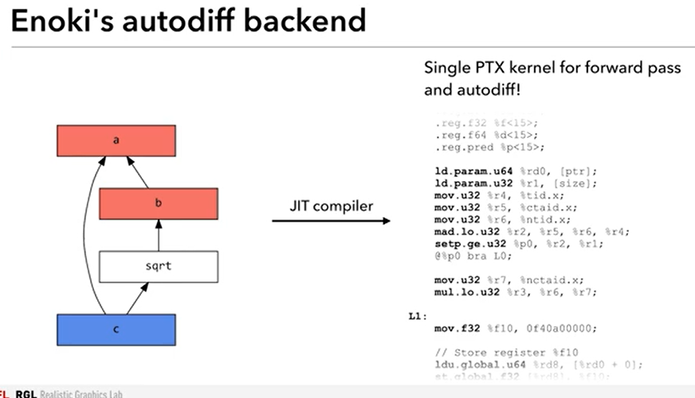
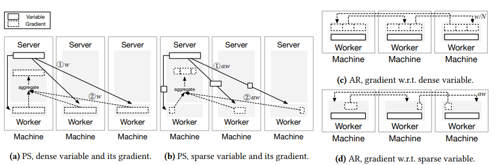
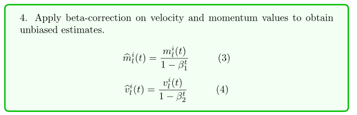
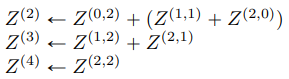
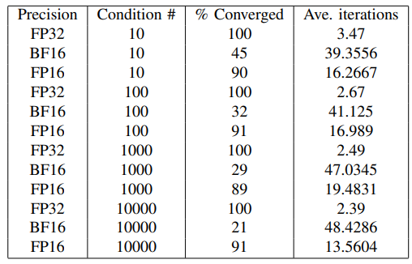

# Conferences:

|         | 19   | 18   |
| ------- | ---- | ---- |
| asplos  | y    |      |
| cgo     | y    |      |
| pact    | y    |      |
| sosp    | y    |      |
| eurosys | y    |      |
| atc     | y    |      |
| osdi    |      |      |
| sigcomm |      |      |
| nsdi    |      |      |
| sysml   | y    | y    |
| hpca    |      |      |
| micro   |      |      |
| isca    |      |      |
|         |      |      |

# models, algorithms

## HPC

### Weather forcast

#### 市场分析

**分类**

Atmospheric Science：需要大量使用科学计算

中国气象服务产业发展报告：预计未来十年气象服务产业规模至少500亿美元。一直找不到这份报告，需要付费。

**公司**

墨迹天气，成立十年，年营收只有两三亿，主要靠广告。 https://new.qq.com/omn/20191013/20191013A0G6X500.html

climacell：融资7000万

AccuWeather：62年成立，年收约1亿刀 [https://www.owler.com/company/accuweather]

气候和天气公司的总收入约为30亿美元，整个行业的总价值约为60亿美元 https://knowledge.wharton.upenn.edu/article/todays-forecast-for-the-weather-business-increased-revenues-and-a-focus-on-innovation/

整个行业数十亿美元 [National Weather Service Enterprise Analysis Report Findings on changes in the private weather industry June 8, 2017]

**影响的产业** 

[这些气象公司让 IBM 愿意掏 20 亿美金收购，https://36kr.com/p/5051967]

The Climate Corporation在 2013 年 10 月被全球最大的种子与农药公司孟山都公司（Monsanto Company）以 9.3 亿美元收购。

#### 20, A Neural Weather Model for Eight-Hour Precipitation Forecasting (MetNet: A Neural Weather Model for Precipitation Forecasting)

谷歌的气象预测。无物理模型。能够在未来8小时内以2分钟的间隔以1 km的分辨率预测未来的降水。

看来气象预报挑战不大。

#### 20, WeatherBench: A benchmark dataset for data-driven weather forecasting

建立了一个基于ML预测气象的数据集

**气象分类预报**

短期：6h～2天，1km

中期：数天～2周，全球范围

**Related work**

好像介绍的基本上都是完全无物理模型知识的，纯数据驱动的模型。有的场景可以超过基线。

**验证**

图中，CNN，LR（线性回归）是ML方案。Operational 和IFS是SOTA物理模型方案。climatology是简化的物理模型方案。ML方案距离物理模型方案还差一点。

dataset: https://github.com/pangeo-data/WeatherBench

**讨论：**

可能训练技巧能够弥补ML的精度缺陷。

#### 19, Weather and climate forecasting with neural networks: using general circulation models (GCMs) with different complexity as a study ground

基于NN的气象预测依然有很多挑战。

#### 19, Can Machines Learn to Predict Weather - Using Deep Learning to Predict Gridded 500-hPa Geopotential Height From Historical Weather Data

使用完全无物理模型的CNN预测气象。

基线是climatology, persistence, CFS, Barotropic。好像是说CNN方法超越了基线，且$\tau$ LSTM误差最小。可能最下面的线是理想最优值？

在某些其他场景比不过最优的物理模型。可以超过一些简单的物理模型。

### 市场分析

#### THE DATACENTER STARTS TO PERK UP FOR NVIDIA

https://www.nextplatform.com/2019/11/15/the-datacenter-starts-to-perk-up-for-nvidia/

英伟达的数据中心可能很大部分是HPC + AI。虽然在上涨，但是看不出HPC单独的趋势。

#### 19, Hyperion Research HPC Market Update from ISC 2019

https://www.youtube.com/watch?v=i98nMw1XFbE

https://www.hpcwire.com/2019/06/18/at-isc-for-the-hpc-industry-these-are-the-good-old-days/

HPC里超算的比例近半。

气象比例不大。

主要讲硬件，缺少软件投入的数据。

#### 16, THE IMPACT OF NATIONAL HIGH PERFORMANCE COMPUTING

UK政府的HPC重要性的分析报告。给了很多HPC的应用。但是没有看出能帮公司赚多少钱。

## Computer Graphics

### ML for MPM (differentiable MPM/CG)

#### 概要：

**落地**：蒙特卡洛计算支持，稀疏雅可比，降低内存消耗

#### **19, Mitsuba 2: A Retargetable Forward and Inverse Renderer**

[http://rgl.epfl.ch/publications/NimierDavidVicini2019Mitsuba2]

贡献1：一个能高效利用cache且并行度高（利用vectorization）的光线追踪算法（下图右）。

贡献2：自动微分框架

现有的TF，pytorch不适合非计算密集的应用，而且不支持一些重要op。

维护计算图。优化计算图。

贡献3：把c++代码转换为高效的GPU代码

#### 19, DiffTaichi: Differentiable Programming for Physical Simulation

#### 19, A Differential Theory of Radiative Transfer

#### 19, Reparameterizing Discontinuous Integrands for Differentiable Rendering

#### 19, Non-linear sphere tracing for rendering deformed signed distance fields

#### 19, Differentiable Surface Splatting for Point-based Geometry Processing

#### 19, The Camera Offset Space: Real-time Potentially Visible Set Computations for Streaming Rendering

#### 19, Real2Sim: Visco-elastic parameter estimation from dynamic motion

#### 19, Video-Guided Real-to-Virtual Parameter Transfer for Viscous Fluids

#### 19, Fluid Carving: Intelligent Resizing for Fluid Simulation Data

#### 19, ScalarFlow: A Large-Scale Volumetric Data Set of Real-world Scalar Transport Flows for Computer Animation and Machine Learning

#### 19, Differentiable Rendering Theory and Applications

#### 19, Quadrilateral Mesh Generation : Meromorphic Quartic Differentials and Abel-Jacobi Condition

#### 19, Differentiable Rendering for Mesh and Implicit Field

#### 19, Accelerated Complex Finite Difference for Expedient Deformable Simulation

#### 18, Differentiable Programming for Image Processing and Deep Learning in Halide

#### 19, Learning to Drive by Differentiating through Scenes， 

https://avik-pal.github.io/blog/learning_to_drive.html

没有看懂。

Inverse raytracing. 基于渲染结果，推测产生渲染结果的参数（比如光源位置）。

介绍了可微分物理引擎，用于仿真。但是没有理解与其他物理引擎有什么区别。

和强化学习比较，DP也需要设计reward。那和RL有什么区别？

好像DP就是指基于梯度学习参数，减少人工知识。

挑战之一：很多问题不可微。可能就涉及到估计梯度，降低方差。

我的猜想：当前的NN是可微的，可以做很多事情。NN可以看作一种代码，有些参数需要学习。相比传统代码，NN的表达能力有限，不容易表现递归、逻辑判断等语法。DP做的事能够让表达能力更强的代码也可微。

#### 19, DIFFERENTIABLE COMPUTER GRAPHICS FOR TRAINING AND VERIFICATION OF MACHINE PERCEPTION

#### 19, Differentiable Monte Carlo Ray Tracing through Edge Sampling

[Differentiable Programming with Julia by Mike Innes, https://www.youtube.com/watch?v=LjWzgTPFu14]

#### 19, A Collection of Jacobian Sparsity Acceleration Tools for Julia

#### 19, Sparsity Programming: Automated Sparsity-Aware Optimizations in Differentiable Programming

#### 18, Solving Stiff Ordinary Differential Equations

#### 18, chainQueen: A Real-Time Differentiable Physical Simulator for Soft Robotics

### 19, Automatically Translating Image Processing Libraries to Halide

把图像处理的C++代码转换为halide DSL，以便在各种平台都可以优化。

我们现在可能没有支配多平台的需求。

只能转换单个函数，可能适用范围受限。

### 19, Staged Metaprogramming for Shader System Development

### 18, GPU Optimizations of Material Point Method and Collision Detection

### 18, Rendering Tutorial II: Monte Carlo Path Tracing

[GAMES Webinar 2018-66期-赵爽, https://v.qq.com/x/page/y0740eh4z76.html]

需要计算每个点的亮度。理论上需要计算空间中所有散射到点上的光线的积分，但是实际光线数量无限，做不到。所以只采样一部分光线，对其求和作为积分的近似。挑战在于高效的构建从点到光源的光线路径。

### Accelerating sampling

#### 19, Gen: A General-Purpose Probabilistic Programming System with Programmable Inference：

  更灵活的实现各种概率模型（HM，HMC，MCMC等）。

  基于julia，性能比baseline（venture）好很多。没有看出为什么好。

  related work中介绍了一些基于概率编程的应用如图形学，仿真。但是不是非常新的工作。

  好像主要是贡献是软件工程。[http://probcomp.csail.mit.edu/videos-talks-podcasts/]

#### 18, Approximate Program Smoothing Using Mean-Variance Statistics, with Application to Procedural Shader Bandlimiting: 

  基于compiler去噪。没什么后续工作跟进，好像不是为了提高效率。

#### 17, Cataloging the Visible Universe through Bayesian Inference at Petascale

做了超算级别的大规模VI。但是也没有什么深入的性能优化。

#### 16, Swift: Compiled Inference for Probabilistic Programming Languages 

针对概率编程（即后验分布推断）的编译器，优化内存管理，降低运行时开销。与CG看不出直接关系。没什么后续工作跟进。

## Differentiable programming

### 19, AcMC 2 : Accelerating Markov Chain Monte Carlo Algorithms

自动把概率模型转换为高效的FPGA代码的编译器。

我们还是要先确认MCMC是不是CG的瓶颈。

### 19, DiffEqFlux.jl – A Julia Library for Neural Differential Equations

### 19, Differentiable Programming with Julia by Mike Innes

https://www.youtube.com/watch?v=LjWzgTPFu14

DP核心是用代码表示模型，基于梯度下降和训练数据找到模型的参数。

比RL快，因为模型是人工先验。

为了实现DP，需要让增强AD，使其支持分支判断、递归等；需要在TPU等加速器高效运行。很多编译器工作。

### 19, A Differentiable Programming System to Bridge ML and Scientific Computing

### 19, JAX 

使得numpy可微。基于XLA加速。

https://news.ycombinator.com/item?id=18636054

tensorflow很难实现二阶梯度——不能并行求梯度。JAX很容易实现。

不是数值求解梯度，JAX更快、更高效。不是符号求解。

### ODENet

#### 18, Deep Neural Networks Motivated By Differential Equations

[Lars Ruthotto: "Deep Neural Networks Motivated By Differential Equations (Part 1/2)", https://www.youtube.com/watch?v=G2n2nJnh5kc]

通过把NN用ODE表示，可以利用ODE的理论分析成果。比如，可以使用optimal control approach (OCA)

OCA有两种做法

可以分析NN稳定性

有的ODE可以reverse，前后向传播都稳定，就不用保存前向数据。但不是所有ODE都有这种特性。

可以做层间并行

在HPC有很多研究。

当有很多core，有巨大性能提升。

#### 18, Neural Ordinary Differential Equations

* 动机：用ODE分析解释网络结构
* 方法

把resnet看作ODE。用现成的ODE solver求解。

假设网络结构是ResNet

**前向：**

可以表示为ODE

最后一层的激活可以通过积分算出

**反向：**

传统NN的反向与ODENet的反向梯度计算

反向过程也是一个ODE，所以用另一个ODE solver求解。

L是误差函数，z(t)是最后一层激活

求出$a(t) = -dL/z(t)$。

可以证明：

基于（4）求每个时间的da(a)/dt，从而求出每个时间的a(t)。

最后，用积分求$\theta$的梯度，用于更新$\theta$。

* 讨论

##### 可以避免保存前向传播数据

 [Lars Ruthotto: "Deep Neural Networks Motivated By Differential Equations (Part 1/2)"，https://www.youtube.com/watch?v=G2n2nJnh5kc]

但是实际上好像还是与迭代步数正相关。

迭代步长越小，结果越精确，但是消耗内存越多。[An empirical study of neural ordinal differential equations]

##### Transformer, 3D点云可以用ODE解释优化	

[LIMITING THE DEEP LEARNING, YIPING LU PEKING UNIVERSITY]

##### 可以指导并行训练

##### 使用更少的参数(?)

##### 不能控制网络层数（由ODE solver控制），比ResNet训练多2-4x耗时

[Neural Ordinary Differential Equations - Best Paper Awards NeurIPS 2018， https://www.youtube.com/watch?v=V6nGT0Gakyg]

可能因为反向需要重新计算。

##### 需要积分，高维不容易求

训练慢。要求每层结构相同，不灵活。需要把多个不同的OdeNet叠加起来形成灵活的ODE。

论文用现成的ODE求解器求解神经网络。但是现成的ODE求解器自己也有很多问题，很多问题解不好。

## 强化学习

### 17, Domain Randomization for Transferring Deep Neural Networks from Simulation to the Real World

目标：增强RL泛化性

方法：

数据增强，使得现实环境近似等于训练环境的一个变种。

### 17, Reinforcement learning with deep energy-based policies.

传统RL策略函数一般收敛到单峰分布

希望策略函数收敛到多峰而不是单峰分布。

为此，我们构造一个能量，与Q成正比：。V相当于正则项。

根据能量获得策略函数

Q* 和V*这样定义

可以推出

要求Q* 和 V*，我们可以交替的迭代以下两式

这里有两个困难。

第一，V要求积分，不容易。我们用importance采样近似V。V可以表示成。$q_{q'}$是一个容易采样的分布。

第二，为了求Q和V，需要对$\pi$采样。$\pi$可能复杂，不容易采样。我们找一个容易采样的分布$\pi^\phi$去近似。具体的，最小化$\pi^\phi$和的KL距离：

## * 20, A3 : Accelerating Attention Mechanisms in Neural Networks with Approximation

transformer在很多网络里都是耗时的大头。

加速attention的硬件和算法。TBR

## 20, PoWER-BERT: Accelerating BERT inference for Classification Tasks

算法层加速。

## 19, A simple parameter-free and adaptive approach to optimization under a minimal local smoothness assumption

一种黑盒优化算法。研究最优点附近地形的光滑性d和噪声b对优化效率的影响。设计在相同d和b下收敛更快的算法。

## 17, MobileNets: Efficient Convolutional Neural Networks for Mobile Vision Applications

* 目标：降低计算量，模型尺寸
* 方法

用depthwise卷积和pointwise卷积代替普通卷积。

去掉正则项，因为小模型不容易过拟合。

* 评估

精度降低1%，计算量和模型尺寸降低一个数量级。

## 15, On Using Very Large Target Vocabulary for Neural Machine Translation

* 问题

语言模型解码器输出一个词时需要做softmax。

softmax的分母需要对所有备选词汇求和，计算量太大。

* 传统的方法：对softmax分层，或用其他方法逼近分母。
* 方案

基于重要性采样近似分母

## 13, Stochastic Simultaneous Optimistic Optimization

* 背景：输入一个黑盒函数f，一个预算n，输出能够使f最大的解

* 现有方案：现有方案或者需要知道一个L平滑范围。或者只能处理f为非随机函数的情况，即假设f能够被准确评估。实际上，每次评估f的结果可能带噪声。

  

* 目标：不要求知道L范围，且f输出带噪声

* 方案

  把解空间组织成一棵树，每个节点对应一部分子空间，评估有潜力（可能包含高输出解）的子空间。初始时整个解空间是树的根节点。每次迭代在当前树中选择一部分有潜力的叶节点进行评估或扩展。评估指的是从子空间选一个代表性的解求f。因为f是带噪声的，我们对每个子空间需要评估固定的k次，取平均值。一个naive的想法是扩展平均f最大的节点。本文不是这么做，而是以当前节点的评估值和评估值的置信度的和，记做b-value，选择b-value大的节点。

​	$\mu_{h,i}$是第h层第i个节点当前的平均评估值。

​	文章的理论分析重点在于当f满足一定假设时，能够找到一定质量的解。

* 评估

原始函数

加上噪声

提案算法stosoo超越基线doo（不过好像也没有超过很多）

# distributed training

## 20, zero: Memory Optimization Towards Training A Trillion Parameter Models

[Turing-NLG, DeepSpeed and the ZeRO optimizer, https://www.youtube.com/watch?v=tC01FRB0M7w]

* 目标：训练大模型，节约内存

占用内存的有几部分数据：激活，w，adam等优化器用到的动量（m）、权重（v）。激活通过recompute处理，其他几部分的尺寸都是O(|w|)。

* 方法：每个GPU存一部分模型。每个GPU算一部分batch。

前向时，每个GPU把自己管理的部分模型动态的广播到其他GPU。其他GPU基于收到的部分参数计算激活，然后把收到的参数扔掉。

反向时，每个GPU把自己的梯度广播给其他GPU。其他GPU基于收到的梯度求平均，更新自己的参数，然后把收到的梯度扔掉。

这个图还没看懂

## 19, Ouroboros: On Accelerating Training of Transformer-Based Language Models

号称是第一个针对transformer的模型并行加速。

idea和实验都太粗糙。不可信。

## 19, A Generic Communication Scheduler for Distributed DNN Training Acceleration

op执行顺序调度，增加通信和计算的overlap。

分布式训练（PS-worker模式）中，调度通信op的执行顺序。

把通信op看作计算op。切分大op为小op，小步快跑。

主要看通信op，但是思想可以借鉴到计算op的调度。

强调统一不同的DNN 框架（TF，torch）

讨论：运行时，不是编译时

## 19, Megatron-LM: Training Multi-Billion Parameter Language Models Using Model Parallelism

很简单，对于一个transformer，把attention，MLP分别按层拆分，基于Allreduce做模型并行。

把多个transformer叠加起来

## 19, TICTAC: ACCELERATING DISTRIBUTED DEEP LEARNING WITH COMMUNICATION SCHEDULING

op执行顺序调度，增加通信和计算的overlap。

Ops in a computational DAG may have multiple feasible topological orders. However, some of them may result in a bad iteration time (as explained in Figure 1). We want to limit the execution path to take the one that improves the training performance. We achieve this with priority numbers. Priority number is a positive integer assigned to an op in the DAG. A higher priority op is given a lower priority number.

**Op properties**

The inputs are the worker dataflow DAG (G), a time oracle (Time), available communication channels on a device © and a set of outstanding (to-be-activated) recvs ops ®.

- **Communication Dependency (op.dep)**: For example, in figure 1a, `op2.dep` = {`recv1`, `recv2`}. We extract the communication dependencies using a **depth-first post-fix** graph traversal on the DAG.
- **CommunicationTime(Op.M)**: Communicationtimeof an op is the total network transfer time required to complete that op.

$\sum_{r \in op.dep \cap R} \operatorname{Time}(r)$

For example, in Figure 1a, $op_{1} \cdot M=\operatorname{Time}\left(r e c v_{1}\right)$ and $op_{2} \cdot M=\operatorname{Time}\left(r e c v_{1}\right)+\operatorname{Time}\left(r e c v_{2}\right)$.

For recv ops, we define two additional properties:

**Defining Overlap Coefficient**

total DNN iteration time (`T`) are network transfer time or the communication time (`N`) and the computation time (`C`).

Since the computation and communication may overlap, the total time `T <= N + C`.

We define two metrics that define the DNN iteration time:

- the communication/computation ratio, `ρ`
- the overlap coefficient, `α`.

When `ρ < 1`, communication time is smaller than the total computation time, providing ample opportunity for running GPUs at high utilization.

The overlap coefficient (The difference between these quantities is the extent of overlap)

$\alpha=\frac{N+C-T}{\min (N, C)}$

The GPU utilization ($U=\frac{C}{T}$) can be represented in terms `T` of these coefficients:

$U=\frac{C}{N+C-\alpha * \min (N, C)}=\frac{1}{1+\rho-\alpha * \min (\rho, 1)}$

The goal of our scheduling algorithms is to achieve high GPU efficiency by maximizing `α`, i.e., increasing the overlap of communication and computation.

**SCHEDULING ALGORITHMS**

The intuition behind our heuristics is to **prioritize transfers** that speed up the critical path in the DAG by reducing blocking on computation caused by parameter transfers.

* 讨论：需要运行时信息

## 19, Parallax: Sparsity-aware Data Parallel Training of Deep Neural Networks

* 背景：PS和allreduce是两种常用的数据同步方式。

* 问题：不同同步方式适合于不同稀疏率的模型。通信模式应该考虑模型稀疏率的影响。

很多模型是稀疏的，比如NLP。不同稀疏度的模型适合不同的通信方式。

AR适合稠密数据同步，PS适合稀疏数据同步。

tensorflow里，稀疏数据以compressed sparse row (CSR)格式保存。

在基于ring的AR模式下，对于稠密数据，每个worker传输$O(\alpha w(N-1)/N)$。对于稀疏数据，每个worker传输$O(\alpha wN)$。w是模型参数量，$\alpha$是稀疏率，N是worker数。（这里没看懂）

PS，AR模式下，稀疏稠密数据分别的数据传输量。

对于稀疏变量，在PS模式下，即使变量的切分是均匀的，切分数目也会对效率产生影响。

* 方案

融合PS和AR。每个worker复制保存稠密变量，用AR同步。一部分呢PS保存稀疏变量，用PS模式同步。

更合适的variable切分数目。每个PS处理一部分稀疏数据。增加切分数可以提高并行度，但是需要维护更多的CSR数据转换等开销。用一个线性模型估计最优的切分数。

传输融合

算子放置优化

* 评估

## 09, MPI-aware compiler optimizations for improving communication-computation overlap

## optimizer

### 19, LARGE BATCH OPTIMIZATION FOR DEEP LEARNING: TRAINING BERT IN 76 MINUTES

LAMB

[Pretraining BERT with Layer-wise Adaptive Learning Rates, https://devblogs.nvidia.com/pretraining-bert-with-layer-wise-adaptive-learning-rates/]

先对梯度归一化

计算动量和学习率调整项并归一化，和Adam一样

像Adam一样动量除以v，但是加上weight decay

再做一次学习率调整

最后

### 17, LARGE BATCH TRAINING OF CONVOLUTIONAL NETWORKS (Tech report)

Equal to "17, Scaling SGD Batch Size to 32K for ImageNet Training"

LARS

缺陷：之前的优化器对每层的学习率是一样的

实际上，每层的梯度/w比例不同。所以，根据梯度/w比例调整学习率。

第l层的学习率记为$\lambda^l$，$\gamma$是全局学习率。

加上weight decay

总体来说，RMS，Adam里是先用g算动量作为梯度，$g^2$的移动平均算v，用1/v作为学习率。

LARS用$w_t^l(g_t^l+\beta w_t^l)$算动量，用$\gamma_t/(g_t^l+w_t^l)$作为学习率。

### 17, Accurate, Large Minibatch SGD: Training ImageNet in 1 Hour

* 问题：需要使用大batchsize以提高GPU利用率。但是大BZ会降低精度，泛化性。

* 方案：

  可能因为BZ大了，训练的次数少了，能够走的距离近了。所以，让学习率随BZ线性增大。

  训练开始时，梯度变化幅度很大。初始时使用小学习率，逐步增大到大学习率。

  使用allreduce，大带宽网卡。

## gradient compression

### 18, Error Compensated Quantized SGD and its Applications to Large-scale Distributed Optimization

对梯度做量化。基于上一轮的量化误差调整本轮传输的梯度。

好像是一个纯算法工作，不需要编译器任何支持。

## op placement

## * pipeline

### 19, PipeMare: Asynchronous Pipeline Parallel DNN Training

比pipedream节约内存，比gpipe气泡少（throughput高）

待细读。

### 19, GPipe: Efficient Training of Giant Neural Networks using Pipeline Parallelism

问题：模型太大，单卡放不下

* 方案：

把模型按层分割，放在不同卡上。但是，这样每个卡的利用率很低。把每个minibatch分为多个micro batch。每个卡算完一个micro-batch的一层后，不等待，接着开始算下一个micro-batch的这一层，提高卡利用率。

前向不保存FM，反向需要时再计算。

评估：

micro-batch越多，线性度越好。在transformer也适用。

### * 18, PipeDream: Fast and Efficient Pipeline Parallel DNN Training （19，PipeDream: Generalized Pipeline Parallelism for DNN Training）

* 目标：通过pipeline做模型并行。

* 方案：

一个卡基于batch0前向计算了权重w后，在反向计算w的梯度前可能又基于batch1，batch2，……计算了w的前向激活。

Pipedream是同步执行，即用于前向计算的权重等于用于方向计算梯度的权重。

所以，对于每个batch需要把每个w保存下来用于后期反向计算梯度和更新，占用更多内存。

Gpipe是在计算反向时重新做正向计算，不增加内存开销，但是会有气泡。

难点之一是确定给每个卡分配哪部分子模型，以达到load balance，降低卡间通信。

* 评估

不同网络效果很不同。总体上还是能够超越数据并行。

缺少resnet数据。

和编译器没有强依赖。

## cluster management

### Nexus: A GPU Cluster for Accelerating Neural Networks for Video Analysis

GPU集群调度。偏上层。可能不适合我们。

### 16, dCUDA: Hardware Supported Overlap of Computation and Communication

* 问题：CPU和GPU构成的异构系统里，CPU和GPU与各自不同的机制，优化起来困难。

* 方案：用MPI的remote memory access功能构建透明的远程访问。给每个GPU超过其核数的线程，以便一个线程卡住时能立刻切换到其他线程，降低GPU资源浪费。	

* 讨论：好像偏交换。有细读价值。

## computation

### * 19, DISTRIBUTED EQUIVALENT SUBSTITUTION TRAINING FOR LARGE-SCALE RECOMMENDER SYSTEMS

* 问题：推荐系统的模型非常大，单卡放不下。传统的PS模式，allreduce模式都需要在单卡上存储整个模型，不合适。需要模型并行。

  模型并行时卡之间传输两种数据，FM和梯度。比如把一个FC切分放在多卡计算获得多份子FM，然后通过AR规约子FM获得完整FM，再对完整FM做操作f获得解。这样的话卡间需要传输子FM，比较大。

  希望进一步减低模型并行时卡间通信。

* 方案：

  > 推荐模型大多有如下特点：**参数虽多，但都集中于模型头部layer**，如Logistic Regression和Embedding layer等，在这些layer，**高维稀疏参数经过Sum或Aggregation by field计算后，layer output尺度显著降低**，以W&D模型为例，DNN部分，embedding layer的输出相对输入size下降了3-4个数量级，后续NN层参数大约只有数MB：
  >
  > 
  >
  > 这促使我们考虑：尽量不传递参数本身，而是先对稀疏参数“做少量计算”之后，传递参数“初步”处理过的这个“中间结果”。这就是DES的初始思路。

  各个卡先在本地对子FM做f获得子解，然后对子解做规约。好像做完f后的结果比FM小很多，所以能节省通信。

* 评估

精度不损失

throughput提升1.5到4.5x

* 讨论

模型拆分，可能是MDE的应用场景。

文章的主要讨论对象是推荐系统，是否对DNN也适用？虽然也讨论了全连接DNN的场景，待细读。

性能提升是否主要是由稀疏数据这一特性带来的，受否对所有稀疏数据场景都适用？

文章去年9月发表，好像没有被顶会录取，也没有人引用，是否有bug？

### 19, Beyond Data and Model Parallelism for Deep Neural Networks 

### 19, Megatron-LM: Training Multi-Billion Parameter Language Models Using GPU Model Parallelism

* 目标：加速bert训练

* 现有方案：

数据并行：需要配合高级优化技巧。不能处理一块卡放不下的模型。

流水线：可能会有气泡，需要改优化器

mesh-tensorflow：需要改编译器

* 方案

bert是self attention + MLP

MLP是Y = GeLU(XA), Z = Dropout(YB)

XA 和 YB都是矩阵乘。

把X拆分，算完Z后通过allreduce合并。

self attention里是Y = self-attention(X V/Q/K), Z = Dropout(YB)

类似MLP，把X拆分，算完Z后通过allreduce合并。

一共用到4个allreduce

数据并行和模型并行搭配

* 评估

  线性度74%

  

### 19, μLayer: Low Latency On-Device Inference Using Cooperative Single-Layer Acceleration and Processor-Friendly Quantization

* 目标：加速移动端推理

* 方案：同时利用CPU和GPU做异构推理。之前的TFLite对异构推理支持不好，CPU和GPU同时使用时利用率不高。

在卷积的output维度切分。对于googlenet这种一层有多个分支的情况，把一部分分支合并起来放在一个CPU或GPU上，以提高设备利用率。

对CPU做8bit量化，GPU做16bit量化，因为这两种位宽分别在CPU和GPU上效果好。

* 评估

### 18, Scheduling Computation Graphs of Deep Learning Models on Manycore CPUs

动态调度计算图的op到不同core上执行，降低计算图的总完成时间。

* 评估：自己实现了一个ML框架与tf比较，可能不公平。

* 讨论：是一个runtime系统，可能我们不符合我们体系架构的定位。

### 18, image classification at supercomputer scale

使用分布式BN

分布式批归一化算法示意图，图中集群包含两个计算节点

首先各个节点计算独立的局部均值与方差

计算一个子集群（图中子集群包含两个计算节点的）中的分布式均值和方差。

使用分布式均值和方差对子集群中的所有节点进行归一化

使用二维梯度汇聚。第一阶段，蓝色张量在 Y 轴方向进行求和，红色张量在 X 轴方向进行求和。第二阶段，维度进行转换再次求和。复杂度从O(n2)降低到O(n)。

### 18, Highly Scalable Deep Learning Training System with Mixed-Precision: Training ImageNet in Four Minutes

为了提高GPU利用率，需要加大batch。但是，大batch会降低随机性，从而降低测试精度。为此，使用LARS优化器。

为了加速，使用低精度训练。

LARS会给梯度乘以一个稀疏。低精度训练配合LARS会导致数据下溢，即梯度会变成0。为此，allreduce获得FP16的梯度后先转换为FP32，再乘以LARS系数和做参数更新。

传统的ring allreduce的性能随着节点数目增加而降低。通过两层ring降低每个ring的节点数目。

原来的模型的目标函数有正则项，迫使参数接近0。bias，bn的参数变为0会影响精度。所以，让正则项不对bias，bn的参数起作用。

alexnet的pool5的激活震荡剧烈，所以加上BN。

融合小算子传输。

对输入数据预处理使用SSD+pipeline。

## 17, Don't Decay the Learning Rate, Increase the Batch Size

[Don’t Decay the Learning Rate, Increase the Batch Size，https://supercomputersfordl2017.github.io/Presentations/DLSC_talk.pdf]

* 动机：确定学习率，batchsize，以提高泛化性

* 方案：

提高泛化性其实是指收敛到平坦的局部最小。

learning rate decay是常用的方案。其思想是训练的时间越长，越接近最优解，就不要探索的太猛，降低探索噪声，免得走过头，浪费时间。

实际上，我们增加batch size，梯度的噪声越小，也能达到与降低LR同样的效果。

可以推导出LR和batch size的关系如下。g是目标噪声。

$\epsilon$：学习率 ，N：训练数据集大小， B：Batch Size大小，g：噪声，m：动量

## 17, LARGE BATCH TRAINING OF CONVOLUTIONAL NETWORKS

动机：需要使用大batch以提高GPU利用率。但是，大batch会降低泛化性。同时，使用相同的dataset时增大batch意味着降低迭代次数。假设起始解和最优解的距离是固定的话，增加batch后我们需要增加learning rate。需要找一个好的learning rate调节方法。

方案：对不同层的参数使用不同的learning rate

## 14, Scaling Distributed Machine Learning with the Parameter Server

【深度学习分布式】Parameter Server 详解, https://zhuanlan.zhihu.com/p/21569493

动机：加速训练

现有方案：容错性不好；同步更新，效率低

方案：异步更新；参数按照key-value格式传输；……

## 11, HOGWILD!: A Lock-Free Approach to Parallelizing Stochastic Gradient Descent

问题：多个core需要读写一块数据。传统方法需要在读写前申请lock，导致系统不可扩展。

方案：发现实际上写的数据是稀疏的，不同core写的地方基本不一样，可以不获得lock，直接读写。

# single machine

## processor

### HPC

#### 20, Large-Scale Discrete Fourier Transform on TPUs

Can be written as the follows

2D DFT

Can be rewritten

(5) can be expressed by Kronecker product

(Simply imposing the definition of KP to V1 and V2 [[https://zh.wikipedia.org/wiki/%E5%85%8B%E7%BD%97%E5%86%85%E5%85%8B%E7%A7%AF](https://zh.wikipedia.org/wiki/克罗内克积)]) 

> 

#### 19, Leveraging the bfloat16 Artificial Intelligence Datatype For Higher-Precision Computations

For computer, each float number can be represented in the format FP32, FP16 or BFloat16. Each format contains one sign bit, several mantissa (or fraction) bits and some exponent bits. 

 [https://www.johndcook.com/blog/2018/11/15/bfloat16/]

The error bound (minimum value can be expressed) of FP32 and BF16 are denoted by $\epsilon_f$ and $\epsilon_b$：

Our goal is to calculate the inner productioin of two vectors $\bold{x}$ and $\bold{y}$:. This is the basic operation for matrix product and hence lots of interesting applications. 

The inner production is realized by a sequence of fused multiplication add (FMA) operations in computer.

 （1）

$x_l$ and $y_l$ are FP32 numbers, the approximation of the real $x_l$ and $y_l$. Therefore, $Z$ is an approximation of the real summation $z$. The difference between $z$ and $Z$:

where ，

---------

Lets use $B_{16}$ (and $F_{32}$) to denote the conversation from FP32 to BF16 (and BF16 to FP32). Each FP32 $\alpha $ can be approximated by the summation of thee BF16 $b^{(i)}, i=0,1,2$. 

 (0)

Moreover, $b^{(0)}$ is more informatic than $b^{(1)}$ and $b^{1}$ is more informatic than $b^{2}$.

Each FP32 multiplication $xy$ hence can be approximated by the summation of nice BF16 numbers $\sum_{i,j \in (1,2,3)}x^{(i)}y^{(j)}$. Accordingly, the vector production $\bold{xy}$ can be expressed as the productions and summations of $x_l^{(i)}$ and $y_l^{(j)}$. 

For each FP32 number $x_l$ (and $y_l$ ), we express it with three BF16 numbers $x_l^{(i)}, i=0,1,2$:

Anolagy to equation (1), we can do the following FMA calculation.

 [2]

According to different $i$ and $j$, we can group $Z^{(i,j)}$. Further we create these notations:

Each $Z^{(i)}$ can be regarded as an approximation of $z$. Generally, $Z^{(i)}$ with smaller $i$ is the product-summations of larger components of $x$ and $y$. $Z^{i}$ with smaller $i$ are better approximation of the accurate value $z$.

Further, we can combine $Z^{i}$ to obtain finer level of approximation of $z$.

Now we analyze the error bound between $Z_i$ and $z$.

First, we can prove that

Similarly, we can prove that 

##### Evaluation

###### GEMM

1. GEMM, Numbers are belong to the same range [-1, 2]

$bxA\_B$ means to use A bf16 numbers to do B multiplications. The accuracy is computed by compare with the FP64 ground truth value. We can see that bx2_3 is less accurate than PF32 SGEMM but bx3_6 is more accurate. 

2. GEMM, Numbers are very different, either near zero other close to -inf or inf.	

bx3_6 is less accurate than FP32 SGEMM.

3. GEMM, Eacn number is choosen from a normal distribution.

bx3_6 is comparable with FP32 SGEMM.

4. LU decomposition. Error of FP32 calculation over Error of BF16 calculation.

What does the y-axis mean? In my understanding, it is the error ration between FP32 and bf16, correct? Then it means that the error of FP32 is lower than BF16, right? Why does the paper claims that "In every case, the triplet of BF16s was more accurate."?

###### Iterative refinement

1. Comparision of doing iterative refinement with BF16, FP16 and FP32. Generally, to achieve more convergency, more iterations are needed. So, we compare iterations/converage. The performance is FP32 > FP16 > BF16. Meanwhile, as condition number increases, the convergency of bf16 decreases, while FP16 is less affected. 

   

2. Solving Ax=b, where A is diagonally-dominant matrices. n is the matrix dimension. Generally, the number of iterations needed is BF16 > FP16 > FP32.

###### FLOPS 

Theoratically, BF16 can be 5.2x faster than FP32.

#### 18, Harnessing gpu tensor cores for fast fp16 arithmetic to speed up mixed-precision iterative refinement solvers

### * Sparse

#### 19, Generating Long Sequences with Sparse Transformers

* 问题：一个L层，输入大小n的transformer的内存消耗是o(Ln^2)，太多

* 方案：

不保存feature map，需要时再计算。

每个输入只和$\sqrt{n}$的输出计算注意力。

所以，总内存消耗变为$o(n\sqrt{n})$。

重点是每个输入和哪些元素保持注意力。可以与每隔k个元素建立注意力，也可以和周边的k个元素建立注意力。两种形式分别保存了全局和局部信息。本论文把两种方式结合起来。从注意力矩阵上看就很容易理解了，就是除了相对距离不超过k的、相对距离为k,2k,3k,…的注意力都设为0，这样一来Attention就具有“局部紧密相关和远程稀疏相关”的特性，这对很多任务来说可能是一个不错的先验，因为真正需要密集的长程关联的任务事实上是很少的。 [为节约而生：从标准Attention到稀疏Attention, https://kexue.fm/archives/6853/comment-page-1]

#### * 19, Fast Sparse ConvNets

看不懂

* 问题：之前大家认为剪枝等稀疏方法虽然能压缩模型，但是实际不能降低运算耗时。

* 方案：设计了一些稀疏计算kernel，用以替换dense MM kernel。

核心思想是cache里的数据重用。权重是稀疏的，但是激活时稠密的。我们每次读一个权重，相应的要读一组激活值。很有可能读了几个权重后后续的激活值都已经被读入cache了，可以被后续计算重用，不用再读取。

比如，下图1中，左边和右边分别时稀疏权重和读入cache的激活。权重（0，1）和（0，3）分别使得第0行和第3行的激活被读入cache。同样的，图2中，权重（1，1）和（1，2）分别使得第1行和第2行的激活被读入cache。这样，后续的图三图四就不用再读入激活了。

为了增加cache reuse，我们可以在对权重做pruning时刻意选择要稀疏的权重。比如，下图左边时传统pruning。本文觉得稀疏成右侧能增加cache reuse。

* 验证：通过pruning加新kernel，性能超于dense MM版本

  

* 讨论：算法性能依赖芯片cache机制。主要基于移动CPU设计，不知道在GPU上是否有用。

#### 19, Balanced Sparsity for Efficient DNN Inference on GPU

* 问题：结构化稀疏导致精度降低，非结构化稀疏对硬件不友好。

* 方案：

机构化稀疏。把权重分为等大小的块，每一块的稀疏率相同。这种结构化稀疏对硬件友好。

GPU共享内存可以分为bank，每个bank的读写可以并行。把每个稀疏块放在一个bank里，利用GPU的多线程特性并行的处理每个稀疏块。

* 评估

  

  

* 讨论

  D芯片没有GPU，可能不能像GPU那样并行处理稀疏块。

  VGG-16 net, LSTM model, and CTC model，不是最常用网络。

#### 19, TVM at Facebook Lots of contributors at FB and elsewhere

https://sampl.cs.washington.edu/tvmconf/slides/2019/Andrew-Tulloch-Bram-Wasti-FB.pdf

作者：facebook

目标：降低RNN模型的推理时间

方法：pruning + block sparse [Efficient neural audio synthesis]

评估：数百倍延时降低

### * save memory

显存优化是不是一个有价值的场景？

> 在Capuchin的benchmark里，选的都是**batch size > 1**的baseline，关注显存优化的工作，通常都知道在单卡能够hold batch size为1的训练场景的时候，实际上通过[Gradient Accumulation](https://link.zhihu.com/?target=https%3A//stackoverflow.com/questions/46772685/how-to-accumulate-gradients-in-tensorflow)这样的手段就可以比较廉价的解决掉显存问题了（这里忽略BN这样的计算层的影响，因为目前只是了解到在某些模型上，非Sync-BN可能带来收敛性影响，还并不是一个有足够多业务支持的需求）。

#### 19, Low-Memory Neural Network Training: A Technical Report

目标：通过实验分析四种降低NN内存消耗的方法

1. sparse：训练过程中动态的把一些权重置零，把另一些权重恢复。
2. 低精度：用低精度比如fp16代替原来的fp32权重
3. microbatch：把minibatch分为microbatch。一次算一个microbatch，累加梯度。缺陷是遇到BN时，microbatch越小，精度损失越大。
4. checkpoint：前向不保存FM，反向时重新计算。缺陷是会造成计算量提升。

model memory：权重

optimizer memory：用于保存梯度信息的内存

activations： FM

主要占用内存的是FM

microbatch的效果明显

#### * 19, CHECKMATE: BREAKING THE MEMORY WALL WITH OPTIMAL TENSOR REMATERIALIZATION

* 目标：降低内存消耗，而不是提升训练速度。

* 现有方案：

前向计算时丢弃一部分FM。比如，对于n层的网络，只保留$\sqrt{n}$的FM。计算梯度需要时再重新计算。

缺陷是要求网络是线性的（不然重计算变复杂），而且要求各层的负载比较均衡。

* 方案：

通过线性规划算出最好的丢弃方案。

* 评估：1.3x内存节约提升。允许使用更大的batch

#### * 18, Gist: Efficient Data Encoding for Deep Neural Network Training

* 目标：降低显存消耗

* 现有方案：

把不用的数据放在host，需要时prefetch。缺陷是会占用PCIe。

减小batch size。缺陷是会降低GPU利用率。

前向不保存FM。反向重新计算。缺陷是会增加耗时。

* 方案

把relu结果用1bit，而不是32bit表示。

用稀疏数据结构表示relu结果。

降低FM精度。

* 评估

5种模型上最高2x，平均1.8x内存使用量降低。

#### * 18, SuperNeurons: Dynamic GPU Memory Management for Training Deep Neural Networks

主要用作降低内存消耗，不是端到端速度。

### TPU
#### 19, High Performance Monte Carlo Simulation of Ising Model on TPU Clusters

Ising模型是物理上重要的模型。

其假设系统由分子构成。各个分子有正负两种状态，取决于系统温度和周边分子的状态。

系统处于$\bold{\sigma}$状态时的能量：

对应的概率：

其中$\sigma_i$表示分子i当前的状态(0或1)。$<i,j>$表示i和j分子相邻。 J和$\mu$是超参。本文里，我们假设J=1，$\mu$等于0。

当系统温度超过一定值，整个系统的分子状态会发生突变。比如磁铁温度超过700度会失去磁性。

可以用于金融，建模金融市场收到巨大影响时状态的突变，比如暴跌。

给定温度，可以用MC求解。

每个时间步，系统状态基于一定概率（$\pi(\bold{\sigma})$?）转变。以一定概率接受此新状态。

我们把系统分为黑白两色。因为每个分子只收到其邻居的影响。可以看到每次可以并行更新所有白色或所有黑色。

为了计算$\pi(\bold{\sigma})$，我们需要计算H，即对于每个分子i，需要计算$\sum_{<i,j>}{\sigma_i \sigma_j}$，即计算i与邻接分子状态的和。

首先，TPU可以每次计算一个128 x 128的矩阵乘法。我们把整个系统分成多个128x128的子矩阵，第i行j列的子矩阵的状态概率表示为$\sigma_{ij}$。

对于每个每个子矩阵，我们计算$\pi(\sigma)$。我们设计一个矩阵k。

那么$\sigma_{ij}$对应的邻接求和等于

nn代表nearest neighbor。

对于每个子矩阵，其上下左右边界上的求和算不了，需要单独算。我们另外进建立一个矩阵M。

以下几行分别算单独上下左右边界的求和：

所以完整流程如下。每次确定一个颜色，根据K求和，再根据M求各个边界的和，得到完整nn。根据计算接受概率。更新状态。然后翻转颜色，进入下一个迭代。

这个方法效率不高，因为每次只能算一个颜色。

可以把状态组织成这种样子

每个子矩阵进一步分为四个子子矩阵，等

每个子子矩阵的状态：

然后这样算，效率会高一些（待细读）

### 20, Perspective: A Sensible Approach to Speculative Automatic Parallelization

动机：通过speculative提高并行代码性能

之前的方案：为了验证代码正确性和处理预测失败，付出开销太大

本方案：降低开销，同时扩大speculative的投资回报率。

讨论：DNN没有很多speculative，可能不适用

### 19, Deepcpu: Serving rnn-based deep learning models 10x faster

### 19, Optimizing CNN Model Inference on CPUs

之前的工作是优化图或op，局部最优解不一定带来整体性能提升。这里是端到端整体优化。

**交叉优化算子和计算图**

除此之外，在ATC’19 paper中，我们还提出算子和计算图的联合优化。我们的方案让operator-level和graph-level配合，使得算子的优化可以反映到计算图上；反过来，计算图的tuning又能指导算子层面做出更好的调优策略。

举例来说，为了优化convolution的性能，我们通常会对输入数据的layout (NCHW四维，分别对应batch size, input channel, height, width)做处理，比如tile input channel这一维去做vectorize（一个常见办法是把NCHW转换成NCHW16c，这个16就是vectorize的大小），在计算结束后再把layout转回去（NCHW16c → NCHW）。这个layout的转换操作是有性能成本的，每个convolution都这么转来转去肯定造成一些浪费。一个自然的想法是，如果网络中的convolution都采用NCHW16c这个layout，是不是只需要在整个网络的输入输出各转换一次就可以了？进一步说，这里的参数16也是可调的，网络中有些conv可能用16比较好，有些用32比较好，还有些形状奇怪的可能要用7，14……这样一来，我们就需要在layout transform产生的性能损失，和使用不同layout产生的性能提升之间做trade-off。具体算法可以参考我们paper中的相关描述。

通过算子和计算图的自动优化，TVM可以生成非常高效的计算代码。我们最终希望，给定一个网络结构和目标硬件，使用TVM可以自动生成最优的计算逻辑。就像如今程序员只需要专注于业务逻辑，而把性能调优交给高级语言编译器来完成；深度学习科学家也只需要专注于模型结构本身，把部署到生产环境（可以是CPU/GPU服务器，Edge device，浏览器，FPGA等等）这个任务交给深度学习编译器。

**CPU上的运行时多线程**

上面说的各种优化思想其实可以用到各种不同的设备上，专门对于CPU来说，我们还优化了TVM运行时的多线程并行操作。你可能会问为什么不直接用OpenMP, 简单的答案是我们实测的OpenMP扩展性和稳定性并不理想（具体参见paper）。另外OpenMP这套接口的在不同平台上的实现各不相同，这也带来了性能上的不确定性。再者，TVM里遇到的多线程并行都是embarassingly parallel的，我们并不需要像OpenMP那样处理各种复杂的并行同步。基于以上种种，我们决定在TVM用pthread和C++11以后提供的`std::atomic`实现一套简单实用的CPU运行时多线程。具体一点说，我们用细粒度的原子操作来实现单生产者单消费者的lockfree queue以便调度作业的主线程和各个工作线程高效通信；我们还把不同的工作线程绑在不用的CPU物理核上，最大程度地消除资源竞争；最后我们在全局变量上加了相应的cache line padding以消除线程间的false sharing。

### * 19, Modeling and analyzing Computations in Graph Neural Networks

> 同时还分析了在当前主流的一些硬件加速器上，比如GPU或TPU上运行GNN算法的表现，提出了针对GNN里常见的稀疏GEMM计算，目前的加速器都缺乏对应的硬件支持，可能是未来硬件加速器的研究方向。

### 19, DYNAMIC SPARSE GRAPH FOR EFFICIENT DEEP LEARNING

之前的问题：没有怎么考虑训练，没有考虑BN，没有考虑激活的稀疏，没有考虑运行时激活的稀疏

方案：用较低的开销基于训练样本预测每个神经元的输出，生成mask，训练时不计算这些神经元。对于BN，直接把通过BN之前的mask用在通过后的激活上，因为BN不改变激活的相对位置。

讨论：没有评估ResNet上的端到端性能。workshop论文，思想和实验都比较简单。待细读。

### 19, AutoTM: Automatic Tensor Movement in Heterogenous Memory Systems using Integer Linear Programming

> Distributed deep learning training usually adopts AllReduce as the synchronization mechanism for data parallel algorithms due to its high performance in homogeneous environment. However, its performance is bounded by the slowest worker among all workers, and is significantly slower in heterogeneous situations. AD-PSGD, a newly proposed synchronization method which provides numerically fast convergence and heterogeneity tolerance, suffers from deadlock issues and high synchronization overhead. Is it possible to get the best of both worlds — designing a distributed training method that has both high performance as All-Reduce in homogeneous environment and good heterogeneity tolerance as AD-PSGD? In this paper, we propose Ripples, a high-performance heterogeneity-aware asynchronous decentralized training approach. We achieve the above goal with intensive synchronization optimization, emphasizing the interplay between algorithm and system implementation. To reduce synchronization cost, we propose a novel communication primitive Partial All-Reduce that allows a large group of workers to synchronize quickly. To reduce synchronization conflict, we propose static group scheduling in homogeneous environment and simple techniques (Group Buffer and Group Division) to avoid conflicts with slightly reduced randomness. Our experiments show that in homogeneous environment, Ripples is 1.1× faster than the state-of-the-art implementation of All-Reduce, 5.1× faster than Parameter Server and 4.3× faster than AD-PSGD. In a heterogeneous setting, Ripples shows 2× speedup over All-Reduce, and st

好像属于交换的工作。

### 19, Tangram: Optimized Coarse-Grained Dataflow for Scalable NN Accelerators

太靠近硬件的工作。

### 19, HyPar: Towards Hybrid Parallelism for Deep Learning Accelerator Array

混合并行。没有和horovod、resnet比较。

### 19, AN5D: Automated Stencil Framework for High-Degree Temporal Blocking on GPUs

用于科学计算。 

### 19, Revec: Program Rejuvenation through Revectorization

提升不多，1.4x。

### 19, Learning automatic schedulers with projective reparameterization

提升不多，4%。

### 19, The Indirect Convolution Algorithm

传统矩阵乘法基于img2col实现，需要把FM基于kernel展开。这个展开的矩阵消耗大量内存。QNNPACK不展开FM，而是基于每次滑动窗口的当前位置动态生成一个部分FM，放在一个buffer里供kernel相乘。

更详细的解释：

* 基于GEMM实现的CNN底层算法被改？Google提出全新间接卷积算法, https://cloud.tencent.com/developer/article/1464001
* 卷积神经网络优化算法, https://jackwish.net/2019/convolution-neural-networks-optimization.html

**间接卷积算法的缺点**

间接卷积算法作为GEMM-BASED CNN算法的一种改进，能极大的提升计算效率，但是存在以下几个限制：

\1. 这个算法是为NHWC layout设计的，也就是说应用范围比较窄，不能和目前的主流方法相比。

\2. 算法适用于前向传播中的卷积操作，而在反向传播中作用不大，不及基于col2im和row2im的算法。

\3. 具有和GEMM相同的缺点，在深度小卷积核的卷积操作中效率并不好。

### 19, The OoO VLIW JIT Compiler for GPU Inference

把一些编译时确定的信息，kernel融合，改为在运行时动态决定。

实验结果不全，有一定效果。

我们的MDE，多核调度也可以做类似事情。有参考价值。

### 19, Bit Prudent In-Cache Acceleration of Deep Convolutional Neural Networks

硬件工作。

### 18, QNNPACK: Open source library for optimized mobile deep learning

通用矩阵乘（GEMM）优化与卷积计算，https://zhuanlan.zhihu.com/p/66958390

FB出的移动端量化加速框架。

一些基础概念：

大z小z

卷积通常是以矩阵乘法实现，每次去A和B矩阵的第k行和第k列做点乘。QNNPACK是直接取A和B的一块直接做乘法。这样读取出来的A（B）的每一行（列）可以被B（A）的每一列（行）使用做乘法，降低了访存开销。

QNNPACK对A和B做8bit量化，这样A和B的可以直接放在L1缓存里，省去了把中间结果保存到更低速度内存里、读回L1缓存、把中间结果变为32bit又变回8bit这些开销。

高端ARM芯片一次可以同时发射矩阵乘法和加法两条指令。QNNPACK会尽量利用这个特性。

传统矩阵乘法基于img2col实现，需要把FM基于kernel展开。这个展开的矩阵消耗大量内存。QNNPACK不展开FM，而是基于每次滑动窗口的当前位置动态生成一个部分FM，放在一个buffer里供kernel相乘。

QNNPACK对depthwise卷积做了优化。

* 评估：性能超越TF-lite

### 15, Deep Compression: Compressing Deep Neural Networks with Pruning, Trained Quantization and Huffman Coding

对参数按照阈值剪枝。

用稀疏数据结构表示。

剪枝后的数据依照聚类法量化。

论文的最后一步是使用哈夫曼编码进行权值的压缩，其实如果将权值使用哈夫曼编码进行编码，解码的代价其实是非常大的，尤其是时间代价。还需要注意的是，DeepCompression 中对于输出没有压缩。所以这种方案对于硬件加速的主要作用体现在遇到 0 即可 zero skip，即使用判断语句替代乘法器。

需要特殊的硬件处理稀疏数据结构。

## framework

### TASO: Optimizing Deep Learning Computation with Automatic Generation of Graph Substitutions

计算图优化，我们部门已经做不了？

# graph neural network

## 19, PYTORCH-BIGGRAPH: A LARGE-SCALE GRAPH EMBEDDING SYSTEM

* 作者：Facebook

* 动机：高效率对20亿节点的大图做embedding。推荐系统。

不是GCN。

> Recent work proposes to construct embeddings by using graph convolutional neural networks (GCNs, Kipf & Welling 2016). These methods have shown success when applied to problems at large-scale web companies (Hamilton et al., 2017a; Ying et al., 2018). The problem studied by the GCN is different than the one solved by PBG (mostly in that GCNs are typically applied to graphs where the nodes are already featurized). Combining ideas from graph embedding and GCN models is an interesting future direction both for theory and applications.

* 方案：图分割

The contribution of PBG is to scale to graphs with billions of nodes and trillions of edges. Important components of PBG are: • A block decomposition of the adjacency matrix into N buckets, training on the edges from one bucket at a time. PBG then either swaps embeddings from each partition to disk to reduce memory usage, or performs distributed execution across multiple machines. • A distributed execution model that leverages the block decomposition for the large parameter matrices, as well as a parameter server architecture for global parameters and feature embeddings for featurized nodes. • Efficient negative sampling for nodes that samples negative nodes both uniformly and from the data, and reuses negatives within a batch to reduce memory bandwidth. • Support for multi-entity, multi-relation graphs with perrelation configuration options such as edge weight and choice of relation operator.

* 评估

We show that partitioning of the Freebase graph reduces memory consumption by 88% without degrading embedding quality, and distributed execution on 8 machines speeds up training by a factor of 4。

## 19, AliGraph: A Comprehensive Graph Neural Network Platform

作者：阿里巴巴

GNN框架要解决的问题：提高在大规模时间域和空间域的处理效率、不同对象有异构的属性、结构化的拓扑属性和非结构化的节点属性的统一，动态图

* 评估

没有和DGL，PYG比较。只和一些具体的GNN算法比较。

好像主要是在数据库系统、os层做了优化，没有芯片级别优化。

## 18, Graph Convolutional Neural Networks for Web-Scale Recommender Systems

* 作者：pinterest

* 动机：推荐系统。高效率GCN

* 方案：

不是直接用特征向量乘拉普塔斯矩阵，而是动态的构造每个节点的局部邻接矩阵。

高效的利用GPU。用CPU构造构造邻接矩阵，tensorflow + GPU做GCN计算。

# zero-order optimization

# others

## AutoMine: Harmonizing High-Level Abstraction and High Performance for Graph Mining

针对graph mining问题，自动生成算法，减少内存消耗
